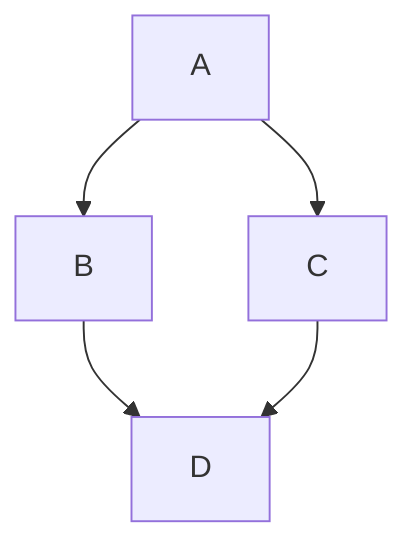

**标签：** #Markdown

---

# 📝 Markdown 全部语法大全（通用版 + 扩展）

> 本文档涵盖 **标准 Markdown** 语法（CommonMark）以及 **GitHub Flavored Markdown (GFM)** 和其他常用扩展（脚注、定义列表、删除线、任务列表、表格、代码高亮、数学公式等）。  
> 适用于 Typora、Obsidian、GitHub、GitLab、VS Code、Jupyter Notebook 等绝大多数平台。

---

## 1. 标题

使用 `#` 表示标题级别，共 6 级。`#` 后必须跟一个空格。

```markdown
---

# 一级标题
---

## 二级标题
---

### 三级标题
---

#### 四级标题
---

##### 五级标题
---

###### 六级标题
```

> **替代语法**（Setext 风格，仅支持 1、2 级）

```markdown
一级标题
========

 二级标题
--------
```

---

## 2. 段落与换行

- **段落**：连续两行文本之间用**空行**分隔（即一个空行）。
- **换行**（软换行）：在行末加**两个空格**然后回车。  

  > 有些平台支持 `\` 结尾换行，但不通用。

```markdown
这是第一段（末尾无空格）

这是第二段（上面有空行）

这是第一行（末尾有两个空格）  
这是第二行（紧接上一行软换行）
```

---

## 3. 强调（斜体 / 粗体）

| 样式  | 语法                      | 示例          | 效果        |
| --- | ----------------------- | ----------- | --------- |
| 斜体  | `*文字*` 或 `_文字_`         | `*hello*`   | *hello*   |
| 粗体  | `**文字**` 或 `__文字__`     | `**world**` | **world** |
| 粗斜体 | `***文字***` 或 `___文字___` | `***!!!***` | ***!!!*** |

> 建议使用 `*` 和 `**`，避免与下划线混淆（尤其在单词中间）。

---

## 4. 列表

---

### 4.1 无序列表

使用 `-`、`+` 或 `*` 作为标记，后跟空格。

```markdown
- 苹果
- 香蕉
- 橙子
```

效果：

- 苹果
- 香蕉
- 橙子

---

### 4.2 有序列表

使用数字加点 `.`，数字不必连续，但建议从 1 开始。

```markdown
1. 第一项
2. 第二项
3. 第三项
```

效果：

1. 第一项
2. 第二项
3. 第三项

---

### 4.3 嵌套列表

在子项前**缩进 2 或 4 个空格**（或一个 Tab）。

```markdown
- 水果
  - 苹果
    - 红富士
  - 香蕉
- 蔬菜
  1. 胡萝卜
  2. 西兰花
```

效果：

- 水果
  - 苹果
    - 红富士
  - 香蕉
- 蔬菜
  1. 胡萝卜
  2. 西兰花

---

### 4.4 任务列表（GFM 扩展）

使用 `- [ ]` 表示未完成，`- [x]` 表示已完成。

```markdown
-  [x]  完成作业
-  [ ]  阅读书籍
-  [ ]  写报告
```

效果：

- [x] 完成作业
- [ ] 阅读书籍
- [ ] 写报告

> **注意**：方括号内有一个空格，`x` 大小写均可。

---

## 5. 引用（块引用）

使用 `>` 标记，可嵌套。

```markdown
> 这是一段引用。
> 
> > 这是嵌套引用。
> 
> 回到外层引用。
```

效果：

> 这是一段引用。
>
> > 这是嵌套引用。
>
> 回到外层引用。

引用中可以包含其他 Markdown 元素（标题、列表、代码块等）。

---

## 6. 代码

---

### 6.1 行内代码

使用反引号 `` ` `` 包裹。

```markdown
使用 `printf()` 函数输出。
```

效果：使用 `printf()` 函数输出。

若代码中包含反引号，可使用双反引号包裹：

```markdown
`` `code` ``  →  `` `code` ``
```

---

### 6.2 代码块

####6.1 围栏式代码块（推荐）

使用三个反引号 ` ``` ` 或三个波浪线 `~~~` 包裹，可指定语言实现语法高亮。

````markdown
```python
def hello():
    print("Hello, world!")
```
````

效果：

```python
def hello():
    print("Hello, world!")
```

---

#### 6.2.1 缩进式代码块

每行缩进 4 个空格或 1 个 Tab。

```markdown
    def hello():
        print("Hello")
```

> 围栏式更常用，且支持语法高亮。

---

## 7. 分隔线

使用三个或以上的 `-`、`*` 或 `_` 单独成行。建议在前后加空行。

```markdown
---

***
___
```

效果（分隔线）：

---

---

## 8. 链接

---

### 8.1 行内链接

```markdown
[文本] (URL "可选标题")
```

示例：  
`[Google](https://www.google.com "搜索引擎")` → [Google](https://www.google.com "搜索引擎")

---

### 8.2 参考式链接

将链接定义为引用，便于复用。

```markdown
[文本] [标签]

[标签]:  URL "可选标题"
```

示例：

```markdown
我常去  [GitHub] [1] 和  [Stack Overflow] [so]。

[1]:  https://github.com
[so]:  https://stackoverflow.com "技术问答"
```

---

### 8.3 自动链接

使用 `<URL>` 或 `<email@example.com>`。

```markdown
<https://example.com>
<user@example.com>
```

效果：<https://example.com> 和 <user@example.com>

---

### 8.4 相对链接

在本地 Markdown 文件中可使用相对路径（适用于 wiki、笔记）。

```markdown
[关于我们] (./about.md)
[图片] (../images/photo.jpg)
```

---

## 9. 图片

语法与链接类似，前面加 `!`。

```markdown
! [替代文本] (图片URL "可选标题")
```

示例：  
``

---

### 9.1 带链接的图片

```markdown
[] (点击跳转的URL)
```

---

## 10. 表格（GFM）

使用竖线 `|` 和短横 `-` 绘制表格。第二行使用 `|---|` 分隔表头和内容，冒号 `:` 控制对齐。

```markdown
| 左对齐 | 居中对齐 | 右对齐 |
|:-------|:--------:|-------:|
| 单元格1 | 单元格2  | 单元格3 |
| 单元格4 | 单元格5  | 单元格6 |
```

效果：

| 左对齐 | 居中对齐 | 右对齐 |
|:-------|:--------:|-------:|
| 单元格 1 | 单元格 2  | 单元格 3 |
| 单元格 4 | 单元格 5  | 单元格 6 |

> 表格前后需有空行（避免被误认为普通文本）。单元格内容可包含行内格式（如粗体、代码、链接）。

---

## 11. 脚注（扩展）

部分平台（Typora、MultiMarkdown、Pandoc）支持脚注。

```markdown
这里需要解释一个概念 [^1] 。

[^1]:  这是脚注内容，可以多行，缩进两个空格。
```

效果（渲染后在页面底部显示脚注）。

---

## 12. 定义列表（扩展）

部分平台（如 Kramdown、PHP Markdown Extra）支持。

```markdown
术语
: 定义内容，可多行，每行前至少两个空格。
```

示例：

```markdown
Markdown
: 一种轻量级标记语言。
: 由 John Gruber 创建。
```

渲染效果：

Markdown

: 一种轻量级标记语言。

: 由 John Gruber 创建。

---

## 13. 删除线（GFM）

使用两个波浪线 `~~` 包裹。

```markdown
~~删除的内容~~
```

效果：~~删除的内容~~

---

## 14. 上下标（扩展）

---

### 14.1 上标：`^文字^`（部分平台，如 Typora、Pandoc）

```markdown
x^2^
```

效果（若支持）：x ^2^

---

### 14.2 下标：`~文字~`（同上）

```markdown
H~2~O
```

效果（若支持）：H ~2~ O

> 更可靠的方式：使用 LaTeX 的 `$x^2$` 和 `$H_2O$`。

---

## 15. 数学公式（LaTeX）

许多 Markdown 编辑器支持 MathJax 或 KaTeX。

- 行内公式：`$E = mc^2$` → $E = mc^2$
- 行间公式：`$$E = mc^2$$` →

$$
E = mc^2
$$

详细用法参见  [Markdown LaTeX 公式大全](./latex-cheatsheet.md)（或单独文档）。

---

## 16. HTML 原生标签

Markdown 允许直接使用 HTML 标签，适用于特殊格式。

```html
这是 <u>下划线</u> 文本。  
<span style="color: red;">红色文字</span>  
<div align="center">居中的内容</div>
```

效果：  
这是 <u>下划线</u> 文本。  
<span style="color: red;">红色文字</span>  

<div align="center">居中的内容</div>

> 部分平台会过滤不安全标签（如 `<script>`）。

---

## 17. 转义字符

使用反斜杠 `\` 转义 Markdown 中的特殊字符。

```markdown
\* 不斜体 \*  
\# 不是标题  
\[ 不链接 \]  
\` 不是代码
```

效果：  
\* 不斜体 \*  
\# 不是标题  
\[ 不链接 \]  
\` 不是代码

可转义字符：`\` ` ` ` ` `*` `_` `{}` `[]` `()` `#` `+` `-` `.` `!` `|` `<` `>` `$` `~` `^` `:`

---

## 18. 表情符号（Emoji）

- **复制粘贴**：直接插入 😀 🎉 ❤️  
- **短码**（GFM、GitHub）：`:smile:` → :smile: `:heart:` → :heart:  

  > 常用短码可在 [Emoji Cheat Sheet](https://github.com/ikatyang/emoji-cheat-sheet) 查询。

---

## 19. 高亮 / 标记（扩展）

某些平台支持 `==高亮==`（如 Typora、Obsidian）。

```markdown
==需要高亮的内容==
```

效果（若支持）：==需要高亮的内容==

> 替代方案：使用 HTML `<mark>` 标签：`<mark>高亮</mark>` → <mark>高亮</mark>

---

## 20. 目录（TOC）扩展

Typora、GitLab、某些编辑器支持自动生成目录。

```markdown
[TOC]
```

或

```markdown
<!-- toc -->
```

渲染后自动提取所有标题生成链接。

> 部分平台（如 GitHub）不支持 TOC 语法，但可以通过手动链接或插件实现。

---

## 21. 图表与流程图（Mermaid 扩展）

Typora、GitLab、Obsidian、GitHub（部分）支持 Mermaid。

````markdown

````

渲染为流程图、时序图、甘特图等。详情参考 [Mermaid 文档](https://mermaid.js.org/)。

---

## 22. 注脚与引用

已包含在 [11. 脚注](#1.1.-脚注扩展) 中。另可手动实现 `<sup>` 和链接模拟脚注：

```html
正文<sup><a href="#fn1" id="r1">[1]</a></sup>

<hr>
<p id="fn1">1. 脚注内容 <a href="#r1">↩</a></p>
```

---

## 📋 总结：常用语法速查表

| 元素 | 语法 |
|------|------|
| 标题 | `# H1` ... `###### H6` |
| 粗体 | `**bold**` |
| 斜体 | `*italic*` |
| 删除线 | `~~strikethrough~~` |
| 无序列表 | `- item` |
| 有序列表 | `1. item` |
| 任务列表 | `- [ ] todo` |
| 引用 | `> quote` |
| 行内代码 | `` `code` `` |
| 代码块 | ` ```lang ` |
| 链接 | `[text](url)` |
| 图片 | `` |
| 表格 | `\| a \| b \|` |
| 分隔线 | `---` |
| 脚注 | `[^1]` + `[^1]: text` |
| 转义 | `\*` |
| 表情 | `:smile:` 或 😃 |
| 数学 | `$...$` / `$$...$$` |

---

## ✅ 最佳实践建议

1. **统一风格**：列表用 `-`，粗体用 `**`，代码块用围栏式。
2. **空行分隔**：段落、列表、表格、代码块前后建议加空行，避免渲染错误。
3. **不依赖扩展**：若需要在 GitHub 等通用平台使用，优先使用标准语法 + GFM。
4. **预览测试**：不同渲染器可能存在差异，发布前预览。

---

> 本文档涵盖范围较广，部分扩展语法需目标平台支持。如有疑问，可查阅 [CommonMark 规范](https://commonmark.org/) 或 [GitHub Flavored Markdown 说明](https://github.github.com/gfm/)。

**祝你写作愉快！** 🚀

---

# 📚 常用 Markdown LaTeX 公式大全

> 本指南涵盖了 **Markdown** 中常用的 **LaTeX 数学公式**写法，适用于 Typora、GitHub、Obsidian、Jupyter Notebook 等支持 LaTeX 的 Markdown 环境。  
> 所有公式代码均已用 `$...$` 或 `$$...$$` 包裹，可直接复制使用。

---

## 1. 行内公式与行间公式

---

### 1.1 行内公式

语法：`$...$`

示例代码：

```latex
$E = mc^2$
```

渲染效果：

$E = mc^2$

---

### 1.2 行间公式

语法：`$$...$$`

示例代码：

```latex
$$
E = mc^2
$$
```

渲染效果：

$$
E = mc^2
$$

---

### 1.3 行间公式（编号）

语法：`$$\begin{equation}...\end{equation}$$`

示例代码：

```latex
$$
\begin{equation} 
E=mc^2 
\end{equation}
$$
```

渲染效果：

$$
\begin{equation} 
E=mc^2 
\end{equation}
$$

> 提示：GitHub 原生 Markdown 不支持 `\begin{equation}` 编号，推荐使用 `$$`。

---

## 2. 希腊字母

| 名称      | 大写         | 代码         | 小写                         | 代码                         |
| ------- | ---------- | ---------- | -------------------------- | -------------------------- |
| Alpha   | $A$        | `A`        | $\alpha$                   | `\alpha`                   |
| Beta    | $B$        | `B`        | $\beta$                    | `\beta`                    |
| Gamma   | $\Gamma$   | `\Gamma`   | $\gamma$                   | `\gamma`                   |
| Delta   | $\Delta$   | `\Delta`   | $\delta$                   | `\delta`                   |
| Epsilon | $E$        | `E`        | $\epsilon$ / $\varepsilon$ | `\epsilon` / `\varepsilon` |
| Zeta    | $Z$        | `Z`        | $\zeta$                    | `\zeta`                    |
| Eta     | $H$        | `H`        | $\eta$                     | `\eta`                     |
| Theta   | $\Theta$   | `\Theta`   | $\theta$ / $\vartheta$     | `\theta` / `\vartheta`     |
| Iota    | $I$        | `I`        | $\iota$                    | `\iota`                    |
| Kappa   | $K$        | `K`        | $\kappa$                   | `\kappa`                   |
| Lambda  | $\Lambda$  | `\Lambda`  | $\lambda$                  | `\lambda`                  |
| Mu      | $M$        | `M`        | $\mu$                      | `\mu`                      |
| Nu      | $N$        | `N`        | $\nu$                      | `\nu`                      |
| Xi      | $\Xi$      | `\Xi`      | $\xi$                      | `\xi`                      |
| Omicron | $O$        | `O`        | $\omicron$                 | `\omicron`                 |
| Pi      | $\Pi$      | `\Pi`      | $\pi$ / $\varpi$           | `\pi` / `\varpi`           |
| Rho     | $P$        | `P`        | $\rho$ / $\varrho$         | `\rho` / `\varrho`         |
| Sigma   | $\Sigma$   | `\Sigma`   | $\sigma$ / $\varsigma$     | `\sigma` / `\varsigma`     |
| Tau     | $T$        | `T`        | $\tau$                     | `\tau`                     |
| Upsilon | $\Upsilon$ | `\Upsilon` | $\upsilon$                 | `\upsilon`                 |
| Phi     | $\Phi$     | `\Phi`     | $\phi$ / $\varphi$         | `\phi` / `\varphi`         |
| Chi     | $X$        | `X`        | $\chi$                     | `\chi`                     |
| Psi     | $\Psi$     | `\Psi`     | $\psi$                     | `\psi`                     |
| Omega   | $\Omega$   | `\Omega`   | $\omega$                   | `\omega`                   |

---

## 3. 常用数学符号

---

### 3.1 关系运算符

| 符号          | 代码          | 符号        | 代码        |
| ----------- | ----------- | --------- | --------- |
| $\leq$      | `\leq`      | $\geq$    | `\geq`    |
| $\neq$      | `\neq`      | $\approx$ | `\approx` |
| $\equiv$    | `\equiv`    | $\sim$    | `\sim`    |
| $\simeq$    | `\simeq`    | $\cong$   | `\cong`   |
| $\propto$   | `\propto`   | $\perp$   | `\perp`   |
| $\parallel$ | `\parallel` | $\asymp$  | `\asymp`  |

---

### 3.2 集合运算符

| 符号          | 代码          | 符号         | 代码         |
| ------------- | ------------- | ------------ | ------------ |
| $\in$         | `\in`         | $\ni$        | `\ni`        |
| $\notin$      | `\notin`      | $\subset$    | `\subset`    |
| $\subseteq$   | `\subseteq`   | $\supset$    | `\supset`    |
| $\supseteq$   | `\supseteq`   | $\cup$       | `\cup`       |
| $\cap$        | `\cap`        | $\emptyset$  | `\emptyset`  |
| $\varnothing$ | `\varnothing` | $\mathbb{R}$ | `\mathbb{R}` |

---

### 3.3 箭头

| 符号                | 代码                | 符号                | 代码                |
| ----------------- | ----------------- | ----------------- | ----------------- |
| $\leftarrow$      | `\leftarrow`      | $\rightarrow$     | `\rightarrow`     |
| $\Leftarrow$      | `\Leftarrow`      | $\Rightarrow$     | `\Rightarrow`     |
| $\leftrightarrow$ | `\leftrightarrow` | $\Leftrightarrow$ | `\Leftrightarrow` |
| $\longleftarrow$  | `\longleftarrow`  | $\longrightarrow$ | `\longrightarrow` |
| $\uparrow$        | `\uparrow`        | $\downarrow$      | `\downarrow`      |
| $\Uparrow$        | `\Uparrow`        | $\Downarrow$      | `\Downarrow`      |

---

### 3.4 逻辑与其它

| 符号         | 代码         | 符号           | 代码           |
| ---------- | ---------- | ------------ | ------------ |
| $\forall$  | `\forall`  | $\exists$    | `\exists$`   |
| $\nexists$ | `\nexists` | $\therefore$ | `\therefore` |
| $\because$ | `\because` | $\partial$   | `\partial`   |
| $\infty$   | `\infty`   | $\nabla$     | `\nabla`     |
| $\angle$   | `\angle`   | $\degree$    | `\degree`    |
| $\pm$      | `\pm`      | $\mp$        | `\mp`        |
| $\cdot$    | `\cdot`    | $\times$     | `\times`     |
| $\div$     | `\div`     | $\ast$       | `\ast`       |
| $\star$    | `\star`    | $\circ$      | `\circ`      |
| $\bullet$  | `\bullet`  | $\oplus$     | `\oplus`     |
| $\otimes$  | `\otimes`  | $\odot$      | `\odot`      |
| $\vert$    | `\vert`    | $\Vert$      | `\Vert`      |

---

## 4. 上下标、根号、分式

| 功能       | 语法               | 示例代码       | 效果                   |
| ---------- | ------------------ | -------------- | ---------------------- |
| 上标       | `^{...}`           | `x^{2}`        | $x^{2}$                |
| 下标       | `_{...}`           | `x_{i}`        | $x_{i}$                |
| 上下标结合 | `^{...}_{...}`     | `x_{i}^{2}`    | $x_{i}^{2}$            |
| 平方根     | `\sqrt{...}`       | `\sqrt{x+y}`   | $\sqrt{x+y}$           |
| $n$ 次根号 | `\sqrt[n]{...}`    | `\sqrt[3]{x}`  | $\sqrt[3]{x}$          |
| 分式       | `\frac{...}{...}`  | `\frac{a}{b}`  | $\frac{a}{b}$          |
| 大型分式   | `\dfrac{...}{...}` | `\dfrac{1}{2}` | $\dfrac{1}{2}$ （行间） |

---

## 5. 大型运算符（求和、积分、极限）

---

### 5.1 求和

代码：`\sum`

行内示例： $\sum_{i=1}^{n} i$

```latex
$\sum_{i=1}^{n} i$
```

行间示例：

$$
\sum_{i=1}^{n} i
$$

```latex
$$
\sum_{i=1}^{n} i
$$
```

---

### 5.2 累乘

代码：`\prod`

行内示例： $\prod_{i=1}^{n} i$

```latex
$\prod_{i=1}^{n} i$
```

行间示例：

$$
\prod_{i=1}^{n} i
$$

```latex
$$
\prod_{i=1}^{n} i
$$
```

---

### 5.3 积分

代码：`\int`

行内示例： $\int_{a}^{b} f(x)dx$

```latex
$\int_{a}^{b} f(x)dx$
```

行间示例：

$$
\int_{a}^{b} f(x)dx
$$

```latex
$$
\int_{a}^{b} f(x)dx
$$
```

---

### 5.4 二重积分

代码：`\iint`

行内示例： $\iint_{D} dxdy$

```latex
$\iint_{D} dxdy$
```

行间示例：

$$
\iint_{D} dxdy
$$

```latex
$$
\iint_{D} dxdy
$$
```

---

### 5.5 三重积分

代码：`\iiint`

行内示例： $\iiint_{V} dV$

```latex
$\iiint_{V} dV$
```

行间示例：

$$
\iiint_{V} dV
$$

```latex
$$
\iiint_{V} dV
$$
```

---

### 5.6 环路积分

代码：`\oint`

行内示例： $\oint_{C} F \cdot dr$

```latex
$\oint_{C} F \cdot dr$
```

行间示例：

$$
\oint_{C} F \cdot dr
$$

```latex
$$
\oint_{C} F \cdot dr
$$
```

---

### 5.7 极限

代码：`\lim`

行内示例： $\lim_{x \to 0} \frac{\sin x}{x} = 1$

```latex
$\lim_{x \to 0} \frac{\sin x}{x} = 1$
```

行间示例：

$$
\lim_{x \to 0} \frac{\sin x}{x} = 1
$$

```latex
$$
\lim_{x \to 0} \frac{\sin x}{x} = 1
$$
```

---

### 5.8 行内显示与行间一致

在行内公式中，上下标会显示在右侧；若希望像行间一样显示在正下方，可使用 `\limits`，例如 `\sum\limits_{i=1}^{n}`： $\sum\limits_{i=1}^{n} i$

---

## 6. 括号与定界符

| 描述     | 语法                               | 示例代码                         | 效果                           |
| ------ | -------------------------------- | ---------------------------- | ---------------------------- |
| 普通括号   | `( )`                            | `(x+y)`                      | $(x+y)$                      |
| 方括号    | `[ ]`                            | `[x+y]`                      | $[x+y]$                      |
| 花括号    | `\{ \}`                          | `\{x+y\}`                    | $\{x+y\}$                    |
| 绝对值    | `\|` 或 `\vert`                   | `\vert x\vert`               | $\vert x\vert$               |
| 范数     | `\| \|`                          | `\|x\|`                      | $\ |x\|$                      |
| 取整     | `\lfloor \rfloor`                | `\lfloor x \rfloor`          | $\lfloor x \rfloor$          |
| 取顶     | `\lceil \rceil`                  | `\lceil x \rceil`            | $\lceil x \rceil$            |
| 自动调整大小 | `\left...\right`                 | `\left( \frac{a}{b} \right)` | $\left( \frac{a}{b} \right)$ |
| 手动调整大小 | `\big`, `\Big`, `\bigg`, `\Bigg` | `\Big( (x) \Big)`            | $\Big( (x) \Big)$            |

---

## 7. 矩阵与行列式

---

### 7.1 基本矩阵环境

```latex
$$
\begin{matrix}
a & b \\
c & d
\end{matrix}
$$
```

$$
\begin{matrix}
a & b \\
c & d
\end{matrix}
$$

---

### 7.2 带括号的矩阵

| 环境  | 代码        | 效果                                             |
| --- | --------- | ---------------------------------------------- |
| 圆括号 | `pmatrix` | $\begin{pmatrix} a & b \\ c & d \end{pmatrix}$ |
| 方括号 | `bmatrix` | $\begin{bmatrix} a & b \\ c & d \end{bmatrix}$ |
| 花括号 | `Bmatrix` | $\begin{Bmatrix} a & b \\ c & d \end{Bmatrix}$ |
| 竖线  | `vmatrix` | $\begin{vmatrix} a & b \\ c & d \end{vmatrix}$ |
| 双竖线 | `Vmatrix` | $\begin{Vmatrix} a & b \\ c & d \end{Vmatrix}$ |

---

### 7.3 带省略号的矩阵

```latex
$$
\begin{pmatrix}
a_{11} & a_{12} & \cdots & a_{1n} \\
a_{21} & a_{22} & \cdots & a_{2n} \\
\vdots & \vdots & \ddots & \vdots \\
a_{m1} & a_{m2} & \cdots & a_{mn}
\end{pmatrix}
$$
```

$$
\begin{pmatrix}
a_{11} & a_{12} & \cdots & a_{1n} \\
a_{21} & a_{22} & \cdots & a_{2n} \\
\vdots & \vdots & \ddots & \vdots \\
a_{m1} & a_{m2} & \cdots & a_{mn}
\end{pmatrix}
$$

---

### 7.4 行列式示例

```latex
$$
\det(A) = \begin{vmatrix}
a & b \\
c & d
\end{vmatrix} = ad - bc
$$
```

$$
\det(A) = \begin{vmatrix}
a & b \\
c & d
\end{vmatrix} = ad - bc
$$

---

## 8. 多行公式

---

### 8.1 `align` 环境（等号对齐）

需要 `amsmath` 包，大部分 Markdown 引擎支持。  
使用 `&` 指定对齐位置，`\\` 换行。

```latex
$$
\begin{align}
x &= a + b \\
y &= c + d + e + f \\
z &= g + h
\end{align}
$$
```

$$
\begin{align}
x &= a + b \\
y &= c + d + e + f \\
z &= g + h
\end{align}
$$

> 若不想自动编号，使用 `\begin{align*} ... \end{align*}`

---

### 8.2 `gather` 环境（居中对齐）

```latex
$$
\begin{gather}
x = a + b \\
y = c + d
\end{gather}
$$
```

$$
\begin{gather}
x = a + b \\
y = c + d
\end{gather}
$$

---

### 8.3 `cases` 环境（分段函数）

```latex
$$
f(x) = 
\begin{cases}
x^2, & \text{if } x \ge 0 \\
-x^2, & \text{if } x < 0
\end{cases}
$$
```

$$
f(x) = 
\begin{cases}
x^2, & \text{if } x \ge 0 \\
-x^2, & \text{if } x < 0
\end{cases}
$$

---

### 8.4 多行公式手动调整间距

使用 `\\[2ex]` 增加行距：

```latex
$$
\begin{aligned}
y &= x^2 + 2x + 1 \\[2ex]
  &= (x+1)^2
\end{aligned}
$$
```

$$
\begin{aligned}
y &= x^2 + 2x + 1 \\[2ex]
  &= (x+1)^2
\end{aligned}
$$

---

## 9. 函数与操作符

---

### 9.1 标准函数名（正体）

| 函数     | 代码      | 效果      | 函数   | 代码      | 效果      |
| -------- | --------- | --------- | ------ | --------- | --------- |
| 正弦     | `\sin`    | $\sin$    | 余弦   | `\cos`    | $\cos$    |
| 正切     | `\tan`    | $\tan$    | 余切   | `\cot`    | $\cot$    |
| 反正弦   | `\arcsin` | $\arcsin$ | 反余弦 | `\arccos` | $\arccos$ |
| 反正切   | `\arctan` | $\arctan$ | 对数   | `\log`    | $\log$    |
| 自然对数 | `\ln`     | $\ln$     | 指数   | `\exp`    | $\exp$    |
| 最大值   | `\max`    | $\max$    | 最小值 | `\min`    | $\min$    |
| 极限     | `\lim`    | $\lim$    | 上确界 | `\sup`    | $\sup$    |

---

### 9.2 自定义操作符

```latex
$$
\operatorname{Var}(X) = \mathbb{E}[(X-\mu)^2]
$$
```

$$
\operatorname{Var}(X) = \mathbb{E}[(X-\mu)^2]
$$

---

## 10. 字体与黑板体

| 效果             | 代码               | 示例                       | 说明         |
| ---------------- | ------------------ | -------------------------- | ------------ |
| 罗马体           | `\mathrm{...}`     | $\mathrm{ABC}$             | 正体         |
| 斜体             | `\mathit{...}`     | $\mathit{ABC}$             | 默认数学斜体 |
| 粗体             | `\mathbf{...}`     | $\mathbf{ABC}$             | 粗体         |
| 粗体（希腊）     | `\boldsymbol{...}` | $\boldsymbol{\alpha\beta}$ | 需 `amsmath` |
| 黑板粗体（数集） | `\mathbb{...}`     | $\mathbb{R, C, Q, Z, N}$   | 实数、复数等 |
| 花体（书法）     | `\mathcal{...}`    | $\mathcal{ABCDEF}$         | 大写字母     |
| 德文尖角体       | `\mathfrak{...}`   | $\mathfrak{AaBb}$          | Fraktur 字体 |
| 无衬线体         | `\mathsf{...}`     | $\mathsf{SansSerif}$       | 无衬线       |
| 打字机体         | `\mathtt{...}`     | $\mathtt{Typewriter}$      | 等宽字体     |

---

## 11. 颜色与带框公式

---

### 11.1 颜色（需 `\color` 或 `\textcolor`）

```latex
$$
\color{red}{x} = \frac{-b \pm \sqrt{\color{blue}{b^2 - 4ac}}}{2a}
$$
```

$$
\color{red}{x} = \frac{-b \pm \sqrt{\color{blue}{b^2 - 4ac}}}{2a}
$$

常用颜色：`red`, `blue`, `green`, `yellow`, `cyan`, `magenta`, `orange`, `purple`, `brown`, `black`, `white`, `gray`。

也可以使用 `\textcolor{颜色}{内容}`：

```latex
$$
\textcolor{orange}{E} = \textcolor{orange}{m}c^2
$$
```

$$
\textcolor{orange}{E} = \textcolor{orange}{m}c^2
$$

---

### 11.2 带框公式

```latex
$$
\boxed{E = mc^2}
$$
```

$$
\boxed{E = mc^2}
$$

```latex
$$
\boxed{\lim_{n \to \infty} \left(1+\frac{1}{n}\right)^n = e}
$$
```

$$
\boxed{\lim_{n \to \infty} \left(1+\frac{1}{n}\right)^n = e}
$$

---

## 12. 标注、上下括号与修饰符

| 功能     | 语法                      | 示例代码                            | 效果                                |
| -------- | ------------------------- | ----------------------------------- | ----------------------------------- |
| 上划线   | `\overline{...}`          | `\overline{x+y}`                    | $\overline{x+y}$                    |
| 下划线   | `\underline{...}`         | `\underline{x+y}`                   | $\underline{x+y}$                   |
| 上花括号 | `\overbrace{...}^{标签}`  | `\overbrace{a+b+c}^{\text{三个数}}` | $\overbrace{a+b+c}^{\text{三个数}}$ |
| 下花括号 | `\underbrace{...}_{标签}` | `\underbrace{a+b+c}_{\text{和}}`    | $\underbrace{a+b+c}_{\text{和}}$    |
| 向量箭头 | `\vec{...}`               | `\vec{v}`                           | $\vec{v}$                           |
| 加粗箭头 | `\overrightarrow{...}`    | `\overrightarrow{AB}`               | $\overrightarrow{AB}$               |
| 帽子     | `\hat{...}`               | `\hat{y}`                           | $\hat{y}$                           |
| 宽帽子   | `\widehat{...}`           | `\widehat{xyz}`                     | $\widehat{xyz}$                     |
| 波浪号   | `\tilde{...}`             | `\tilde{a}`                         | $\tilde{a}$                         |
| 宽波浪   | `\widetilde{...}`         | `\widetilde{abc}`                   | $\widetilde{abc}$                   |
| 点       | `\dot{...}`               | `\dot{x}`                           | $\dot{x}$                           |
| 双点     | `\ddot{...}`              | `\ddot{x}`                          | $\ddot{x}$                          |

---

## 13. 特殊符号补充

| 符号           | 代码           | 符号               | 代码               |
| ------------ | ------------ | ---------------- | ---------------- |
| $\dots$      | `\dots`      | $\cdots$         | `\cdots`         |
| $\vdots$     | `\vdots`     | $\ddots$         | `\ddots`         |
| $\aleph$     | `\aleph`     | $\hbar$          | `\hbar`          |
| $\imath$     | `\imath`     | $\jmath$         | `\jmath`         |
| $\ell$       | `\ell`       | $\wp$            | `\wp`            |
| $\Re$        | `\Re`        | $\Im$            | `\Im`            |
| $\nabla$     | `\nabla`     | $\partial$       | `\partial`       |
| $\eth$       | `\eth`       | $\dag$           | `\dag`           |
| $\S$         | `\S`         | $\P$             | `\P`             |
| $\copyright$ | `\copyright` | $\pounds$        | `\pounds`        |
| $\angle$     | `\angle`     | $\measuredangle$ | `\measuredangle` |
| $\triangle$  | `\triangle`  | $\square$        | `\square`        |
| $\diamond$   | `\diamond`   | $\star$          | `\star`          |

---

## 14. 复杂公式示例

---

### 14.1 傅里叶级数

```latex
$$
f(t) = \frac{a_0}{2} + \sum_{n=1}^{\infty} \left( a_n \cos(n\omega t) + b_n \sin(n\omega t) \right)
$$
```

$$
f(t) = \frac{a_0}{2} + \sum_{n=1}^{\infty} \left( a_n \cos(n\omega t) + b_n \sin(n\omega t) \right)
$$

---

### 14.2 高斯积分

```latex
$$
\int_{-\infty}^{\infty} e^{-x^2} dx = \sqrt{\pi}
$$
```

$$
\int_{-\infty}^{\infty} e^{-x^2} dx = \sqrt{\pi}
$$

---

### 14.3 正态分布概率密度函数

```latex
$$
f(x) = \frac{1}{\sigma\sqrt{2\pi}} \, e^{-\frac{(x-\mu)^2}{2\sigma^2}}
$$
```

$$
f(x) = \frac{1}{\sigma\sqrt{2\pi}} \, e^{-\frac{(x-\mu)^2}{2\sigma^2}}
$$

---

### 14.4 欧拉公式

```latex
$$
e^{i\theta} = \cos\theta + i\sin\theta
$$
```

$$
e^{i\theta} = \cos\theta + i\sin\theta
$$

---

### 14.5 交叉多行对齐

```latex
$$
\begin{aligned}
\text{Re}(z) &= \frac{z + \bar{z}}{2} \\
\text{Im}(z) &= \frac{z - \bar{z}}{2i}
\end{aligned}
$$
```

$$
\begin{aligned}
\text{Re}(z) &= \frac{z + \bar{z}}{2} \\
\text{Im}(z) &= \frac{z - \bar{z}}{2i}
\end{aligned}
$$

---

## ✅ 小贴士

- **在 Markdown 中显示行内公式**：`$...$`  
- **显示独立行间公式**：`$$...$$`（推荐）或 `\[ ... \]`  
- **转义花括号**：在 LaTeX 中 `{` 和 `}` 有特殊含义，需要输出时请使用 `\{` 和 `\}`  
- **空格控制**：LaTeX 忽略普通空格，可使用 `\quad`（一个空格）或 `\qquad`（两个空格），也可用 `\,`、`\:`、`\;` 等微调  
- **换行**：在 `$$...$$` 中，`\\` 换行，`&` 对齐  
- **引擎要求**：多数平台使用 MathJax 或 KaTeX，基本语法通用。若遇到不支持的指令，请查阅平台文档  

---

> 本手册持续更新，建议收藏 🌟  
> 欢迎补充更多常用公式到评论区。
