**上一级：** [06-Transformer](06-Transformer.md)

**下一级：** [08-Transformers库和Bert应用](08-Transformers库和Bert应用.md)

**标签：** #NLP

---

# Bert 系列模型超详细笔记

## 第一部分：BERT 模型详解

### 1.1 BERT 背景与诞生

#### 1.1.1 Transformer 奠定的基础

2017 年，Google 团队提出 **Transformer** 架构（论文《Attention is All You Need》），使用纯注意力机制替代 RNN，解决了长距离依赖和并行计算问题。这一架构为后续预训练语言模型的爆发奠定了基础。

**关键时间线**：

- 2001 年：神经语言模型
- 2013 年：词嵌入（Word2Vec、GloVe）
- 2014 年：Seq2Seq 模型
- 2015 年：注意力机制
- 2017 年：Transformer 问世
- **2018 年：预训练语言模型爆发**（GPT、BERT）

---

#### 1.1.2 BERT 的诞生与里程碑意义

**BERT**（Bidirectional Encoder Representations from Transformers）是 Google 在 **2018 年 10 月**提出的一种革命性 NLP 模型。论文地址：https://arxiv.org/pdf/1810.04805.pdf

**震撼表现**：

- 在 **SQuAD1.1**（斯坦福问答数据集）中，两个衡量指标上**全面超越人类**。
- 在 **11 种不同 NLP 任务**中创下 SOTA（State of the Art）表现。
- 将 **GLUE 基准**推高至 80.4%（绝对改进 7.6%）。
- **MultiNLI** 准确度达到 86.7%（绝对改进 5.6%）。

BERT 的出现被视为 NLP 发展史上的里程碑，其核心结构仍然是 Transformer，但通过**双向编码**和**预训练+微调**范式，大大提升了模型对语言的理解能力。

---

#### 1.1.3 BERT、GPT、ELMo 的宏观对比

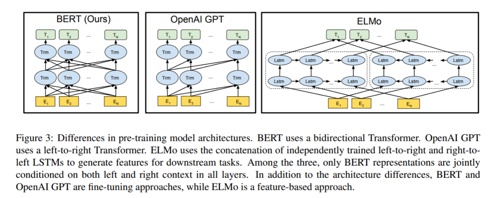

| 模型 | 提出时间 | 提出机构 | 基础架构 | 特征提取方向 | 主要擅长任务 |
| --- | --- | --- | --- | --- | --- |
| **ELMo** | 2018 年 3 月 | 华盛顿大学 | 双向双层 LSTM | 独立从左到右、从右到左，然后拼接 | 动态词向量，解决一词多义 |
| **GPT** | 2018 年上半年 | OpenAI | Transformer Decoder | 从左到右（单向） | 自然语言生成（NLG） |
| **BERT** | 2018 年 10 月 | Google | Transformer Encoder | 深度双向（同时左右上下文） | 自然语言理解（NLU） |

**核心区别**：BERT 采用**深度双向**，能够同时利用一个词左边和右边的上下文信息；GPT 只能利用左边信息（单向）；ELMo 虽然也使用了左右信息，但只是分别训练然后**拼接**，不是深度融合。

---

### 1.2 BERT 模型架构

BERT 宏观上分为**三个主要模块**（从下至上）：

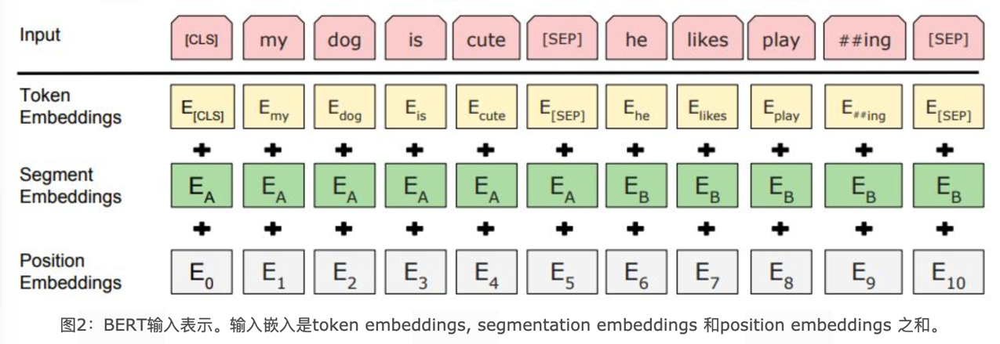

1. **Embedding 模块**（底层，黄色标记）
2. **Transformer 模块**（中间层，蓝色标记）
3. **预微调模块**（最上层，绿色标记）

---

#### 1.2.1 Embedding 模块

BERT 的输入表示由**三种嵌入向量相加**构成：


1. **Token Embeddings（词嵌入张量）**  
   将每个单词（token）映射为固定维度的向量。BERT 使用 **WordPiece** 分词（子词分词），词汇表大小通常为 30,000。第一个 token 始终是 `[CLS]`（分类标志），用于后续分类任务。

2. **Segment Embeddings（句子分段嵌入张量）**  
   用于区分两个句子（如问答任务中的问题和上下文）。句子 A 的 segment embedding 全为 0，句子 B 的全为 1（或可学习的两种向量）。

3. **Position Embeddings（位置编码张量）**  
   与原始 Transformer 使用固定三角函数不同，BERT 采用**可学习的位置编码**。每个位置（0~512）对应一个可训练的向量，在训练过程中更新。

**三者相加**：对于输入序列中的每个 token，其最终输入向量为：

```python
input_embedding = token_embedding + segment_embedding + position_embedding
```

假设维度 `d_model=768`，每个分量都是 `[1,768]` 的张量，相加后仍为 `[1,768]`。

**代码示例**（PyTorch 风格）：

```python
class BERTEmbeddings(nn.Module):
    def __init__(self, vocab_size, max_len=512, d_model=768, seg_vocab_size=2):
        super().__init__()
        self.token_embeddings = nn.Embedding(vocab_size, d_model)
        self.position_embeddings = nn.Embedding(max_len, d_model)
        self.segment_embeddings = nn.Embedding(seg_vocab_size, d_model)
        self.layer_norm = nn.LayerNorm(d_model)
        self.dropout = nn.Dropout(0.1)

    def forward(self, input_ids, segment_ids):
        seq_len = input_ids.size(1)
        position_ids = torch.arange(seq_len, dtype=torch.long, device=input_ids.device)
        position_ids = position_ids.unsqueeze(0).expand_as(input_ids)

        token_emb = self.token_embeddings(input_ids)
        seg_emb = self.segment_embeddings(segment_ids)
        pos_emb = self.position_embeddings(position_ids)

        embeddings = token_emb + seg_emb + pos_emb
        embeddings = self.layer_norm(embeddings)
        embeddings = self.dropout(embeddings)
        return embeddings
```

---

#### 1.2.2 双向 Transformer 模块（Encoder Only）

BERT **只使用了 Transformer 架构中的 Encoder 部分**，完全舍弃了 Decoder。这是因为 BERT 的目标是**深度双向理解**，而非自回归生成。

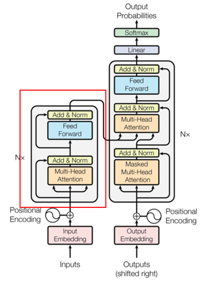

**特点**：

- 堆叠多个 Encoder 层（BERT-base 为 12 层，BERT-large 为 24 层）。
- 每层包含：**多头自注意力** + **前馈网络**，每个子层后有残差连接和层归一化。
- 与原始 Transformer 编码器不同的是，BERT 的注意力是**双向**的，即每个 token 可以同时看到左侧和右侧的所有 token（无掩码，除了填充掩码）。

**参数配置（BERT-base）**：

- 层数（Transformer blocks）：12
- 隐藏层维度（d_model）：768
- 注意力头数：12
- 总参数量：约 1.1 亿

---

#### 1.2.3 预微调模块（任务适配）

BERT 经过预训练后，最后一层的输出会根据**下游任务的不同**进行不同的调整，只需微调少量参数即可获得 SOTA 结果。常见的四类 NLP 微调任务架构如下：

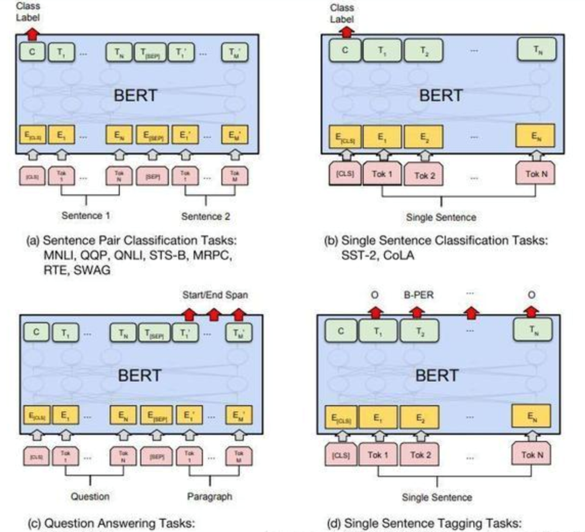

| 任务类型            | 图例  | 说明                                     | 微调方式                      |
| --------------- | --- | -------------------------------------- | ------------------------- |
| **句子对关系判断**     | (a) | 输入两个句子，判断关系（如蕴含、中性、矛盾；或是否相似）           | 使用 `[CLS]` 位置的输出，接分类层     |
| **单文本分类**       | (b) | 输入一个句子，输出类别（情感分析、语法正确性等）               | 同样使用 `[CLS]` 输出           |
| **问答任务（QA）**    | (c) | 输入问题和上下文，输出答案在上下文中的起始和结束位置             | 在编码器输出上接两个线性层，分别预测起始和结束位置 |
| **序列标注（如 NER）** | (d) | 输入一个句子，对每个 token 进行分类（如 B-PER、I-LOC 等） | 使用每个 token 对应的输出，接分类层     |

**微调的优势**：只需在预训练模型基础上添加一个简单的输出层，并用少量标注数据训练即可。预训练模型已经掌握了丰富的语言知识，微调相当于“定制化”。

---

### 1.3 BERT 的预训练任务

**什么是预训练任务？**  
预训练模型先在大规模无监督语料上训练，获得通用语言知识（预训练阶段）；然后在具体任务上微调（fine-tuning 阶段）。预训练任务的设计决定了模型能学到什么样的能力。

BERT 的预训练包含两个任务：

1. **MLM（Masked Language Model，掩码语言模型）** —— 类似完形填空 + 纠错
2. **NSP（Next Sentence Prediction，下一句预测）**

---

#### 1.3.1 MLM 任务详解

**目的**：让模型学习深度双向的上下文表示，而不是像传统语言模型那样只利用单向信息。

**具体实现**（15%中的“811”规则）：

1. 在原始训练文本中，**随机抽取 15%的 token** 作为被掩码处理的对象。
2. 对于每个被选中的 token，按照以下规则处理：
   - **80%的概率**：将该 token 替换为 `[MASK]` 标记。  
     例如：`my dog is hairy` → `my dog is [MASK]`
   - **10%的概率**：将该 token 替换为一个**随机单词**（不是 `[MASK]`）。  
     例如：`my dog is hairy` → `my dog is apple`
   - **10%的概率**：保持该 token **不变**。  
     例如：`my dog is hairy` → `my dog is hairy`

**为什么这样设计？**

- **80% mask**：强制模型依靠上下文预测被遮住的词，从而学习双向语义。
- **10%随机替换**：让模型具备一定的“纠错”能力，因为模型需要识别出某些词可能是错的，并预测原始正确的词。
- **10%不变**：缓解预训练与微调时的不匹配（微调时没有 `[MASK]`），使模型能对正常单词也产生有意义的表示。

**损失函数**：只计算被选中的 15%的 token 上的交叉熵损失，预测这些位置上的原始词。

**数学表示**：

$$
\mathcal{L}_{\text{MLM}} = -\sum_{i \in \text{masked}} \log P(w_i | \text{context})
$$

---

#### 1.3.2 NSP 任务详解

**目的**：让模型理解两个句子之间的关系，这对于问答、自然语言推理等任务至关重要。

**具体实现**：

- 所有训练样本都由句子对 `(A, B)` 组成。
- **50%的概率**：B 是 A 在原始文本中**真实的下一句**（正样本，标记为 `IsNext`）。
- **50%的概率**：B 是**随机从语料中抽取的句子**（负样本，标记为 `NotNext`）。

模型需要预测 B 是否是 A 的下一句。这是一个二分类任务，使用 `[CLS]` 位置的输出接一个分类层。

**效果**：BERT 在此任务上可达到 97-98%的准确率。

**损失函数**：

$$
\mathcal{L}_{\text{NSP}} = -\log P(\text{isNext} | A,B)
$$

**总预训练损失**：

$$
\mathcal{L} = \mathcal{L}_{\text{MLM}} + \mathcal{L}_{\text{NSP}}
$$

---

#### 1.3.3 预训练的意义

BERT 在海量数据（如英文维基百科+BookCorpus，共约 33 亿词）上训练这两个任务后，模型参数被初始化成一种“通用语言理解”状态。后续接入下游任务时，只需微调即可获得优异效果。

---

### 1.4 BERT 的优势与局限

| 优势 | 说明 |
| --- | --- |
| **深度双向** | 能够同时利用左右上下文，对自然语言理解任务尤其有效 |
| **统一架构** | 同一套预训练模型可适配多种下游任务，只需微调输出层 |
| **SOTA 效果** | 在 GLUE、SQuAD 等多个基准上刷新纪录 |
| **迁移学习友好** | 大大减少对标注数据的需求，少量微调即可 |

| 局限 | 说明 |
| --- | --- |
| **模型庞大** | BERT-large 参数量达 3.4 亿，训练和推理需要大量算力 |
| **不适合生成任务** | 由于没有解码器，不是自回归模型，生成文本能力弱 |
| **预训练-微调不一致** | `[MASK]` 只在预训练出现，微调时没有，可能造成偏差 |
| **最大输入长度限制** | 通常为 512 个 token，长文档需截断或分段 |

---

### 1.5 评估基准：GLUE 与 CLUE

#### 1.5.1 GLUE 基准数据集

**GLUE**（General Language Understanding Evaluation）是由纽约大学、华盛顿大学等机构创建的多任务自然语言理解基准和分析平台。所有数据集均为英文。

官网：https://gluebenchmark.com/

GLUE 包含 9 项 NLU 任务，涉及：

- **自然语言推断**（如 MNLI、RTE）
- **文本蕴含**（如 WNLI）
- **情感分析**（如 SST-2）
- **语义相似度**（如 STS-B）
- **问答/推理**（如 QNLI）
- **语法可接受性**（如 CoLA）
- **重复检测**（如 MRPC、QQP）

知名模型（BERT、XLNet、RoBERTa、T5 等）都会在此基准上评测，官方给出确认结果。

---

#### 1.5.2 CLUE 中文语言理解基准

为服务中文 NLP 发展，国内建立了 **CLUE benchmark**（Chinese GLUE）。  
官网：https://www.cluebenchmarks.com/

包含多项中文任务，如文本分类、阅读理解、自然语言推理等，是评估中文预训练模型的标准平台。

---

### 1.6 BERT 常见问题与面试题

**Q1：BERT 的三个嵌入分别是什么？它们是如何组合的？**  
A：Token Embedding（词向量）、Segment Embedding（句子分段）、Position Embedding（位置编码）。三者相加，再经过 LayerNorm 和 Dropout。

**Q2：BERT 的预训练任务有哪些？MLM 中为什么有随机替换和不变？**  
A：MLM（掩码语言模型）和 NSP（下一句预测）。随机替换和不变是为了缓解预训练-微调差异，同时让模型具有纠错能力。

**Q3：BERT 为什么被称为“深度双向”？与 ELMo 的双向有何不同？**  
A：BERT 使用 Transformer Encoder，每个 token 同时关注左右所有 token，是真正的深度双向融合。ELMo 分别训练前向 LSTM 和后向 LSTM，然后简单拼接，不是深度融合。

**Q4：BERT 适合做文本生成吗？为什么？**  
A：不适合。BERT 是 Encoder-only 结构，没有自回归解码能力，生成任务需要 Decoder（如 GPT）。

**Q5：为什么 BERT 的输入需要 `[CLS]` 和 `[SEP]`？**  
A：`[CLS]` 用于聚合整个序列的信息，适合分类任务；`[SEP]` 用于分隔两个句子（如问答、NSP 任务）。

**Q6：如何用 BERT 做问答任务（如 SQuAD）？**  
A：输入 `[CLS]` + 问题 + `[SEP]` + 上下文 + `[SEP]`，编码后，在上下文对应位置输出上接两个线性层，分别预测答案起始和结束位置。

**Q7：BERT 的参数量估算（base 版本）？**  
A：嵌入层约 30k×768；12 层每层：自注意力 QKV 矩阵 3×768×768，输出矩阵 768×768，前馈两层 768×3072+3072×768，加上 LayerNorm 等，总约 1.1 亿。

---

### 第一部分总结速查表

| 概念 | 内容 |
| --- | --- |
| **全称** | Bidirectional Encoder Representations from Transformers |
| **提出** | Google，2018 年 10 月 |
| **架构** | 多层 Transformer Encoder（无 Decoder） |
| **输入表示** | Token + Segment + Position Embedding（可学习位置） |
| **预训练任务** | MLM（15% token 掩码，80%[MASK]/10%随机/10%不变） + NSP（50%下一句/50%随机） |
| **常用变体** | BERT-base（12 层，768 维，1.1 亿参数），BERT-large（24 层，1024 维，3.4 亿参数） |
| **擅长任务** | NLU（分类、问答、序列标注、自然语言推理） |
| **不擅长** | NLG（文本生成） |
| **评估基准** | GLUE（英文）、CLUE（中文） |

---

## 第二部分：ELMo 模型详解

### 2.1 ELMo 背景与简介

#### 2.1.1 为什么需要 ELMo？——静态词向量之痛

在 ELMo 出现之前（2013-2017 年），NLP 领域广泛使用**静态词向量**（如 Word2Vec、GloVe）。这类方法为每个单词学习一个**固定向量**，无论该单词出现在什么上下文中，向量都不变。这导致了一个根本性问题：**无法处理一词多义**。

例如，“apple”在“I eat an apple”和“I bought an Apple phone”中应该有不同的语义表示，但静态词向量无法区分。

**ELMo 提出的动机**：一个好的预训练语言模型应该能够：

- 包含丰富的句法和语义信息。
- **对多义词进行建模**（即根据上下文动态生成词向量）。

---

#### 2.1.2 ELMo 的诞生与定义

**ELMo**（Embeddings from Language Models）由**华盛顿大学**研究团队于** 2018 年 3 月**提出，论文题目《Deep Contextualized Word Representations》。

ELMo 是**第一个支持动态词向量的预训练模型**，在 NLP 技术发展史上具有里程碑意义。它在 6 个 NLP 任务上获得显著提升，包括问答、情感分析、命名实体识别等。

**核心贡献**：ELMo 证明了**上下文相关的词表示**可以大幅提升下游任务性能，为后续 BERT、GPT 等模型开辟了道路。

---

### 2.2 ELMo 模型架构

ELMo 宏观上分为**三个主要模块**（从下至上）：

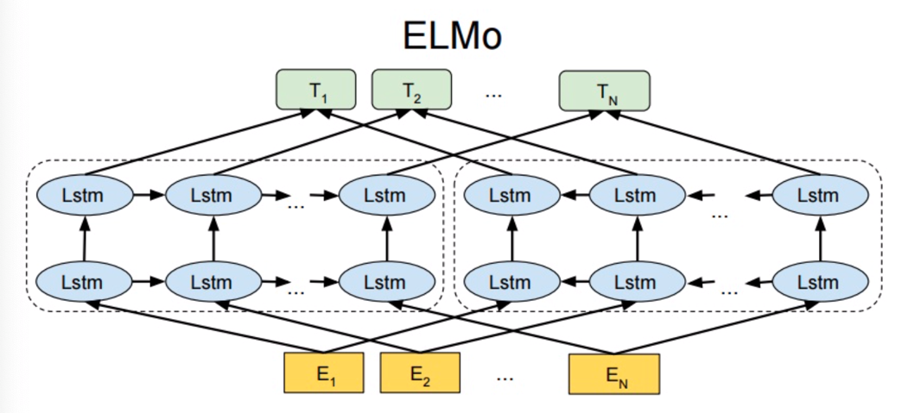

1. **底层 Embedding 模块**（黄色标记）—— 生成静态词向量（字符级 CNN）
2. **中间层双向双层 LSTM 模块**（蓝色标记）—— 提取上下文特征
3. **最上层词向量表征模块**（绿色标记）—— 合成最终词向量

---

#### 2.2.1 Embedding 模块

ELMo 的底层嵌入采用**字符级卷积神经网络（CharCNN）**，而非传统的词级嵌入。这样做的优点：

- 可以有效处理**未登录词**（OOV），通过字符组合推断语义。
- 能够利用词形态学信息（如词缀、词根），对形态丰富的语言（如土耳其语、德语）尤其有效。

**过程**：

- 每个字符被映射为字符嵌入。
- 对单词中的所有字符嵌入进行 CNN 卷积和池化，得到一个固定维度的**静态词向量**（与上下文无关）。
- 该静态向量作为后续双向 LSTM 的输入。

**代码概念示例**（伪代码）：

```python
# 字符级CNN生成词嵌入
char_embeddings = CharCNN(word)  # 输出 shape: (batch, seq_len, char_hidden)
static_word_emb = ProjectionLayer(char_embeddings)  # 映射到d_model维度
```

---

#### 2.2.2 双向双层 LSTM 模块

ELMo 的核心特征提取器是**双向双层 LSTM**（而非 Transformer）。

**结构详解**：

- **前向 LSTM**：从左到右读取序列，生成每个位置的隐藏状态 $\overrightarrow{h}_t$。
- **后向 LSTM**：从右到左读取序列，生成每个位置的隐藏状态 $\overleftarrow{h}_t$。
- **双层**：LSTM 堆叠两层（原论文使用 2 层），第一层的输出作为第二层的输入。

对于单词“爱”在句子“我爱中国”中，ELMo 会生成：

- 静态词向量：1 个（来自 CharCNN）
- 前向 LSTM 第一层、第二层：2 个隐藏状态
- 后向 LSTM 第一层、第二层：2 个隐藏状态
- **总共 5 个词向量表示**（静态 + 2 层前向 + 2 层后向）

**数学表示**：

对于每个时间步 $t$，ELMo 计算：

$$
\overrightarrow{h}_{t,1}, \overrightarrow{h}_{t,2} = \text{ForwardLSTM}(x_t, \overrightarrow{h}_{t-1})
$$

$$
\overleftarrow{h}_{t,1}, \overleftarrow{h}_{t,2} = \text{BackwardLSTM}(x_t, \overleftarrow{h}_{t+1})
$$

---

#### 2.2.3 词向量表征模块（合成最终词向量）

ELMo 的最终词向量是**各层表示的加权组合**。对于第 $k$ 层（包括静态嵌入层、前向 LSTM 各层、后向 LSTM 各层），学习一个任务相关的权重 $s_k$，并可能按任务缩放：

$$
\text{ELMo}_t = \gamma \sum_{k=0}^{L} s_k \cdot h_{t,k}
$$

其中 $L$ 是层数（原论文 L=2 层 LSTM，但包含静态嵌入，共 5 个表示），$\gamma$ 是任务相关的缩放因子，$s_k$ 是 softmax 归一化后的权重（不同任务可以学习不同的权重）。

**意义**：不同的下游任务可能更关注不同层的信息（例如词性标注更依赖底层，而语义理解更依赖高层），ELMo 允许任务自适应地加权融合。

---

#### 2.2.4 以“我爱中国”为例生成“爱”的词向量

```python
输入单词序列: 我, 爱, 中国, 啊

对于“爱”这个位置 t=2：

1. 静态词向量: v0 = CharCNN("爱")   [维度d1]
2. 前向LSTM第1层: h_forward1 = LSTM1(v0, 上一时刻隐藏)
3. 前向LSTM第2层: h_forward2 = LSTM2(h_forward1)
4. 后向LSTM第1层: h_backward1 = LSTM1(v0, 下一时刻隐藏)
5. 后向LSTM第2层: h_backward2 = LSTM2(h_backward1)

最终词向量: ELMo("爱") = γ * (s0*v0 + s1*h_forward1 + s2*h_forward2 + s3*h_backward1 + s4*h_backward2)
```

---

### 2.3 ELMo 的预训练任务

ELMo 的预训练任务本质上是**双向语言模型**（biLM）。与传统单向语言模型不同，ELMo 最大化前向和后向语言模型的对数似然之和。

---

#### 2.3.1 前向语言模型

给定序列 $(t_1, t_2, ..., t_N)$，前向 LM 预测第 $t$ 个词的概率，基于之前的词：

$$
P(t_1, t_2, ..., t_N) = \prod_{k=1}^{N} P(t_k | t_1, ..., t_{k-1})
$$

---

#### 2.3.2 后向语言模型

后向 LM 从右到左，基于后面的词预测当前词：

$$
P(t_1, t_2, ..., t_N) = \prod_{k=1}^{N} P(t_k | t_{k+1}, ..., t_N)
$$

---

#### 2.3.3 联合训练目标

ELMo 的损失函数是前向和后向 LM 损失的**和**（独立优化）：

$$
\mathcal{L} = \mathcal{L}_{\text{forward}} + \mathcal{L}_{\text{backward}} = -\sum_{k=1}^{N} \left( \log P(t_k | t_1, ..., t_{k-1}) + \log P(t_k | t_{k+1}, ..., t_N) \right)
$$

**注意**：两个方向的 LSTM **没有参数共享**，各自独立训练。这就是为什么 ELMo 的特征融合只是“拼接”而非“深度双向”。

---

#### 2.3.4 预训练数据

ELMo 在大规模语料上预训练，包括：

- 英文维基百科（约 8 亿词）
- 其他文本语料（如新闻、书籍）

---

### 2.4 ELMo 的模型效果与改进点

#### 2.4.1 模型效果

ELMo 在提出时，在 6 个 NLP 任务上取得了显著提升：

- **问答**（SQuAD）
- **情感分析**（SST-5）
- **命名实体识别**（CoNLL-2003）
- **语义角色标注**（OntoNotes）
- **指代消解**（CoNLL-2012）
- **文本分类**（TREC）

ELMo 证明了**上下文词向量**的有效性，为后续 BERT 的成功铺平了道路。

---

#### 2.4.2 待改进点

ELMo 虽然具有历史意义，但存在两个主要缺点：

| 缺点 | 说明 |
| --- | --- |
| **特征提取器较弱** | 使用 **LSTM** 而非 Transformer。LSTM 串行计算、长距离依赖弱于 Transformer。如果 ELMo 当时使用了 Transformer，BERT 的影响力可能会被削弱。 |
| **融合方式不充分** | 前向和后向的特征只是**拼接**（concatenation），而非深度融合。相比之下，BERT 的 Transformer Encoder 中每个位置能同时看到左右所有信息，实现真正的双向融合。 |

---

### 2.5 ELMo 的使用方式（下游任务集成）

使用 ELMo 进行下游任务时，通常有两种方式：

1. **冻结特征**：预训练好的 ELMo 作为特征提取器，其参数固定，只训练下游任务的参数。输入句子，ELMo 输出每个词的动态向量，然后送入下游模型。
2. **微调**：将 ELMo 的权重作为初始化，在下游任务上进行小幅度微调（一般学习率较小）。

由于 LSTM 参数量相对较小，ELMo 可以在中等规模硬件上运行。

**代码示例（使用 AllenNLP 库的 ELMo）**：

```python
from allennlp.modules.elmo import Elmo, batch_to_ids

# ELMo的配置文件
options_file = "elmo_2x4096_512_2048cnn_2xhighway_options.json"
weight_file = "elmo_2x4096_512_2048cnn_2xhighway_weights.hdf5"

# 创建ELMo层
elmo = Elmo(options_file, weight_file, num_output_representations=1, dropout=0.5)

# 示例句子
sentences = [["I", "love", "you", "."], ["ELMo", "is", "great", "."]]
character_ids = batch_to_ids(sentences)

# 前向传播
embeddings = elmo(character_ids)  # 返回 (batch, seq_len, d_model)
```

---

### 2.6 ELMo 与 BERT 的对比总结

| 对比维度 | ELMo | BERT |
| --- | --- | --- |
| **提出时间** | 2018 年 3 月 | 2018 年 10 月 |
| **基础架构** | 双向双层 LSTM | Transformer Encoder（多层） |
| **特征提取能力** | 较弱（LSTM 串行、长距离弱） | 强（自注意力、并行、长距离强） |
| **双向方式** | 前向和后向分别训练，然后**拼接** | 深度**双向融合**（同一个 Transformer 同时看左右） |
| **预训练任务** | 双向语言模型（前向+后向 LM） | MLM + NSP |
| **词向量特点** | 动态（上下文相关） | 动态且更深双向 |
| **适用任务** | 可做各种 NLU，但效果通常不如 BERT | NLU 任务 SOTA |
| **参数量** | 较小（约 94M） | 较大（base 110M，large 340M） |

---

### 2.7 ELMo 常见问题与面试题

**Q1：ELMo 的全称是什么？它解决了什么问题？**  
A：Embeddings from Language Models。解决了静态词向量无法处理一词多义的问题，提供上下文相关的动态词向量。

**Q2：ELMo 使用什么架构提取特征？与 BERT 有何不同？**  
A：ELMo 使用双向双层 LSTM，前向和后向分开训练再拼接。BERT 使用 Transformer Encoder，实现真正的深度双向融合。

**Q3：ELMo 的输入嵌入是什么？为什么用字符级 CNN？**  
A：字符级 CNN。优点：处理未登录词，利用词形态信息。

**Q4：ELMo 的损失函数是什么？**  
A：前向语言模型损失 + 后向语言模型损失（独立相加）。

**Q5：ELMo 如何生成最终的词向量？**  
A：各层（静态嵌入、前向 LSTM 各层、后向 LSTM 各层）加权求和，权重是任务相关可学习的。

**Q6：ELMo 的主要缺点是什么？**  
A：1. 特征提取器 LSTM 弱于 Transformer；2. 双向只是拼接而非深度融合。

---

### 第二部分总结速查表

| 概念 | 内容 |
| --- | --- |
| **全称** | Embeddings from Language Models |
| **提出** | 华盛顿大学，2018 年 3 月 |
| **架构** | 双向双层 LSTM（前向+后向分别训练） |
| **输入表示** | 字符级 CNN（静态嵌入） |
| **预训练任务** | 前向语言模型 + 后向语言模型（损失相加） |
| **词向量生成** | 各层表示加权求和（权重任务相关） |
| **优点** | 动态词向量，解决一词多义 |
| **缺点** | LSTM 较弱，双向拼接而非深度融合 |
| **历史地位** | 第一个上下文相关词向量模型，为 BERT 开路 |

---

## 第三部分：GPT 模型详解

### 3.1 GPT 背景与简介

#### 3.1.1 GPT 的诞生

**GPT**（Generative Pre-Training，生成式预训练）由 **OpenAI** 公司提出。第一代 GPT 模型发表于 2018 年上半年（早于 BERT 的 2018 年 10 月），论文题目《Improving Language Understanding by Generative Pre-Training》。

后续发展：

- **GPT-2**（2019 年）：《Language Models are Unsupervised Multitask Learners》，更大模型、更大数据。
- **GPT-3**（2020 年）：《Language Models are Few-Shot Learners》，1750 亿参数，开启大语言模型时代。

---

#### 3.1.2 GPT 与 BERT 的核心区别

| 对比维度 | **GPT** | **BERT** |
| --- | --- | --- |
| **基础架构** | Transformer **Decoder**（仅解码器） | Transformer **Encoder**（仅编码器） |
| **注意力掩码** | 因果掩码（causal mask，即 look-ahead mask），只能看到左侧（过去）的 token | 无掩码（除 padding 外），双向看见所有 |
| **预训练任务** | 传统自回归语言模型：根据上文预测下一个词 | MLM（完形填空）+ NSP |
| **擅长任务** | **自然语言生成（NLG）**：文本生成、故事续写、对话等 | **自然语言理解（NLU）**：分类、问答、序列标注等 |
| **特征提取方向** | 单向（从左到右） | 双向 |

---

#### 3.1.3 GPT 的设计理念

GPT 的设计目标是**生成式**，即给定一个起始提示（prompt），模型能够逐词生成连贯的后续文本。这要求模型在预测每个新词时，不能“作弊”看到未来词，因此必须使用**因果掩码**的自注意力。

尽管 GPT-1 的参数规模和效果当时不如 BERT，但其后续版本（GPT-2、GPT-3、GPT-4）通过扩大数据和模型规模，展现了惊人的生成能力和零样本/少样本学习能力，成为生成式 AI 的基石。

---

### 3.2 GPT 模型架构

#### 3.2.1 与标准 Transformer Decoder 的区别

GPT 采用了 Transformer 的 **Decoder 部分**，但与原始 Transformer 中的解码器相比有两处主要修改：

1. **去掉了第二个注意力子层（编码器-解码器交叉注意力）**：因为 GPT 不使用编码器，只进行自回归生成，无需从外部编码器获取信息。
2. **堆叠更多层**：原始 Transformer 解码器为 6 层，GPT-1 使用了 12 层（small）或 12 层（base），GPT-2 和 GPT-3 使用更多层（如 48 层）。

所以 GPT 的每个“Decoder Block”实际包含：

- **掩码多头自注意力**（带因果掩码，防止看到未来）
- **前馈全连接网络（FFN）**
- 每个子层后有残差连接和层归一化

**结构图示**（文本与图片描述）：

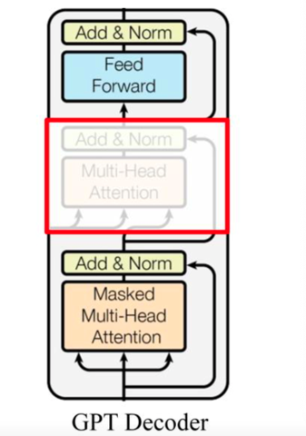

```python
输入（token序列） → Token Embedding + Position Embedding
       ↓
   [Masked Multi-Head Self-Attention]  ← 因果掩码（只能看到左侧）
       ↓
       残差连接 + 层归一化
       ↓
   [Feed-Forward Network]
       ↓
       残差连接 + 层归一化
       ↓
      （重复 N 次，N=12 for GPT-1 base）
       ↓
       输出 → 线性层 + Softmax → 下一个词的概率分布
```

---

#### 3.2.2 因果掩码（Causal Mask）的作用

在 GPT 的自注意力中，对于序列中的位置 `i`，只允许它关注位置 `j ≤ i`（即自身及之前的词）。这通过一个**上三角掩码矩阵**实现：将未来位置的注意力分数设为 `-inf`，经过 Softmax 后权重为 0。

**对比图**（左：无掩码自注意力，可看到右侧；右：带掩码，只能看到左侧）：

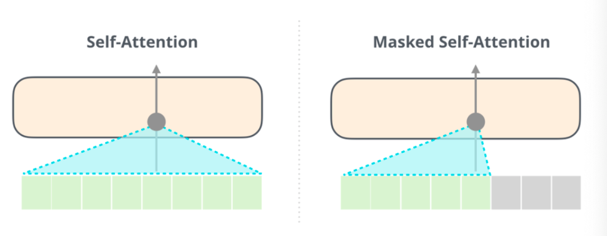

- 无掩码时，`i` 可以关注 `j > i`（未来）。
- 带掩码时，`i` 只能关注 `j <= i`（过去和当前）。

这使得 GPT 在预测下一个词时，只能基于已生成的文本，符合自回归生成的要求。

---

#### 3.2.3 位置编码

GPT 使用**可学习的位置编码**（与 BERT 相同），而非原始 Transformer 的正弦函数。每个位置（0~ 最大序列长度）有一个可训练的嵌入向量，与 token 嵌入相加。

---

### 3.3 GPT 的数据处理流程（以 GPT-2 为例）

GPT 模型处理文本的完整流程分为**三个阶段**：数据输入前、模型处理中、模型输出后。

---

#### 3.3.1 阶段 1：数据送入 GPT 模型前 —— 文本张量化

原始文本（如一段话）需要转换为模型可处理的张量：

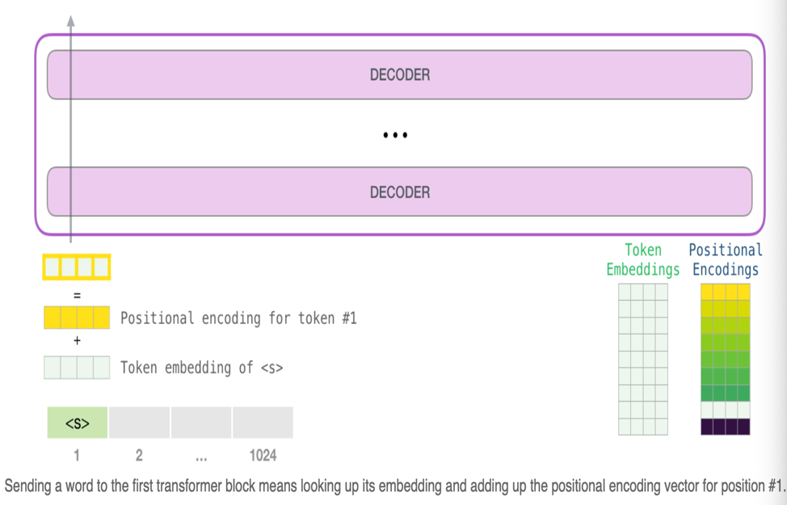

1. **文本 → 数值化**：使用分词器（如 Byte Pair Encoding，BPE）将文本切分为子词 token，每个 token 映射为整数索引。
2. **数值化 → 词向量**：通过可学习的嵌入矩阵 `E`（形状 `vocab_size × d_model`）查表，得到每个 token 的初始向量。
3. **添加位置编码**：将 token 嵌入与对应位置的位置嵌入相加，形成最终输入张量 `(batch, seq_len, d_model)`。
4. 将加和后的张量输入 GPT 模型。

**示例代码**（概念）：

```python
# 假设 token_ids = [101, 452, 1032, ...]  # 已数值化
token_emb = embedding_matrix[token_ids]     # (seq_len, d_model)
pos_emb = position_embeddings[range(seq_len)]  # (seq_len, d_model)
input_tensor = token_emb + pos_emb
```

---

#### 3.3.2 阶段 2：数据在 GPT 模型内的流程

输入张量依次经过 **N 个解码器模块**（GPT-1 为 12 层，GPT-2 为 12/24/36 层，GPT-3 为 96 层）。每个模块内部：

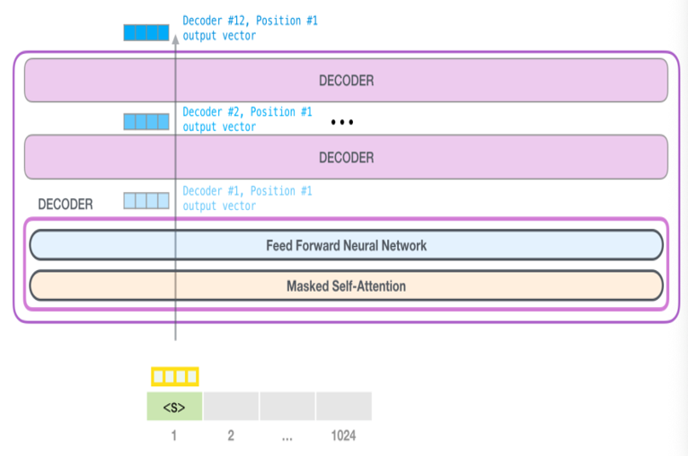

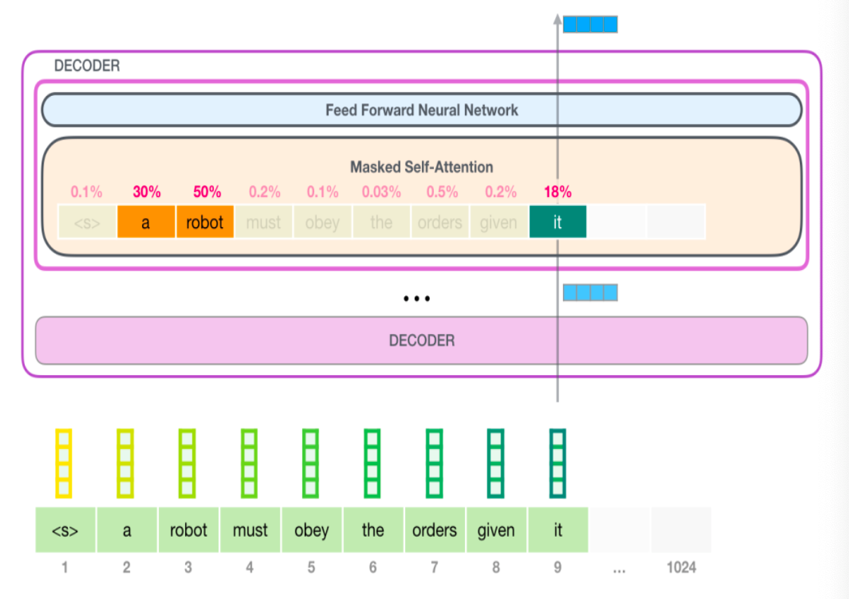

1. **掩码自注意力层**：
   - 计算每个单词与其他单词（仅过去及自身）的注意力权重： $attention_{weights} = softmax(Q * K^T / sqrt(d_k) + mask)$
   - 计算加权输出： $attention_{output} = attention_{weights} * V$
   - 每个层维护自己的权重矩阵（Q、K、V 的投影矩阵）。

1. **前馈网络层**：两层全连接，中间用 GELU 激活（GPT 使用 GELU 而非 ReLU）。

2. **残差连接和层归一化**：每个子层输出后都进行 `x + sublayer(LayerNorm(x))` （Pre-LN 风格，训练更稳定）。

最终，最后一个解码器模块输出一个张量 `(batch, seq_len, d_model)`，其中每个位置的向量包含了该位置及其之前所有位置的信息。

---

#### 3.3.3 阶段 3：GPT 模型的输出 —— 生成下一个词

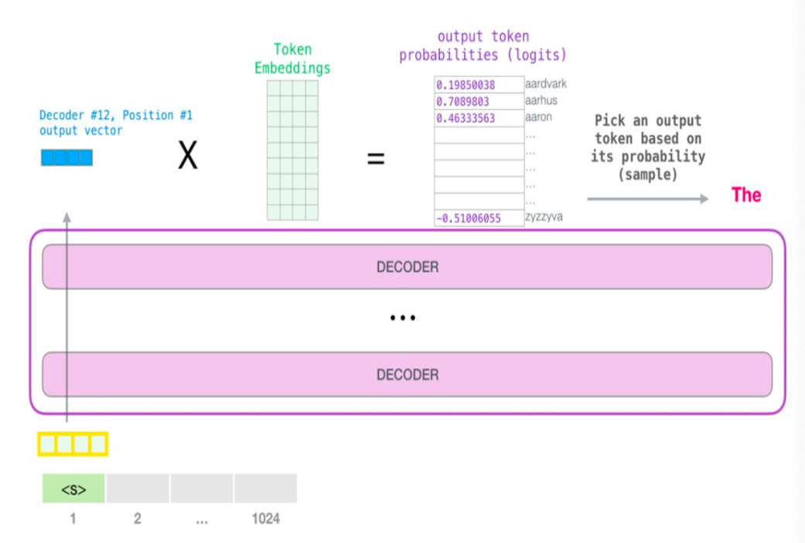

1. **词向量映射到词汇表概率**：
   - 取最后一个位置的输出向量（表示当前序列的上下文），形状 $(d_model,)$。
   - 与词向量矩阵 `E`（形状 `vocab_size × d_model`）做矩阵乘法（或使用独立的输出投影层）：

$$
\text{logits} = E \cdot h_{\text{last}} \quad (\text{形状 } vocab\_size)
$$

  - 可选：只保留概率最高的 top-k（如 40 个）单词，避免全词汇表计算。

2. **选择输出单词**：
   - 对 logits 进行 Softmax 得到概率分布。
   - 采样或贪心选择概率最高的单词索引（或使用 top-k/top-p 采样）。

3. **反查单词**：根据索引从词汇表中得到人类可读的单词。

4. **生成结束条件**：
   - 序列长度达到最大限制（如 1024）。
   - 生成了结束符 `[EOS]`（或 `<|endoftext|>`）。

**自回归循环**：每次生成一个词后，将其追加到输入序列末尾，重复上述过程。

---

### 3.4 GPT 的自回归生成细节

GPT 生成文本时，采用**自回归 (autoregressive)** 方式。以生成句子“The thing”为例：

**步骤 1**：输入起始 token `[SOS]`（有的实现用 `[CLS]` 或直接给第一个词的部分）。模型只看到 `[SOS]`，预测第一个词。输出概率最高的词可能是“The”。

**步骤 2**：输入 `[SOS] The`，模型看到这两个词，预测下一个词。注意：在注意力计算中，`[SOS]` 和 `The` 可以互相看见，但都看不到未来的（因为未来还没生成）。预测出“thing”。

**步骤 3**：输入 `[SOS] The thing`，预测下一个词，以此类推。

**关键特性**：

- 每个新词的生成**依赖之前的所有词**，但模型不会因为新词而重新解释之前已经生成的词（之前词的表示是固定的，尽管在每层自注意力中会相互作用）。
- 这种自回归特性使 GPT 能生成长篇连贯文本，但也导致**生成速度慢**（串行）和**无法回头修改**。

---

### 3.5 GPT 的预训练与微调

#### 3.5.1 预训练阶段

GPT 的预训练是标准的**自回归语言建模**：在大规模无监督文本语料上，最大化给定前文时下一个词的似然。

**训练目标**：

$$
\mathcal{L} = -\sum_{i=1}^{N} \log P(w_i | w_1, ..., w_{i-1})
$$

**数据集**：

- GPT-1：BookCorpus（约 8000 本书，未标注文本）
- GPT-2：WebText（从 Reddit 抓取的优质外链，约 40GB）
- GPT-3：Common Crawl、WebText2、Books1/2、Wikipedia 等（约 45TB 原始数据，过滤后 570GB）

---

#### 3.5.2 微调阶段

对于下游任务（如分类、问答），GPT 可以微调。微调时会在输入序列后添加一个特殊的结束符或任务标记，并将最后一个位置的输出送入一个任务相关的线性层。

然而，GPT-2 和 GPT-3 强调**零样本（zero-shot）**和**少样本（few-shot）**能力：通过设计适当的提示（prompt），模型可以不经过梯度更新直接完成任务。例如：

- 翻译任务：输入“英语：I love you\n 法语：”，模型直接输出“Je t'aime”。
- 摘要任务：输入“文章：[文章内容]\n 摘要：”，模型输出摘要。

这得益于大规模预训练使得模型学会了遵循模式。

---

### 3.6 GPT 与 BERT、ELMo 的全面对比

| 对比维度 | **ELMo** | **GPT** | **BERT** |
| --- | --- | --- | --- |
| **提出时间** | 2018 年 3 月 | 2018 年上半年 | 2018 年 10 月 |
| **基础架构** | 双向 LSTM | Transformer Decoder（掩码自注意力） | Transformer Encoder |
| **特征提取方向** | 前向+后向（独立训练，拼接） | 单向（从左到右） | 深度双向 |
| **预训练任务** | 前向 LM + 后向 LM | 自回归 LM（预测下一个词） | MLM + NSP |
| **是否自回归** | 否（可并行提取特征） | **是**（生成时串行） | 否 |
| **擅长任务** | 上下文词向量，适用于多种任务但效果弱于 BERT | 自然语言生成（文本生成、对话、补全） | 自然语言理解（分类、QA、序列标注） |
| **参数量（base）** | 约 94M | GPT-1 117M；GPT-2 1.5B；GPT-3 175B | 110M (base) / 340M (large) |
| **优势** | 首次实现动态词向量 | 强大的生成能力，零样本学习 | NLU 任务 SOTA，双向融合彻底 |
| **劣势** | LSTM 弱，融合简单 | 单向，无法利用未来信息 | 不适合生成，预训练-微调有差异 |

---

### 3.7 三者优缺点总结

#### ELMo

- **优点**：上下文动态词向量，解决多义词；字符级 CNN 处理 OOV；模型轻量。
- **缺点**：LSTM 特征提取弱；双向只是拼接；效果被 BERT 全面超越。

#### GPT

- **优点**：生成能力强，适合对话、续写、代码生成等；自回归语言模型训练简单高效；通过提示工程实现零样本/少样本学习。
- **缺点**：单向，不能利用下文信息，在需要完整理解上下文的任务（如情感分类）上弱于 BERT；生成速度慢。

#### BERT

- **优点**：深度双向，对语义理解最充分；统一架构适应多种 NLU 任务；预训练效果好。
- **缺点**：不适合生成任务；预训练中 `[MASK]` 的引入导致微调不一致；模型较大，推理成本高。

---

### 3.8 GPT 常见问题与面试题

**Q1：GPT 的全称是什么？它的核心设计理念是什么？**  
A：Generative Pre-Training。核心是使用单向 Transformer 解码器进行自回归语言模型预训练，擅长生成任务。

**Q2：GPT 和原始 Transformer Decoder 有何不同？**  
A：GPT 去掉了编码器-解码器交叉注意力子层，只保留掩码自注意力和前馈网络。

**Q3：什么是因果掩码（causal mask）？为什么需要它？**  
A：因果掩码是一个上三角矩阵，将未来位置的注意力分数设为 `-inf`，使得模型在预测第 i 个词时只能看到前 i-1 个词。这是自回归生成的需要。

**Q4：GPT 的输入包含哪几种嵌入？**  
A：Token Embedding（词嵌入）+ Position Embedding（可学习位置编码）。没有 Segment Embedding（因为不处理句子对）。

**Q5：GPT-1/BERT/ELMo 的历史顺序是怎样的？**  
A：ELMo（2018.03）→ GPT-1（2018 年上半年）→ BERT（2018.10）。BERT 是对前两者的改进。

**Q6：为什么 GPT 适合生成任务而 BERT 不适合？**  
A：GPT 是自回归模型，每次生成一个词并作为下一轮的输入，天然适配文本生成。BERT 没有自回归设计，只能一次性输出整个序列（如分类标签），不适合逐词生成。

**Q7：如何用 GPT 做分类任务？**  
A：在输入序列后添加目标词或特殊标记，取对应位置的输出进行微调。例如情感分类：输入“这部电影很棒，情感：”，让 GPT 生成“积极”或“消极”的词，然后基于生成词判断。

**Q8：GPT-3 的参数量是多少？为什么它能够进行少样本学习？**  
A：GPT-3 有 1750 亿参数。巨大的模型规模使得它能够在预训练阶段接触到大量模式，从而通过提示（prompt）和上下文示例（in-context examples）泛化到新任务，无需梯度更新。

---

### 第三部分总结速查表

| 概念 | 内容 |
| --- | --- |
| **全称** | Generative Pre-Training |
| **提出** | OpenAI，2018 年上半年（GPT-1） |
| **架构** | Transformer Decoder（多层掩码自注意力 + FFN），无交叉注意力 |
| **注意力掩码** | 因果掩码（只能看到过去和当前） |
| **预训练任务** | 自回归语言模型（预测下一个词） |
| **输入表示** | Token Embedding + 可学习 Position Embedding |
| **生成方式** | 自回归（逐词串行生成） |
| **擅长任务** | 文本生成、对话、摘要、代码生成（NLG） |
| **不擅长** | 需要深度双向理解的任务（NLU），如细粒度分类 |
| **后续发展** | GPT-2（2019，1.5B）、GPT-3（2020，175B）、GPT-4（2023） |

---

## 第四部分：BERT、ELMo、GPT 综合对比总结表

| 维度 | ELMo | GPT | BERT |
| --- | --- | --- | --- |
| **基础单元** | LSTM | Transformer Decoder | Transformer Encoder |
| **双向性** | 独立训练前向+后向，拼接 | 单向（从左到右） | 深度双向（同时看左右） |
| **预训练任务** | 双向语言模型（前向+后向 LM） | 自回归语言模型 | MLM + NSP |
| **词向量/表示** | 动态（加权融合各层） | 动态（但单向） | 动态（深度双向） |
| **参数量（典型）** | 94M | 117M ~ 175B | 110M ~ 340M |
| **适用领域** | 通用（但被超越） | **生成** | **理解** |
| **下游微调方式** | 添加特征或微调 | 序列末尾预测或自回归 | 输出层替换 |
| **处理一词多义** | 能 | 能（单向） | 能（双向） |
| **OOV 处理** | 字符级 CNN | BPE 子词 | WordPiece 子词 |
| **最大序列长度** | 通常数百 | 1024 (GPT-2/3) | 512 |
| **影响** | 首开动态词向量先河 | 引领生成式 AI 革命 | 引领预训练+微调范式 |

---
