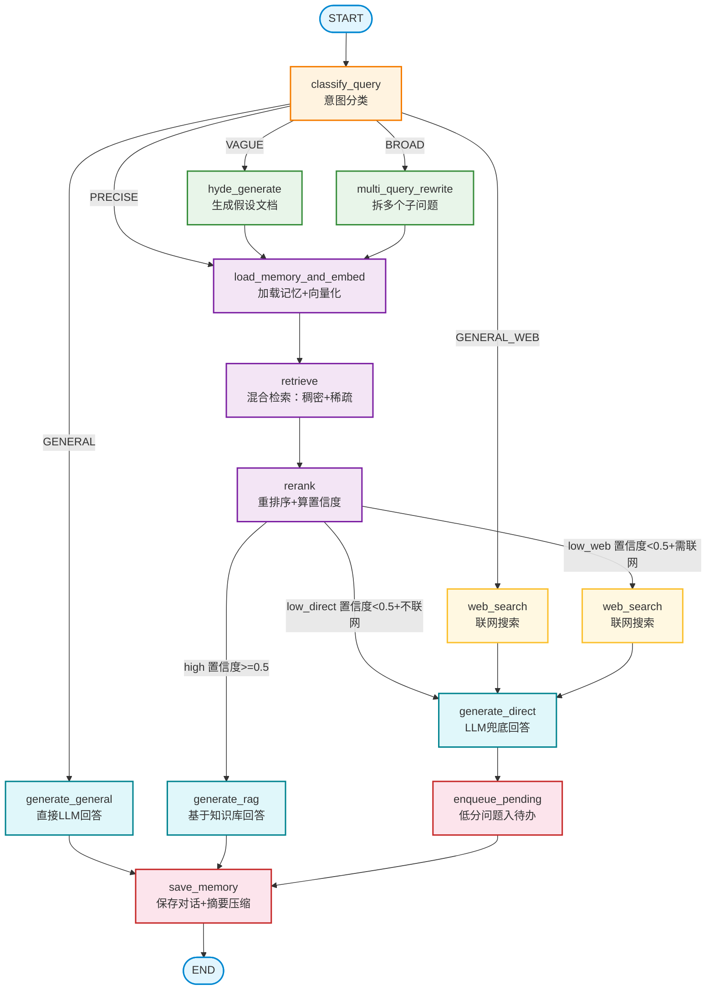

# 第五章 RAG 问答系统 学习笔记

## 目录

- [5.1 RAG全景与架构](#51-rag全景与架构)
- [5.2 文档读取](#52-文档读取)
- [5.3 智能分块](#53-智能分块)
- [5.4 BGE-M3嵌入](#54-bge-m3嵌入)
- [5.5 Milvus初始化与知识库写入](#55-milvus初始化与知识库写入)
- [5.6 Hybrid召回与WeightedRanker](#56-hybrid召回与weightedranker)
- [5.7 Reranker](#57-reranker)
- [5.8 意图分类器](#58-意图分类器)
- [5.9 记忆管理](#59-记忆管理)
- [5.10 MCP工具](#510-mcp工具)
- [5.11 State与Prompts](#511-state与prompts)
- [5.12 节点①：分类、HyDE、Multi-Query](#512-节点分类hyde-multi-query)
- [5.13 节点②：检索与精排](#513-节点检索与精排)
- [5.14 节点③：生成、Web兜底、存记忆](#514-节点生成web兜底存记忆)
- [5.15 图装配](#515-图装配)
- [5.16 HTTP接口](#516-http接口)
- [面试题汇总](#面试题汇总)

---

## 5.1 RAG 全景与架构

### 5.1.1 RAG 是什么，为什么需要

大模型有三个天生的局限：

1. **会编（幻觉）**：模型可能编造不存在的事实，回答看起来像真但其实在胡诌。
2. **不知道新东西（知识截止）**：模型训练数据有截止日期，之后的知识它不知道。
3. **不知道你的私有内容**：比如课程内部讲义、公司内部文档等，模型从未见过。

**RAG（Retrieval-Augmented Generation，检索增强生成）** 的思路是：先去知识库里检索相关内容，再把这些内容连同问题一起交给 LLM，让它"看着资料回答"。这样回答有据可依、可溯源，也能覆盖私有知识。

RAG 天然分成两个阶段：

- **阶段一：离线建库**（事先做好，把知识灌进向量库）

  ```python
  课程文档(PDF/Word) → 切成小块(chunk) → 每块算成向量(嵌入) → 存入向量库(Milvus)
  ```

- **阶段二：在线查询**（学员每次提问时实时发生）

  ```python
  学员提问 → 问题算成向量 → 去向量库检索最相关的块 → 重排 → 交给LLM生成回答
  ```

**一句话记忆**：先把书放进书架（建库），才能查书（查询）。本章前半部分（5.2-5.10）做"建库"，后半部分（5.11 起）做"查询"。

### 5.1.2 在线查询的完整流程图

这是项目中"最复杂的 Agent"，它不再是一条直线，而是有意图分流、查询改写、混合检索、重排序、置信度路由、Web 兜底、多轮记忆。以下是完整的 12 节点流程图：



本质上是"判断问题类型 → 按类型选检索策略 → 检索 → 按置信度选怎么回答 → 存记忆"这条思路的展开。

### 5.1.3 对比第四章：从直线到分支+记忆

| 特性 | 第四章简历 Agent | 本章问答 Agent |
|------|----------------|---------------|
| 流程形态 | 一条直线 | **带分支**（按问题类型、按置信度走不同路径） |
| 分支实现 | 无 | **条件边** `add_conditional_edges` |
| 多轮记忆 | 不需要（一次性任务） | **需要**（连续问答要记得上文） |
| 记忆实现 | 无 checkpointer | **挂 checkpointer**（`MemorySaver`） |
| 节点数量 | 8 个 | 12 个 |
| 依赖模型 | DeepSeek API（1 个） | DeepSeek API + 3 个进程内本地模型 |

第四章掌握了"搭直线图"，本章将掌握"搭带分支和记忆的图"——这才是 LangGraph 真正的威力所在。

### 5.1.4 本章会用到的 7 项 RAG 关键技术

1. **意图分类**：先判断问题是"闲聊/通用"还是"课程专业问题"，通用问题直接答、不浪费检索
2. **HyDE（假设文档）**：问题太模糊时，先让 LLM 生成一段"假设的答案文档"，用它去检索，召回更准
3. **Multi-Query（多查询改写）**：问题太宽泛时，拆成几个具体子问题分别检索，扩大召回
4. **稠密+稀疏混合检索**：BGE-M3 同时产出"语义向量（稠密）"和"关键词向量（稀疏）"，两路检索再融合（RRF），兼顾语义和关键词
5. **重排序（Reranker）**：召回的候选用更精的模型重新打分排序，把最相关的顶上来
6. **置信度路由+Web 兜底**：检索结果够好就基于知识库答；不够好就联网搜索或让 LLM 直答
7. **多轮记忆+摘要压缩**：记住对话历史；太长了就压缩成摘要，省 token

### 5.1.5 本章规划

本章严格按 RAG 的数据流推进——先建库，再查询。

**第一部分：离线建库（阶段一）**

| 节 | 在做什么 | 对应文件 |
|----|---------|---------|
| 5.2 | 读 PDF/Word/Markdown 文档 | `scripts/build_knowledge_base.py`（解析部分） |
| 5.3 | 智能分块（滑动窗口+代码块不拆） | `scripts/build_knowledge_base.py`（分块部分） |
| 5.4 | 用 BGE-M3 把块算成稠密+稀疏双向量 | `backend/core/knowledge_base.py`（嵌入器） |
| 5.5 | 建 Milvus Collection 并写入向量 | `scripts/init_milvus.py` + `build_knowledge_base.py` |

**第二部分：检索基础设施（阶段二的工具层）**

| 节 | 在做什么 | 对应文件 |
|----|---------|---------|
| 5.6 | Hybrid 召回+RRF 融合 | `backend/core/knowledge_base.py`（检索客户端） |
| 5.7 | 重排序 | `backend/core/reranker.py` |
| 5.8 | 意图分类 | `backend/core/query_classifier.py` |
| 5.9 | 记忆管理 | `backend/core/memory.py` |
| 5.10 | MCP 工具 | `backend/mcp/{kb_server,web_search_server,client}.py` |

**第三部分：组装 QA Agent（阶段二的图）**

| 节 | 在做什么 | 对应文件 |
|----|---------|---------|
| 5.11 | State 定义与提示词 | `backend/agents/qa/{state,prompts}.py` |
| 5.12 | 节点①：分类、HyDE、Multi-Query | `backend/agents/qa/nodes.py`（部分） |
| 5.13 | 节点②：加载记忆+向量化、检索、精排 | `backend/agents/qa/nodes.py`（部分） |
| 5.14 | 节点③：生成、Web 兜底、存记忆 | `backend/agents/qa/nodes.py`（完整） |
| 5.15 | 把节点装配成图（条件边+checkpointer） | `backend/agents/qa/graph.py` |
| 5.16 | HTTP 接口（chat+SSE 流式+历史） | `backend/api/v1/qa.py` |

### 章节总结

- RAG 是什么：先检索知识库、再让 LLM"看着资料回答"，解决幻觉/知识截止/私有知识三大局限
- 两个阶段：离线建库（文档→分块→嵌入→存库）+ 在线查询（提问→检索→重排→生成）
- 完整流程图：12 节点+3 个条件分支+记忆，本章逐个方框实现
- 相比第四章：从直线图跃迁到"条件边分支+checkpointer 记忆"的图
- 7 项关键技术：意图分类、HyDE、Multi-Query、混合检索、重排序、置信度路由、多轮记忆

### 面试题（5.1）

1. RAG 是什么？它解决了大模型的哪三个局限？
2. RAG 的两个阶段分别是什么？每个阶段各做什么事？
3. 在线查询的完整流程图中，classify_query 节点之后有几条分支？分别是什么？
4. 为什么本章的问答 Agent 比第四章的简历 Agent 复杂？体现在哪些方面？
5. 本章用到了哪 7 项 RAG 关键技术？各自解决什么问题？
6. 本章要创建的文件有哪些？可以分成哪三部分？

---

## 5.2 文档读取

### 5.2.1 LangChain Document 是什么

在 LangChain 体系里，所有文档内容都用一个统一的数据结构表示：

```python
from langchain_core.documents import Document

doc = Document(
    page_content="这是文档的文本内容",   # 主体文字，后续会被切分、嵌入
    metadata={                           # 附加信息，检索时随内容一起返回
        "source": "Java讲义第3章.pdf",
        "page":   2,
    }
)
```

Document 只有两个字段：

| 字段 | 类型 | 作用 |
|------|------|------|
| `page_content` | `str` | 文本内容，切分/嵌入/存入 Milvus 的核心 |
| `metadata` | `dict` | 来源标注，检索后返回给用户，告诉学员"答案来自哪篇文档哪一页" |

不同的 Loader 返回的都是 `list[Document]`，这就是 LangChain 的统一抽象——不管你加载的是 PDF、Markdown 还是网页，后续分块器拿到的格式永远一样。

### 5.2.2 为什么只支持 PDF 和 Markdown

| 格式 | 理由 |
|------|------|
| **PDF** | 课程讲义最常见的交付格式，绝大多数正文内容可直接提取文字 |
| **Markdown** | 现代知识库的主流格式（技术文档、笔记、Wiki 几乎都是 MD），结构化强，分块效果远好于 PDF |

**Word (.docx)为什么不支持**：Word 文档结构复杂（样式表、嵌套表格、OLE 对象），解析库兼容性差。实际工程中通常先把 Word 另存为 PDF 或导出 Markdown，再入库。

**PDF 的局限**：PyPDFLoader 只能提取 PDF 中的可选择文字（即文字层）。扫描件、以图片嵌入的表格、数学公式截图——这些内容无法用普通文本提取获取。

### 5.2.3 行业趋势：为什么优先选 Markdown

**直接切 PDF 的问题**：PDF 只有"页"的概念，没有语义结构。一段完整的知识点可能横跨两页，切分时很容易把它劈开，导致每个 chunk 意义残缺，检索效果差。

**Markdown 的优势**：Markdown 的 `#` / `##` / `###` 标题天然划定了知识边界——按标题切分，每个 chunk 就是一个完整的知识点，语义完整性远好于按字数切PDF。

**企业主流做法**：

```python
原始文档（PDF/Word）
        |
        ▼  （用转换工具）
    Markdown / HTML
        |
        ▼  （按标题语义分块）
      知识库
```

常用的转换工具：

- `markitdown`（微软开源，支持 PDF/Word/PPT→MD）
- `marker`（高质量 PDF→MD，保留标题结构）

### 5.2.4 PDF 加载：PyPDFLoader

PyPDFLoader 是 langchain-community 自带的 PDF 加载器，底层依赖 pypdf。

```python
from langchain_community.document_loaders import PyPDFLoader

loader = PyPDFLoader("course.pdf")
pages = loader.load()          # 返回 list[Document]，一页 = 一个Document
```

特点：

| 特点 | 说明 |
|------|------|
| 每页一个 Document | `metadata["page"]` 记录页码（从 0 开始） |
| 只提取文字层 | 图片、扫描件内容为空，不报错 |
| 保留换行符 | `\n` 会保留在 page_content 中，后续分块时会用到 |

### 5.2.5 Markdown 加载：TextLoader

Markdown 不需要复杂的解析——本质上它是纯文本文件。用 TextLoader 读取整个文件内容，后续再交给 MarkdownHeaderTextSplitter 按标题切分。

```python
from langchain_community.document_loaders import TextLoader

loader = TextLoader("course.md", encoding="utf-8")
docs = loader.load()           # 返回 list[Document]，整个文件 = 一个Document
```

### 5.2.6 封装统一加载函数

把两个格式的加载逻辑封装成一个统一入口 `load_document()`，后续调用方不需要关心文件是什么格式。函数根据文件扩展名自动选择加载器：`.pdf` →PyPDFLoader，`.md/.markdown` →TextLoader。

### 章节总结

- Document 是 LangChain 的统一文档抽象：`page_content`（文本）+ `metadata`（来源信息）
- PyPDFLoader 加载 PDF，每页一个 Document，只提取文字层
- TextLoader 加载 Markdown，整个文件一个 Document，供后续语义切分
- Markdown 是企业建库的主流格式，因为 `#` / `##` / `###` 标题天然划定知识边界
- 图片/表格处理留给多模态 LLM 或专用工具，主线不涉及

### 面试题（5.2）

1. LangChain Document 对象有哪两个字段？各自的作用是什么？
2. 本项目支持哪两种文档格式？为什么 Word 不支持？
3. 为什么企业建库优先选 Markdown 而不是 PDF？
4. PyPDFLoader 的返回值格式是什么？每页的 metadata 里有什么？
5. 为什么 Markdown 加载用 TextLoader 而不是 UnstructuredMarkdownLoader？
6. load_document()统一入口是如何根据文件扩展名选择加载器的？

---

## 5.3 智能分块

### 5.3.1 为什么需要分块，chunk 多大合适

直接加载出来的 Document 如果直接扔给嵌入模型有两个问题：

**问题 A：太长——向量精度下降**。嵌入模型把一段文字压缩成一个 1024 维向量。文字越长，向量越"平均化"，能表达的具体语义越稀薄。

**问题 B：太短——语义残缺**。chunk 太小（比如按句子切），每个 chunk 上下文不完整，LLM 基于它生成的回答也会缺乏逻辑支撑。

**经验上的平衡点**：

| chunk 大小 | 效果 | 适用场景 |
|-----------|------|---------|
| <100 字 | 精准但碎片化，LLM 很难基于单个 chunk 给出完整回答 | 不推荐 |
| 200-600 字 | 适合纯文字内容，一个知识点的正常篇幅 | 纯文字文档 |
| 800-1500 字 | **含代码块的推荐区间**，能容纳一个完整的函数定义 | 技术课程讲义 |
| >2000 字 | 向量语义稀薄，检索召回率下降 | 不推荐 |

本项目 Markdown 分块默认 **chunk_size=1200，chunk_overlap=100**：1200 字能容纳大多数代码示例完整落在一个 chunk 里，避免代码被截断。

### 5.3.2 PDF 分块：RecursiveCharacterTextSplitter

PDF 加载后的 Document 没有任何语义结构标记，只有纯文字+换行符。RecursiveCharacterTextSplitter 的策略是：**按优先级逐级尝试分隔符，尽可能在"自然边界"处切开**。

优先级顺序：`\n\n`（段落边界）→ `\n`（行边界）→ `。`（中文句号）→ `，`（中文逗号）→ ` `（空格）→ `""`（强制切字符）

每次尝试用最高优先级的分隔符切，如果切出来的块超过 chunk_size，就降级到下一个分隔符继续切，直到满足大小要求。

PDF 分块函数还做了过滤空页的操作：扫描件/图片页 page_content 字数<20 的跳过。

### 5.3.3 Markdown 分块：语义切分+二次切分

Markdown 有天然的语义结构——标题 `#` / `##` / `###` 划定了每个知识点的边界。采用**两阶段方案**：

**第一步：按标题语义切分**（MarkdownHeaderTextSplitter）

```python
headers_to_split_on = [
    ("#",    "H1"),   # 一级标题：章
    ("##",   "H2"),   # 二级标题：节
    ("###",  "H3"),   # 三级标题：小节
    ("####", "H4"),   # 四级标题：子小节
]
md_splitter = MarkdownHeaderTextSplitter(
    headers_to_split_on=headers_to_split_on,
    strip_headers=False,  # 保留标题行在page_content里，让chunk自带上下文
)
```

`strip_headers=False` 的效果：切分后 metadata 里有 H1 和 H2——这两个字段告诉我们这个 chunk 归属于哪一章哪一节。例如，输入 Markdown 的 `# 第三章 Spring IOC` 和 `## 3.1 什么是 IOC`，切分后得到一个 Document，其 page_content 包含 `"## 3.1 什么是 IOC\nIOC（控制反转）是 Spring 框架的核心概念……"`，metadata 为 `{"H1": "第三章 Spring IOC", "H2": "3.1 什么是 IOC"}`。

**第二步：对超长段落做二次切分**（MarkdownTextSplitter）

有些节可能几千个字，远超 chunk_size 上限。先用 MarkdownHeaderTextSplitter 切出语义块，再对超长块用 MarkdownTextSplitter 二次切分。

MarkdownTextSplitter 和 RecursiveCharacterTextSplitter 的关键区别：前者的分隔符列表里包含了代码块标记 ```，切分时会优先在代码块边界处断开，而不是从代码块中间截断。对含有大量代码示例的技术课程讲义，这一点至关重要。

二次切分后，metadata里的H1/H2/H3/H4会**自动继承**到每个子块上（split_documents会透传metadata）。这是两阶段组合的精髓——父块的标题上下文不会丢失。

### 5.3.4 两种策略对比

| 策略 | 切分依据 | 优点 | 缺点 |
|------|---------|------|------|
| RecursiveCharacterTextSplitter | 字符数+分隔符优先级 | 普适，任何纯文本都能用 | 不理解语义，可能切断知识点和代码块 |
| MarkdownHeaderTextSplitter | `#`/`##`/`###`标题边界 | 语义完整，chunk对应完整知识单元 | 只对Markdown有效，不控制大小 |
| MarkdownTextSplitter | Markdown语法边界（含代码块） | 比Recursive更智能，优先在代码块边界切 | 仍然按字符数切，语义不如Header切法 |
| **两阶段组合（本节方案）** | 先Header语义，超长再MarkdownText | 语义完整+大小可控+保护代码块 | 仅适用于有标题结构的Markdown |

### 章节总结

- chunk 大小影响检索质量：含代码块的技术内容推荐 1000-1500 字，纯文字内容 600-800 字即可
- **PDF**：用 RecursiveCharacterTextSplitter（chunk_size=512），按自然边界递归切分
- **Markdown**：两阶段方案——MarkdownHeaderTextSplitter 先按标题语义切，MarkdownTextSplitter 再对超长段落二次切（优先在代码块边界断开），**标题层级自动继承到子 chunk**
- chunk_size 做成函数参数（默认 1200），代码类与纯文字内容可按需调整
- split_documents()统一入口屏蔽了格式差异

### 面试题（5.3）

1. 为什么 RAG 需要分块？chunk 太大或太小各有什么问题？
2. 不同 chunk 大小的适用场景是什么？含代码块的技术内容推荐多少字？
3. RecursiveCharacterTextSplitter 的分隔符优先级是什么？它的工作流程是怎样的？
4. Markdown 两阶段分块方案是哪两步？各自的作用是什么？
5. strip_headers=False 的作用是什么？metadata 里继承的标题信息有什么用途？
6. MarkdownTextSplitter 和 RecursiveCharacterTextSplitter 的关键区别是什么？
7. 为什么 chunk_size 要做成函数参数而不是常量？

---

## 5.4 BGE-M3 嵌入

### 5.4.1 为什么需要向量嵌入

分块后，我们拿到了一堆 Document 对象，每个 page_content 是一段文字。但计算机无法直接比较两段文字的"语义相似度"——它只能做数值运算。

**嵌入（Embedding）** 就是把文字转换成数值向量的过程。语义相近的文字，向量的"方向"相近（余弦相似度高）；语义无关的文字，向量方向差异大。

在 RAG 里，嵌入有两个使用场景：

- **建库时**（离线）：对每个 chunk 做嵌入，存入 Milvus
- **查询时**（在线）：对用户的问题做嵌入，去 Milvus 里找最近邻

### 5.4.2 稠密向量 vs 稀疏向量

**稠密向量（Dense Vector）**

| 特性 | 说明 |
|------|------|
| 形态 | 固定长度的浮点数组，如 `[0.12, -0.34, ...]`（1024 维） |
| 原理 | 嵌入模型把整段文字压缩成一个语义向量，相似语义→相似向量方向 |
| 优点 | 能捕捉语义，即使用词不同也能匹配（如"汽车"和"轿车"） |
| 盲区 | 对精确关键词不敏感——"OrderedDict"和"dict"可能向量很近，但用户就想找"OrderedDict" |

**稀疏向量（Sparse Vector）**

| 特性 | 说明 |
|------|------|
| 形态 | 以 `{token_id: weight}` 字典表示，绝大多数值为 0（稀疏） |
| 原理 | 类似 TF-IDF，记录每个词在文本中的重要程度 |
| 优点 | 精确匹配关键词，API 名称、错误码、专有名词命中率高 |
| 盲区 | 不理解语义——搜"对象创建"找不到写着"Bean 实例化"的 chunk |

**两者互补，组合才强**：稠密检索命中语义相关但无关键词的文档，稀疏检索命中关键词精确匹配的文档，两者融合（RRF）后综合排名最高。

### 5.4.3 BGE-M3：一个模型同时输出两种向量

BGE-M3（BAAI/bge-m3）是百度语言理解研究院发布的多功能嵌入模型，一次推理同时输出：

| 输出类型 | 字段名 | 维度/形态 | 用途 |
|---------|--------|-----------|------|
| 稠密向量 | `dense_vecs` | 1024 维浮点数组 | 语义相似度检索 |
| 稀疏向量 | `lexical_weights` | `{token_id: weight}` 字典 | 关键词精确检索 |

特点：

- 中英双语效果优秀，适合中文课程内容
- **本地推理**，不依赖外部 API，延迟稳定
- **max_length=8192**，可以处理较长的 chunk（普通模型上限 512 token）

### 5.4.4 BGEMEmbedder 类实现

BGEMEmbedder 封装了 BGE-M3 模型的加载和推理，以**单例模式**管理，整个进程只加载一次（约 5-15 秒），后续调用直接复用。

**单例模式设计**：

```python
class BGEMEmbedder:
    _instance: Optional["BGEMEmbedder"] = None  # 类变量持有单例
    
    @classmethod
    def get_instance(cls) -> "BGEMEmbedder":
        if cls._instance is None:
            bge3_path = os.path.join(backend_path, get_settings().bge_m3_model_path)
            cls._instance = BGEMEmbedder(bge3_path)
        return cls._instance
```

**两个核心方法**：

- `encode(texts, batch_size=12)`：批量编码文本，同时返回 dense 和 sparse 两种向量。用于建库时批量处理。
- `encode_query(text)`：编码单条查询，返回(dense_vec, sparse_vec)。用于查询时，batch_size=1 避免不必要的 padding。

**关键实现细节**：

- fp16 仅在 CUDA 上启用，MPS（Apple M 系列）不启用——MPS 在 BGE-M3 attention 矩阵乘法上会触发 LLVM ERROR
- 稀疏向量中的 numpy.float16 必须转成 Python float——LangGraph MemorySaver 用 msgpack 序列化 State，msgpack 不支持 numpy.float16，会在运行时抛 TypeError
- 包含两个兼容性补丁，修复 FlagEmbedding 1.3.x 与 transformers 版本之间的兼容性问题

### 章节总结

- 嵌入把文字转成数值向量，让计算机能计算"语义相似度"
- **稠密向量**（Dense）捕捉语义，**稀疏向量**（Sparse）精确匹配关键词；两者互补，组合才是最优解
- BGE-M3 一次推理同时输出 dense+sparse，天然支持混合检索
- BGEMEmbedder 以单例模式管理模型，进程内只加载一次
- encode_query()用于查询时，encode()用于建库时批量处理
- DocumentChunk 是建库输出的数据结构，字段与 Milvus Schema 一一对应

### 面试题（5.4）

1. 什么是向量嵌入？嵌入在 RAG 中的两个使用场景是什么？
2. 稠密向量和稀疏向量各有什么优缺点？为什么说两者互补？
3. BGE-M3 有什么特点？为什么选择它做嵌入模型？
4. BGEMEmbedder 的单例模式是如何实现的？为什么用单例？
5. encode()和 encode_query()有什么区别？各自在什么场景使用？
6. 为什么稀疏向量中的 numpy.float16 要转成 Python float？
7. 为什么 fp16 只在 CUDA 上启用，而不在 MPS 上启用？

---

## 5.5 Milvus 初始化与知识库写入

### 5.5.1 单 Collection 设计

本项目采用**单 Collection 设计**——所有课程文档的 chunk 都存放在同一个 Collection 里，通过 `course_id` 和 `document_id` 字段区分。这样设计的好处是：

- 管理简单，只有一个 Collection
- 查询时通过 filter 条件过滤到特定课程
- 更新时通过 document_id 删除旧 chunk 再插入新的

### 5.5.2 Collection Schema 与索引配置

Collection 的 Schema 字段与 DocumentChunk 的字段一一对应：

| 字段名 | 类型 | 说明 |
|--------|------|------|
| id | VARCHAR | 全局唯一 ID（MD5） |
| content | TEXT | chunk 文本 |
| embedding | FLOAT_VECTOR(1024) | Dense 向量 |
| sparse_embedding | SPARSE_FLOAT_VECTOR | Sparse 向量 |
| course_id | VARCHAR | 所属课程 |
| document_id | VARCHAR | 所属文档 |
| source_name | VARCHAR | 来源标注 |
| chunk_type | VARCHAR | text/code/table |
| chunk_index | INT | 在文档中的顺序编号 |
| version | VARCHAR | 课程版本号 |
| tenant_id | VARCHAR | 租户 ID |
| updated_at | INT | 更新时间戳 |

**索引配置**：

| 索引类型 | 字段 | 参数 |
|---------|------|------|
| IVF_FLAT（稠密） | embedding | nlist=1024, metric_type=IP |
| SPARSE_INVERTED_INDEX（稀疏） | sparse_embedding | metric_type=IP |

### 5.5.3 Contextual RAG

**Contextual RAG** 是本节的一个亮点技术。在将 chunk 内容写入 Milvus 之前，先用 LLM 生成一段"定位描述"（contextual description），拼接到原始文本前面。这样做的目的是让 chunk 自带上下文，检索时即使 chunk 被截断，LLM 也能理解它在文档中的位置和主题。

例如，一个 chunk 的原始内容是"Bean 的创建过程分为以下几个阶段：实例化→属性注入→初始化回调→使用→销毁回调"，Contextual RAG 会生成类似"这是在第三章 Spring IOC 中关于 Bean 生命周期的描述"的前缀，拼接到文本前面。

### 5.5.4 五步流水线

完整的离线建库流程是一个五步流水线：

```python
① 读取文档（load_document）
   ↓
② 智能分块（split_documents）
   ↓
③ 上下文增强（Contextual RAG，LLM生成定位描述）
   ↓
④ BGE-M3嵌入（embed_chunks）
   ↓
⑤ 写入Milvus（insert到Collection）
```

### 5.5.5 幂等更新

当课程文档更新时，先通过 `document_id` 从 Milvus 删掉旧的 chunk，再插入新的——实现幂等更新。`document_id` 由调用方固定传入，不能每次运行都随机生成。

### 章节总结

- 单 Collection 设计，通过 course_id 和 document_id 区分不同课程和文档
- Schema 字段与 DocumentChunk 一一对应，包含稠密和稀疏两种向量
- Contextual RAG：LLM 生成定位描述拼接到文本，增强 chunk 的上下文信息
- 五步流水线：读取→分块→上下文增强→嵌入→写入
- 幂等更新：通过 document_id 删除旧 chunk 再插入新的

### 面试题（5.5）

1. 为什么采用单 Collection 设计？有什么好处？
2. Collection 的 Schema 有哪些字段？各自的作用是什么？
3. 稠密和稀疏向量的索引配置分别是什么？
4. 什么是 Contextual RAG？它的工作原理是什么？
5. 五步流水线是哪五步？
6. 幂等更新是如何实现的？

---

## 5.6 Hybrid 召回与 WeightedRanker

### 5.6.1 双路 AnnSearchRequest

在线查询时，需要同时对稠密向量和稀疏向量进行检索。在 Milvus 中，通过创建两个 `AnnSearchRequest` 实现：

- **稠密检索请求**：使用 dense 向量字段，设置 metric_type 为 IP（内积），指定 topK
- **稀疏检索请求**：使用 sparse_embedding 字段，设置 metric_type 为 IP，指定 topK

### 5.6.2 WeightedRanker 权重融合

两个检索请求返回的结果集通过 `WeightedRanker` 进行融合排序。本项目采用 dense:sparse = 0.7:0.3 的权重配比：

```python
from pymilvus import WeightedRanker

hybrid_result = collection.hybrid_search(
    reqs=[dense_req, sparse_req],
    rerank=WeightedRanker(0.7, 0.3),
    limit=30,
)
```

**权重设计思路**：

- 稠密权重 0.7：语义相似度在大多数情况下更重要，能捕捉到同义词、近义表达
- 稀疏权重 0.3：关键词精确匹配作为补充，确保 API 名、专有名词等不会漏掉

### 5.6.3 KnowledgeBaseClient

KnowledgeBaseClient 封装了与 Milvus 交互的所有操作，包括：

- `hybrid_search()`：执行双路混合检索
- `generate_chunk_id()`：生成 chunk 唯一 ID
- `insert_chunks()`：批量插入 chunk
- `delete_by_document_id()`：按 document_id 删除 chunk

### 章节总结

- 双路 AnnSearchRequest：稠密和稀疏各一路检索
- WeightedRanker 权重融合：dense:sparse = 0.7:0.3
- KnowledgeBaseClient 封装了 Milvus 交互的所有操作

### 面试题（5.6）

1. 双路 AnnSearchRequest 是如何创建的？两路检索各使用什么字段？
2. WeightedRanker 的权重是如何设置的？为什么稠密权重更高？
3. hybrid_search 的 limit 参数有什么作用？
4. KnowledgeBaseClient 封装了哪些操作？

---

## 5.7 Reranker

### 5.7.1 Embedding vs Reranker 对比

| 对比维度 | Embedding（向量检索） | Reranker（重排序） |
|---------|---------------------|-------------------|
| 计算方式 | 余弦相似度/内积 | 交叉编码器（Cross-Encoder） |
| 输入 | 单个向量 | query+chunk 文本对 |
| 精度 | 中等，有信息损失 | 高，充分比较 query 和 chunk |
| 速度 | 快，百万级毫秒返回 | 慢，每对需一次推理 |
| 使用位置 | 第一轮召回 | 第二轮精排 |

Embedding 是"把文本压缩成向量再比较"，有信息损失；Reranker 是"把 query 和 chunk 拼在一起让模型判断相关度"，精度更高但速度慢。所以典型的 RAG 系统采用"先召回、再精排"的两阶段策略：先用量化检索快速召回 topK（如 30 个），再用 Reranker 精排取 topN（如 5 个）。

### 5.7.2 BAAI/bge-reranker-v2-m3

本项目使用 BAAI/bge-reranker-v2-m3 作为 Reranker 模型。它也是 BGE 系列的一员，在 BGE-M3 的基础上专门为 reranking 任务做了优化。

**模型加载**：

```python
from FlagEmbedding import FlagReranker

reranker = FlagReranker(
    model_name_or_path="./models/reranker/bge-reranker-v2-m3",
    use_fp16=True,  # CUDA可用时启用
)
```

**使用方式**：

```python
pairs = [(query, chunk1_text), (query, chunk2_text), ...]
scores = reranker.compute_score(pairs)  # 返回原始分数列表
```

### 5.7.3 置信度计算

Reranker 输出的原始分数通过 sigmoid 函数转换为 0-1 之间的概率值，作为置信度：

```python
import math

def sigmoid(x):
    return 1 / (1 + math.exp(-x))

confidence = sigmoid(reranker_score)  # 0.0 ~ 1.0
```

**置信度路由策略**：

- `confidence >= 0.5`（high）：基于知识库回答（generate_rag）
- `confidence < 0.5` 且需要联网（low_web）：先联网搜索再回答
- `confidence < 0.5` 且不需要联网（low_direct）：LLM 直接回答

### 章节总结

- Embedding 和 Reranker 是互补关系：Embedding 快但精度中等，Reranker 慢但精度高
- 两阶段策略：先召回（topK）→再精排（topN）
- 使用 BAAI/bge-reranker-v2-m3 作为 Reranker 模型
- 置信度通过 sigmoid 函数计算，决定路由到不同回答路径

### 面试题（5.7）

1. Embedding 和 Reranker 有什么区别？各自的优缺点是什么？
2. 为什么 RAG 系统采用"先召回、再精排"的两阶段策略？
3. bge-reranker-v2-m3 和 bge-m3 有什么关系？
4. 置信度是如何计算的？sigmoid 函数的作用是什么？
5. 置信度路由的三种策略分别是什么？各自在什么条件下触发？

---

## 5.8 意图分类器

### 5.8.1 5 类分类体系

意图分类器将用户问题分为 5 个类别：

| 类别 | 标识 | 描述 | 处理方式 |
|------|------|------|---------|
| 通用对话 | GENERAL | 打招呼、闲聊、感谢等 | 直接 LLM 回答，不走 RAG |
| 需要联网的通用问答 | GENERAL_WEB | 需要最新信息的通用问题 | 联网搜索后回答 |
| 模糊问题 | VAGUE | 问题不明确，缺乏具体指向 | HyDE 生成假设文档再检索 |
| 宽泛问题 | BROAD | 问题范围太广，需要多角度覆盖 | Multi-Query 拆成多个子问题 |
| 精确问题 | PRECISE | 具体明确的知识点问题 | 标准 RAG 流程 |

### 5.8.2 使用 DeepSeek 做分类

意图分类使用 DeepSeek API，通过结构化输出（with_structured_output）让 LLM 返回分类结果：

```python
class QueryIntent(BaseModel):
    intent: str = Field(description="问题意图：GENERAL/GENERAL_WEB/VAGUE/BROAD/PRECISE")
    reason: str = Field(description="分类原因（1-2句话）")
    need_web_search: bool = Field(description="是否需要联网搜索")
```

提示词的关键设计：

- 要求 LLM 先"思考"再分类，提高准确率
- 给出每个类别的详细定义和示例
- 设置 temperature=0，确保分类结果稳定

### 章节总结

- 5 类分类体系：GENERAL、GENERAL_WEB、VAGUE、BROAD、PRECISE
- 使用 DeepSeek 通过结构化输出做分类
- 每个类别有不同的处理方式，从直接回答到 HyDE/Multi-Query

### 面试题（5.8）

1. 意图分类的 5 个类别分别是什么？每个类别的处理方式是什么？
2. 为什么使用 DeepSeek 做分类而不用传统分类器？
3. 结构化输出方式是如何保证分类结果格式的？
4. 为什么设置 temperature=0？对分类结果有什么影响？

---

## 5.9 记忆管理

### 5.9.1 为什么需要记忆

问答 Agent 是**多轮对话**的——学员会连续提问，上下文是连贯的。如果没有记忆，每轮对话都是独立的，无法回答"刚才说的那个问题"这类需要上文的提问。

### 5.9.2 MemoryManager

`MemoryManager` 封装了对话记忆的读写操作，核心方法：

- **save_memory(conversation_id, messages)**：保存对话历史到数据库。将 messages 列表序列化为 JSON 字符串，存入 PostgreSQL 的 qa_memories 表。
- **load_memory(conversation_id)**：加载对话历史。从数据库读取最近 N 轮的对话记录，反序列化为 messages 列表。

### 5.9.3 摘要压缩

当对话历史太长时（超过 token 上限），直接拼接全部历史会浪费 token，甚至超出模型上下文窗口限制。**摘要压缩**机制解决这个问题：

1. 当对话轮数超过阈值（如 10 轮）或总 token 数超过阈值时，触发压缩
2. 用 LLM 把前面的对话历史浓缩成一段摘要
3. 后续对话使用摘要+最近几轮完整对话作为上下文

```python
SUMMARIZATION_PROMPT = """请将以下对话历史压缩成一段简洁的摘要（中文，不超过200字），
保留关键信息：用户的问题主题、用户的背景信息、已经回答过的内容。
【对话历史】
{history}"""
```

### 5.9.4 集成 MemorySaver

LangGraph 的 `MemorySaver` 是 checkpointer 的一种实现，用于保存图的执行状态（包括 messages）。在 `compile()` 时传入 `MemorySaver` 实例，LangGraph 自动在每个节点执行后保存状态。

```python
from langgraph.checkpoint.memory import MemorySaver

memory = MemorySaver()
graph = builder.compile(checkpointer=memory)
```

当图配置了 checkpointer 后，每次 invoke 都需要传入 `config`（包含 `thread_id`），LangGraph 通过 thread_id 区分不同会话。同一 thread_id 的多次调用会自动累积 messages。

### 章节总结

- MemoryManager：save_memory/load_memory，读写对话历史
- 摘要压缩：对话过长时用 LLM 压缩历史，节省 token
- MemorySaver：LangGraph 的 checkpointer，自动保存图的执行状态
- 通过 thread_id 区分不同会话

### 面试题（5.9）

1. 为什么问答 Agent 需要记忆管理？
2. MemoryManager 的 save_memory 和 load_memory 分别做什么？
3. 摘要压缩机制是如何工作的？什么时候触发压缩？
4. MemorySaver 在 LangGraph 中的作用是什么？
5. 什么是 thread_id？它在多轮对话中起什么作用？

---

## 5.10 MCP 工具

### 5.10.1 什么是 MCP

MCP（Model Context Protocol）是 Anthropic 提出的一种标准化协议，用于让 LLM 与外部工具交互。在项目中，MCP 用于实现：

- 知识库检索（kb_server）
- 联网搜索（web_search_server）

### 5.10.2 三个 MCP Server/Client

**kb_server（知识库服务器）**：

- 暴露 Milvus 检索能力
- 接收 query 文本，返回检索到的 chunk 列表
- 内部调用 BGE-M3 编码+Milvus 混合检索

**web_search_server（联网搜索服务器）**：

- 暴露 Web 搜索能力
- 接收 query 文本，返回网页搜索结果
- 底层使用搜索引擎 API（如 SerpAPI、Bing Search API）

**client（MCP 客户端）**：

- 统一管理 MCP 连接
- 提供 `search_knowledge_base()` 和 `web_search()` 两个方法
- 封装了 MCP 协议的通信细节

### 5.10.3 MCP 通信流程

```python
Agent节点 → MCP Client → （MCP协议） → MCP Server → 底层服务
             ↑                                      ↓
             └──────────── 返回结果 ────────────────┘
```

### 章节总结

- MCP 是 LLM 与外部工具交互的标准化协议
- 三个 MCP Server/Client：kb_server、web_search_server、client
- kb_server 暴露 Milvus 检索能力，web_search_server 暴露 Web 搜索能力
- client 封装 MCP 通信细节，提供统一调用接口

### 面试题（5.10）

1. MCP 是什么？它解决了什么问题？
2. 项目的三个 MCP Server/Client 分别是什么？各自的作用是什么？
3. MCP 的通信流程是怎样的？
4. kb_server 和 web_search_server 分别暴露了什么能力？

---

## 5.11 State 与 Prompts

### 5.11.1 State 定义（13 个字段）

```python
class QAState(TypedDict):
    # ── 请求上下文 ──
    messages: Annotated[list[BaseMessage], add_messages]  # 对话消息（追加合并）
    student_id: str
    tenant_id: str
    conversation_id: str                                  # 会话ID
    question: str                                         # 当前问题
    
    # ── 意图分类结果 ──
    intent: str                                           # GENERAL/GENERAL_WEB/VAGUE/BROAD/PRECISE
    
    # ── 查询改写结果 ──
    hyde_document: str                                    # HyDE生成的假设文档
    multi_queries: list[str]                              # Multi-Query拆出的子问题列表
    
    # ── 检索结果 ──
    retrieved_chunks: list[dict]                          # 检索到的chunk列表
    reranked_chunks: list[dict]                           # 重排序后的chunk列表
    confidence: float                                     # 最高置信度
    
    # ── 生成结果 ──
    answer: str                                           # 最终回答
    sources: list[str]                                    # 来源列表
    
    # ── 记忆 ──
    memory_summary: str                                   # 对话摘要
```

### 5.11.2 各提示词

**SYSTEM_PROMPT（系统提示）**：

```python
SYSTEM_PROMPT = """你是一位专业的教育课程助教，专门回答学员关于课程内容的提问。你的回答应当：
1. 基于提供的课程文档内容，准确引用来源
2. 如果知识库中没有相关内容，明确告知学员
3. 用通俗易懂的语言解释技术概念
4. 适当举例帮助理解"""
```

**CLASSIFY_QUERY_PROMPT（意图分类提示）**：定义了 5 个类别的判断标准，要求 LLM 先分析再分类。

**HYDE_PROMPT（假设文档生成提示）**：要求 LLM 针对模糊问题"生成一段假设的课程讲义内容"，用于检索。

```python
HYDE_PROMPT = """根据以下问题，生成一段假设的课程讲义内容，假设这段内容能完整回答这个问题。
要求：内容翔实、技术准确、格式规范，像真实讲义一样包含技术细节。
问题：{question}"""
```

**MULTI_QUERY_PROMPT（多查询改写提示）**：要求 LLM 将宽泛问题拆成 3-5 个具体子问题。

```python
MULTI_QUERY_PROMPT = """以下问题范围太宽，请将其拆解为3-5个具体的子问题，
每个子问题应当聚焦于一个具体的知识点或技术细节。
原问题：{question}"""
```

**RAG_PROMPT（知识库问答提示）**：标准 RAG 提示，包含检索到的 chunk 上下文。

```python
RAG_PROMPT = """基于以下课程文档内容回答学员的问题。
如果文档内容不足以回答问题，请明确告知。
【文档内容】
{context}
【问题】
{question}"""
```

**DIRECT_PROMPT（直接回答提示）**：用于 LLM 不依赖知识库直接回答。

**GENERAL_PROMPT（通用对话提示）**：用于处理闲聊/问候等通用对话。

### 章节总结

- State 定义 13 个字段，覆盖从意图分类到最终回答的完整流程
- 提示词体系包括系统提示、意图分类、HyDE、Multi-Query、RAG、直接回答、通用对话等

### 面试题（5.11）

1. State 的 13 个字段可以分成哪几组？每组的作用是什么？
2. 系统提示 SYSTEM_PROMPT 定义了 Agent 的什么角色？
3. HYDE_PROMPT 的作用是什么？它要求 LLM 生成什么内容？
4. MULTI_QUERY_PROMPT 的作用是什么？它要求 LLM 生成什么内容？
5. RAG_PROMPT 包含了哪些信息？context 和 question 分别是什么？

---

## 5.12 节点①：分类、HyDE、Multi-Query

### 5.12.1 classify_query 节点

**功能**：对用户问题进行意图分类，判断属于 5 类中的哪一类。

**实现**：调用 DeepSeek 的 with_structured_output，传入 QueryIntent Schema，返回分类结果。

**条件路由**：根据 intent 字段的值，路由到不同的下游节点：

- GENERAL → generate_general（直接 LLM 回答）
- GENERAL_WEB → web_search（联网搜索后回答）
- VAGUE → hyde_generate（生成假设文档后检索）
- BROAD → multi_query_rewrite（拆成多个子问题后检索）
- PRECISE → load_memory_and_embed（标准 RAG 流程）

### 5.12.2 hyde_generate 节点

**功能**：对 VAGUE 类型的问题，生成一段"假设的课程讲义文档"（Hypothetical Document），然后用这个假设文档去检索。

**为什么有效**：模糊问题本身包含的信息太少，直接向量化后检索效果差。但"假设的答案"通常包含更丰富的关键词和语义信息，用它去检索能召回更相关的内容。

**示例**：

- 问题："讲一下 Spring 那个东西"
- 假设文档："Spring 框架的核心是 IOC（控制反转）容器，它负责管理 Java 对象的生命周期和依赖关系。IOC 容器通过依赖注入（DI）实现对象之间的解耦。Spring 还提供了 AOP（面向切面编程）、事务管理、MVC 框架等模块。其中，IOC 容器的实现主要包括 BeanFactory 和 ApplicationContext 两个接口，ApplicationContext 是 BeanFactory 的子接口，提供了更多企业级功能。"
- 用这个假设文档去检索，能召回关于 Spring IOC 的具体内容。

### 5.12.3 multi_query_rewrite 节点

**功能**：对 BROAD 类型的问题，拆成 3-5 个具体的子问题，分别检索后合并结果。

**为什么有效**：宽泛问题（如"讲一下 Spring 框架"）覆盖范围太大，单一检索容易遗漏某个子知识点。拆成多个子问题分别检索，能更全面地覆盖各个知识点。

**示例**：

- 问题："讲一下 Spring 框架"
- 子问题 1："Spring IOC 容器的工作原理是什么？"
- 子问题 2："Spring AOP 的实现方式有哪些？"
- 子问题 3："Spring 事务管理是如何实现的？"
- 子问题 4："Spring Boot 和 Spring 框架有什么区别？"

### 章节总结

- classify_query：意图分类，5 类分流
- hyde_generate：对模糊问题生成假设文档，改善检索效果
- multi_query_rewrite：对宽泛问题拆成多个子问题，扩大召回覆盖

### 面试题（5.12）

1. classify_query 节点的 5 类路由分别指向哪些下游节点？
2. HyDE（假设文档）的原理是什么？为什么它能改善模糊问题的检索效果？
3. Multi-Query 的原理是什么？为什么它能扩大召回覆盖？
4. 给出一个 HyDE 的示例，说明假设文档如何帮助检索。

---

## 5.13 节点②：检索与精排

### 5.13.1 load_memory_and_embed 节点

**功能**：并行执行两件事——加载对话记忆和将查询向量化。

**并行设计**：两件事互不依赖，用 `asyncio.gather` 同时执行：

```python
async def load_memory_and_embed_node(state: QAState) -> dict:
    # 并行执行
    memory_task = load_memory_async(state["conversation_id"])
    embed_task = embed_query_async(state["question"])
    
    memory_summary, (dense, sparse) = await asyncio.gather(memory_task, embed_task)
    
    return {
        "memory_summary": memory_summary,
        "query_dense": dense,
        "query_sparse": sparse,
    }
```

**为什么需要记忆**：检索时，对话历史中的上下文信息可能帮助定位更准确的 chunk。例如，如果学员前面问了"Spring IOC 是什么"，现在问"它的实现方式有哪些"，有了记忆就知道"它"指代的是 Spring IOC。

### 5.13.2 retrieve 节点

**功能**：用稠密和稀疏两种向量执行混合检索。

**流程**：

1. 创建稠密 AnnSearchRequest 和稀疏 AnnSearchRequest
2. 调用 collection.hybrid_search()执行双路检索
3. 使用 WeightedRanker(0.7, 0.3)融合结果
4. 返回 topK（默认 30 个）chunk

### 5.13.3 rerank 节点

**功能**：对检索到的 chunk 进行重排序，计算置信度。

**流程**：

1. 将 query 和每个 chunk 的文本组成 pair
2. 调用 Reranker 模型计算每对的相关度分数
3. 按分数降序排列 chunk
4. 取 topN（默认 5 个）chunk
5. 计算最高分的 sigmoid 值作为置信度

**条件路由**：根据置信度大小，路由到三个不同的生成节点：

- high（自信度>=0.5）→ generate_rag（基于知识库回答）
- low_web（自信度<0.5 且配置了联网搜索）→ web_search → generate_direct
- low_direct（自信度<0.5 且未配置联网搜索）→ generate_direct

### 章节总结

- load_memory_and_embed：并行加载记忆和向量化查询
- retrieve：混合检索，稠密+稀疏双路，RRF 融合
- rerank：重排序，取 topN，计算置信度
- 置信度路由：high→generate_rag，low_web→web_search，low_direct→generate_direct

### 面试题（5.13）

1. load_memory_and_embed 节点为什么把两件事并行执行？
2. retrieve 节点的混合检索是如何实现的？两路检索各用什么字段？
3. rerank 节点是如何重排序的？topK 和 topN 分别是多少？
4. 置信度路由的三种路径分别是什么？各自的触发条件是什么？

---

## 5.14 节点③：生成、Web 兜底、存记忆

### 5.14.1 generate_rag 节点

**功能**：基于检索到的知识库 chunk 生成回答。这是标准 RAG 的生成环节。

**实现**：将 reranked_chunks 的内容拼接成 context，与 question 一起填入 RAG_PROMPT，调用 LLM 生成回答。

**来源标注**：在回答中标注信息来源，如"来源：Java 讲义 > 第 3 章 > 3.1 IOC"。

### 5.14.2 web_search 节点

**功能**：当置信度低且需要联网时，执行联网搜索。搜索到的网页内容作为上下文，交给 LLM 生成回答。

**实现**：

1. 调用 MCP Client 的 web_search()方法
2. 获取搜索结果（标题+摘要+URL）
3. 将搜索结果拼成 context
4. 调用 LLM 基于搜索 context 生成回答

### 5.14.3 generate_direct 节点

**功能**：LLM 直接回答，不依赖任何外部知识库或搜索。这是最后的兜底方案。

**触发条件**：

- GENERAL 类型问题（闲聊/问候）
- 检索置信度低且不需要联网搜索

### 5.14.4 enqueue_pending 节点

**功能**：当置信度低时，将问题加入"待办队列"，供后续人工审核或补充知识库。

**作用**：这是一个持续改进机制——低分问题往往意味着知识库中缺少相关内容。收集这些问题，可以指导知识库的补充方向。

### 5.14.5 save_memory 节点

**功能**：保存本轮对话到记忆存储。

**实现**：

1. 将本轮对话（question + answer）追加到 conversation_id 对应的对话历史
2. 检查对话轮数是否超过阈值（如 10 轮）
3. 超过阈值时，触发摘要压缩，用 LLM 生成新的摘要
4. 将更新后的对话历史和摘要存入数据库

### 条件路由映射

| 来源节点 | 条件 | 目标节点 |
|---------|------|---------|
| classify_query | intent=GENERAL | generate_general |
| classify_query | intent=GENERAL_WEB | web_search |
| classify_query | intent=VAGUE | hyde_generate |
| classify_query | intent=BROAD | multi_query_rewrite |
| classify_query | intent=PRECISE | load_memory_and_embed |
| web_search | 搜索完成 | generate_direct |
| rerank | confidence>=0.5（high） | generate_rag |
| rerank | confidence<0.5 且需联网（low_web） | web_search |
| rerank | confidence<0.5 且不联网（low_direct） | generate_direct |

### 章节总结

- generate_rag：基于知识库回答，标准 RAG 生成
- web_search：联网搜索，获取最新信息
- generate_direct：LLM 直接回答，兜底方案
- enqueue_pending：低分问题入待办队列，持续改进
- save_memory：保存对话历史，必要时摘要压缩

### 面试题（5.14）

1. generate_rag 节点是如何生成回答的？context 从哪里来？
2. web_search 节点在什么情况下触发？它的实现流程是什么？
3. generate_direct 节点在什么情况下触发？它和 generate_rag 有什么区别？
4. enqueue_pending 节点的作用是什么？为什么说它是持续改进机制？
5. save_memory 节点保存了什么？摘要压缩在什么条件下触发？

---

## 5.15 图装配

### 5.15.1 12 个节点+条件边

graph.py 把 12 个节点和条件边装配成一张完整的图：

```python
builder = StateGraph(QAState)

# 注册12个节点
builder.add_node("classify_query", classify_query_node)
builder.add_node("generate_general", generate_general_node)
builder.add_node("web_search", web_search_node)
builder.add_node("hyde_generate", hyde_generate_node)
builder.add_node("multi_query_rewrite", multi_query_rewrite_node)
builder.add_node("load_memory_and_embed", load_memory_and_embed_node)
builder.add_node("retrieve", retrieve_node)
builder.add_node("rerank", rerank_node)
builder.add_node("generate_rag", generate_rag_node)
builder.add_node("generate_direct", generate_direct_node)
builder.add_node("enqueue_pending", enqueue_pending_node)
builder.add_node("save_memory", save_memory_node)

# 条件边：意图分类路由
builder.add_conditional_edges(
    "classify_query",
    route_by_intent,  # 路由函数，根据state["intent"]返回目标节点名
    {
        "GENERAL": "generate_general",
        "GENERAL_WEB": "web_search",
        "VAGUE": "hyde_generate",
        "BROAD": "multi_query_rewrite",
        "PRECISE": "load_memory_and_embed",
    }
)

# 条件边：置信度路由
builder.add_conditional_edges(
    "rerank",
    route_by_confidence,  # 路由函数，根据state["confidence"]返回目标节点名
    {
        "high": "generate_rag",
        "low_web": "web_search",
        "low_direct": "generate_direct",
    }
)

# 固定边：串联检索和生成流程
builder.add_edge(START, "classify_query")
builder.add_edge("generate_general", "save_memory")
builder.add_edge("web_search", "generate_direct")
builder.add_edge("hyde_generate", "load_memory_and_embed")
builder.add_edge("multi_query_rewrite", "load_memory_and_embed")
builder.add_edge("load_memory_and_embed", "retrieve")
builder.add_edge("retrieve", "rerank")
builder.add_edge("generate_rag", "save_memory")
builder.add_edge("generate_direct", "enqueue_pending")
builder.add_edge("enqueue_pending", "save_memory")
builder.add_edge("save_memory", END)

# 编译时挂checkpointer实现多轮记忆
memory = MemorySaver()
graph = builder.compile(checkpointer=memory)
```

### 5.15.2 路由函数

**route_by_intent**：

```python
def route_by_intent(state: QAState) -> str:
    intent = state.get("intent", "PRECISE")
    return intent  # 返回值直接匹配条件边的键名
```

**route_by_confidence**：

```python
def route_by_confidence(state: QAState) -> str:
    confidence = state.get("confidence", 0.0)
    need_web = state.get("need_web_search", False)
    if confidence >= 0.5:
        return "high"
    elif need_web:
        return "low_web"
    else:
        return "low_direct"
```

### 图结构总结

```python
START → classify_query
  ├─ GENERAL → generate_general → save_memory → END
  ├─ GENERAL_WEB → web_search → generate_direct → enqueue_pending → save_memory → END
  ├─ VAGUE → hyde_generate → load_memory_and_embed → retrieve → rerank
  │     └─ (置信度路由，同PRECISE)
  ├─ BROAD → multi_query_rewrite → load_memory_and_embed → retrieve → rerank
  │     └─ (置信度路由，同PRECISE)
  └─ PRECISE → load_memory_and_embed → retrieve → rerank
        ├─ high → generate_rag → save_memory → END
        ├─ low_web → web_search → generate_direct → enqueue_pending → save_memory → END
        └─ low_direct → generate_direct → enqueue_pending → save_memory → END
```

### 章节总结

- 12 个节点通过固定边和条件边装配成图
- 两个条件边：意图分类路由和置信度路由
- 编译时挂 MemorySaver checkpointer，实现多轮记忆
- 图结构覆盖了从提问到回答的完整流程

### 面试题（5.15）

1. 图装配了哪些节点？12 个节点的名称分别是什么？
2. 两个条件边分别是什么？各自的路由逻辑是什么？
3. route_by_intent 和 route_by_confidence 函数分别返回什么？
4. 为什么 compile()时要传入 MemorySaver？
5. 画出完整的图结构，包含所有节点和边。

---

## 5.16 HTTP 接口

### 5.16.1 三个端点

qa.py 提供三个 HTTP 接口：

| 方法 | 路径 | 作用 |
|------|------|------|
| POST | /qa/chat | 非流式对话，返回完整回答 |
| POST | /qa/chat/stream | SSE 流式对话，逐步返回回答 |
| GET | /qa/history | 获取对话历史 |

### 5.16.2 chat 端点

```python
@router.post("/chat")
async def chat(
    request: ChatRequest,
    current_user: dict = Depends(get_current_user),
) -> ChatResponse:
    # 1. 构建初始State
    initial_state = {
        "messages": [HumanMessage(content=request.question)],
        "student_id": current_user["id"],
        "tenant_id": current_user.get("tenant_id", "tenant_default"),
        "conversation_id": request.conversation_id or str(uuid.uuid4()),
        "question": request.question,
    }
    
    # 2. 执行图
    config = {"configurable": {"thread_id": initial_state["conversation_id"]}}
    result = await graph.ainvoke(initial_state, config)
    
    # 3. 返回结果
    return ChatResponse(
        conversation_id=initial_state["conversation_id"],
        answer=result.get("answer", ""),
        sources=result.get("sources", []),
    )
```

### 5.16.3 chat/stream 端点（SSE 流式）

SSE（Server-Sent Events）流式接口让前端可以逐步展示回答，提升用户体验。

```python
@router.post("/chat/stream")
async def chat_stream(
    request: ChatRequest,
    current_user: dict = Depends(get_current_user),
):
    # 使用astream_events逐token返回
    async for event in graph.astream_events(initial_state, config, version="v1"):
        if event["event"] == "on_chat_model_stream":
            chunk = event["data"]["chunk"]
            if chunk.content:
                yield f"data: {json.dumps({'token': chunk.content})}\n\n"
    
    yield f"data: {json.dumps({'done': True})}\n\n"
```

### 5.16.4 history 端点

```python
@router.get("/history")
async def get_history(
    conversation_id: str,
    current_user: dict = Depends(get_current_user),
) -> HistoryResponse:
    # 从数据库加载对话历史
    memory = MemoryManager.load_memory(conversation_id)
    return HistoryResponse(
        conversation_id=conversation_id,
        messages=memory,
    )
```

### 章节总结

- 三个端点：chat（非流式）、chat/stream（SSE 流式）、history（历史）
- chat 端点调用 graph.ainvoke 执行完整流程
- chat/stream 端点使用 astream_events 逐 token 返回
- history 端点从数据库加载对话历史

### 面试题（5.16）

1. qa.py 提供哪三个接口？每个接口的方法和路径是什么？
2. chat 端点的实现流程是什么？它如何构建初始 State？
3. chat/stream 端点使用了什么技术实现流式输出？SSE 有什么优势？
4. history 端点如何获取对话历史？
5. thread_id 在 chat 端点中起什么作用？

---

## 面试题汇总

### 5.1 RAG 全景与架构

1. RAG 是什么？它解决了大模型的哪三个局限？
2. RAG 的两个阶段分别是什么？各阶段做什么？
3. 在线查询的完整流程图的 12 个节点分别是什么？
4. 本章用到了哪 7 项 RAG 关键技术？
5. 本章的问答 Agent 相比第四章的简历 Agent，多了哪些特性？

### 5.2 文档读取

1. LangChain Document 对象有哪两个核心字段？
2. 本项目为什么只支持 PDF 和 Markdown？Word 为什么不支持？
3. PyPDFLoader 和 TextLoader 分别用于什么格式？返回值有什么不同？
4. 为什么企业建库优先选 Markdown？
5. load_document()统一入口是如何设计实现的？

### 5.3 智能分块

1. 为什么需要分块？chunk 太大或太小各有什么问题？
2. RecursiveCharacterTextSplitter 的分隔符优先级是什么？
3. Markdown 两阶段分块方案是哪两步？为什么分两步？
4. strip_headers=False 的作用是什么？
5. MarkdownTextSplitter 为什么能保护代码块不被截断？

### 5.4 BGE-M3 嵌入

1. 稠密向量和稀疏向量各有什么优缺点？为什么两者互补？
2. BGE-M3 有什么特点？为什么选择它？
3. BGEMEmbedder 单例模式是如何实现的？
4. encode()和 encode_query()有什么区别？
5. 为什么稀疏向量中的 numpy 数值要转成 Python 原生类型？

### 5.5 Milvus 初始化与知识库写入

1. 为什么采用单 Collection 设计？
2. Collection 的 Schema 有哪些字段？
3. 什么是 Contextual RAG？它如何工作？
4. 五步流水线是哪五步？
5. 幂等更新是如何实现的？

### 5.6 Hybrid 召回与 WeightedRanker

1. 双路 AnnSearchRequest 是如何创建的？
2. WeightedRanker 的权重配比是多少？为什么这样设计？
3. hybrid_search 的 limit 参数的作用是什么？

### 5.7 Reranker

1. Embedding 和 Reranker 有什么区别？各自优缺点是什么？
2. 为什么采用"先召回、再精排"的两阶段策略？
3. 置信度是如何计算的？sigmoid 的作用是什么？
4. 置信度路由的三种策略分别是什么？

### 5.8 意图分类器

1. 意图分类的 5 个类别分别是什么？各自如何处理？
2. 为什么用 DeepSeek 做分类？为什么设置 temperature=0？

### 5.9 记忆管理

1. MemoryManager 的 save_memory 和 load_memory 做什么？
2. 摘要压缩机制是如何工作的？什么时候触发？
3. MemorySaver 在 LangGraph 中的作用是什么？

### 5.10 MCP 工具

1. MCP 是什么？它解决了什么问题？
2. 项目的三个 MCP Server/Client 分别是什么？

### 5.11 State 与 Prompts

1. State 的 13 个字段可以分成哪几组？
2. HYDE_PROMPT 和 MULTI_QUERY_PROMPT 各自的作用是什么？
3. RAG_PROMPT 包含了哪些信息？

### 5.12-5.14 节点详解

1. classify_query 节点的 5 类路由分别指向哪些下游节点？
2. HyDE 的原理是什么？为什么能改善模糊问题的检索效果？
3. Multi-Query 的原理是什么？为什么能扩大召回覆盖？
4. load_memory_and_embed 节点为什么把两件事并行执行？
5. rerank 节点如何重排序和计算置信度？
6. generate_rag、generate_direct、web_search 三个生成节点分别在什么情况下触发？
7. enqueue_pending 节点的作用是什么？
8. save_memory 节点保存了什么？摘要压缩在什么条件下触发？

### 5.15 图装配

1. 12 个节点通过什么方式装配成图？
2. 两个条件边分别是什么？路由逻辑是什么？
3. 为什么 compile()时要传入 MemorySaver？

### 5.16 HTTP 接口

1. qa.py 提供哪三个接口？各自的作用是什么？
2. chat 端点和 chat/stream 端点有什么区别？
3. history 端点如何获取对话历史？

---

## 关键文件路径汇总

| 文件路径 | 作用 | 对应节 |
|---------|------|--------|
| `scripts/build_knowledge_base.py` | 离线建库脚本（读取+分块+嵌入+写入） | 5.2-5.5 |
| `scripts/init_milvus.py` | Milvus 初始化脚本（建 Collection+索引） | 5.5 |
| `backend/core/knowledge_base.py` | BGEMEmbedder + DocumentChunk + KnowledgeBaseClient | 5.4/5.6 |
| `backend/core/reranker.py` | Reranker 封装 | 5.7 |
| `backend/core/query_classifier.py` | 意图分类器 | 5.8 |
| `backend/core/memory.py` | MemoryManager 记忆管理 | 5.9 |
| `backend/mcp/kb_server.py` | 知识库 MCP Server | 5.10 |
| `backend/mcp/web_search_server.py` | 联网搜索 MCP Server | 5.10 |
| `backend/mcp/client.py` | MCP 客户端 | 5.10 |
| `backend/agents/qa/state.py` | QAState 定义 | 5.11 |
| `backend/agents/qa/prompts.py` | 提示词定义 | 5.11 |
| `backend/agents/qa/nodes.py` | 12 个节点实现 | 5.12-5.14 |
| `backend/agents/qa/graph.py` | 图装配 | 5.15 |
| `backend/api/v1/qa.py` | HTTP 接口 | 5.16 |
