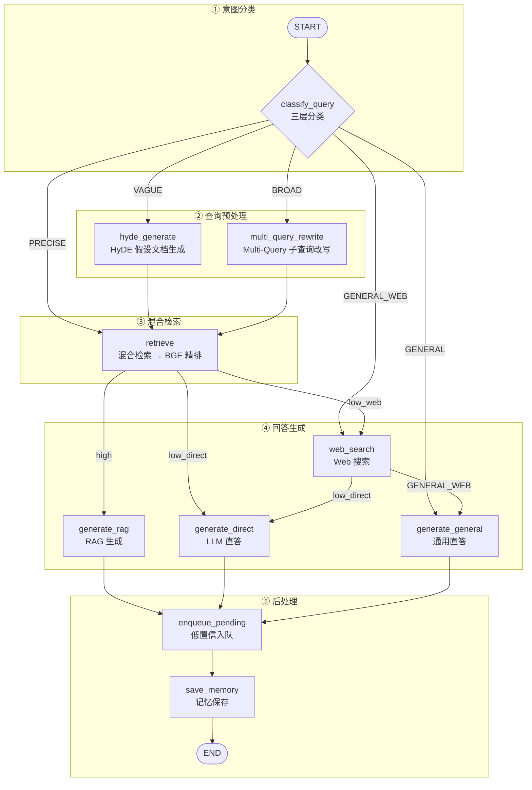

# QA Agent 图装配与 API：`graph.py` + `qa.py` 深度解析

> 源文件：`backend/agents/qa/graph.py`（183 行）+ `backend/api/v1/qa.py`（293 行）
> 对应课件：5.15 图装配（graph.py）+ 5.16 HTTP 接口（qa.py）
> 前置依赖：`state.py`、`nodes.py`、`memory.py`、`dependencies.py`、`llm_factory.py`

---

# 第一部分：`graph.py` — 图装配（183 行）

## 一、文件定位

`graph.py` 是 QA Agent 的"总装图"——把 10 个节点 + 3 个条件路由函数组装成一张 LangGraph StateGraph，定义 5 条完整处理路径和所有分支逻辑。

```
graph.py 的职责：
  ├─ 注册 10 个节点
  ├─ 定义 3 个路由函数
  ├─ 连接边（固定边 + 条件边）
  ├─ 编译图（带 checkpointer）
  └─ 对外暴露 build_qa_graph()

graph.py 不负责：
  ├─ 节点内部逻辑（那是 nodes.py 的事）
  ├─ State 定义（那是 state.py 的事）
  └─ HTTP 接口（那是 qa.py 的事）
```

### 1.1 为什么需要图装配？

`nodes.py` 定义了 10 个独立节点，但每个节点只知道自己的输入输出，不知道执行的先后顺序。`graph.py` 负责：

1. **定义顺序**：`START → classify_query → retrieve → generate_rag → ... → END`
2. **定义分支**：`query_type=GENERAL` 跳过检索，`query_type=VAGUE` 先走 HyDE
3. **定义决策**：置信度高走 RAG 生成，置信度低走联网兜底

没有图装配，就需要在 API 层手动串起所有 if/else 分支，业务逻辑和 HTTP 逻辑耦合，每次新增路径都要改多处代码。

### 1.2 为什么需要 HTTP 接口层？

`graph.py` 编译后的图是 Python 内可调用的对象，但学员不是 Python 开发者。`qa.py` 把图暴露为 RESTful HTTP API，学员通过 HTTP 请求调用：

```
学员（HTTP 请求）→ qa.py（REST API）→ graph.py（LangGraph 图）→ nodes.py（节点执行）
```

`qa.py` 还负责：鉴权（JWT Token 校验）、SSE 流式输出、会话历史查询、错误处理等 API 层的职责。

## 二、全文行号速查表

| 行号 | 内容 | 类型 |
|------|------|------|
| 1~17 | 文件头 docstring + import 语句 | 注释 + 导入 |
| 20 | `from langgraph.graph import StateGraph, START, END` | 导入 |
| 22~34 | 导入 QAState + 10 个节点 | 导入 |
| 35 | `from backend.core.memory import get_memory_saver` | 导入 |
| 38~52 | `_route_by_query_type()` 分类后路由 | 路由函数 |
| 55~68 | `_route_by_confidence()` 检索后路由 | 路由函数 |
| 71~79 | `_route_after_web_search()` 搜索后路由 | 路由函数 |
| 82~102 | `build_qa_graph()` 函数签名与 docstring | 图构建 |
| 103 | `builder = StateGraph(QAState)` | 初始化 |
| 106~117 | 注册 10 个节点 | 节点注册 |
| 120~122 | 固定边：START → classify_query | 连边 |
| 125~137 | 条件边：classify_query → 5 条分支 | 条件路由 |
| 140~143 | 固定边：检索前置路径（2 条） | 连边 |
| 146~156 | 条件边：retrieve → 3 条置信度分支 | 条件路由 |
| 159~168 | 条件边：web_search → 2 条分支 | 条件路由 |
| 171~178 | 固定边：生成节点 → enqueue → save → END | 循环边 |
| 181~183 | 编译图（带 checkpointer） | 编译 |

## 三、import 分析（第 1~35 行）

```python
# graph.py 第 1~35 行
from langgraph.graph import StateGraph, START, END

from backend.agents.qa.state import QAState
from backend.agents.qa.nodes import (
    classify_query_node,
    hyde_generate_node,
    multi_query_rewrite_node,
    retrieve_node,
    generate_rag_node,
    web_search_node,
    generate_direct_node,
    generate_general_node,
    enqueue_pending_node,
    save_memory_node,
)
from backend.core.memory import get_memory_saver
```

| import | 来源 | 用途 |
|--------|------|------|
| `StateGraph` | `langgraph.graph` | LangGraph 状态图构建器 |
| `START` | `langgraph.graph` | 图的起始哨兵 |
| `END` | `langgraph.graph` | 图的终止哨兵 |
| `QAState` | `state.py` | 图的 State 类型 |
| 10 个节点 | `nodes.py` | 所有节点函数 |
| `get_memory_saver` | `memory.py` | MemorySaver 检查点 |

## 四、3 个条件路由函数（第 38~79 行）

### 4.1 `_route_by_query_type`：分类后路由（第 38~52 行）

**动机**：根据 `query_type` 和 `enable_web_search` 分流，决定走 5 条路径中的哪一条。

```python
# graph.py 第 38~52 行
def _route_by_query_type(state: QAState) -> str:
    qt = state.get("query_type", "PRECISE").upper()
    if qt == "GENERAL" and state.get("enable_web_search", False):
        return "GENERAL_WEB"   # 通用问题 + 联网指令 → 先联网再回答
    return qt                   # 其余按 query_type 直走
```

| 行号 | 代码 | 说明 |
|------|------|------|
| 49 | `qt = state.get("query_type", "PRECISE").upper()` | 默认 PRECISE，大写归一 |
| 50 | `if qt == "GENERAL" and state.get("enable_web_search", False):` | 通用问题 + 联网指令 |
| 51 | `return "GENERAL_WEB"` | 特殊分支，先联网再回答 |
| 52 | `return qt` | 其余直走 |

**5 条分支**：

| 返回值 | 后续节点 | 说明 |
|--------|---------|------|
| `"GENERAL"` | `generate_general` | 通用问题直答，跳过检索 |
| `"GENERAL_WEB"` | `web_search` | 通用问题 + 联网，先联网再回答 |
| `"PRECISE"` | `retrieve` | 直接检索 |
| `"VAGUE"` | `hyde_generate` | 先 HyDE 再检索 |
| `"BROAD"` | `multi_query_rewrite` | 先改写再并行检索 |

### 4.2 `_route_by_confidence`：检索后路由（第 55~68 行）

**动机**：根据 `is_high_confidence` 和 `enable_web_search` 分流，决定高置信 RAG 生成 / 低置信联网搜索 / 低置信直答。

```python
# graph.py 第 55~68 行
def _route_by_confidence(state: QAState) -> str:
    if state.get("is_high_confidence", False):
        return "high"           # 置信度 ≥ 0.75 → 高置信度 RAG 生成
    if state.get("enable_web_search", False):
        return "low_web"        # 置信度低 + 联网开启 → 先联网再直答
    return "low_direct"         # 置信度低 + 联网关闭 → 直接 LLM 兜底
```

| 行号 | 代码 | 说明 |
|------|------|------|
| 64 | `if state.get("is_high_confidence", False):` | 置信度 ≥ 0.75 |
| 65 | `return "high"` | 高置信度 RAG 生成 |
| 66 | `if state.get("enable_web_search", False):` | 低置信但联网开启 |
| 67 | `return "low_web"` | 先联网补充再直答 |
| 68 | `return "low_direct"` | 低置信 + 无联网，直接 LLM 兜底 |

**3 条分支**：

| 返回值 | 条件 | 后续节点 | 说明 |
|--------|------|---------|------|
| `"high"` | `is_high_confidence=True` | `generate_rag` | 高置信度，RAG 生成 |
| `"low_web"` | 低置信度 + `enable_web_search=True` | `web_search` | 先联网搜索，再 LLM 直答 |
| `"low_direct"` | 低置信度 + 无联网 | `generate_direct` | 直接 LLM 兜底 |

### 4.3 `_route_after_web_search`：搜索后路由（第 71~79 行）

**动机**：`web_search` 节点被两条路径共用，走完搜索后需要区分去向——GENERAL_WEB 来的回 `generate_general`，低置信度路径来的回 `generate_direct`。

```python
# graph.py 第 71~79 行
def _route_after_web_search(state: QAState) -> str:
    if state.get("query_type", "").upper() == "GENERAL":
        return "generate_general"
    return "generate_direct"
```

| 行号 | 代码 | 说明 |
|------|------|------|
| 77 | `if state.get("query_type", "").upper() == "GENERAL":` | 区分来源：GENERAL_WEB 路径 |
| 78 | `return "generate_general"` | 通用问题直答 |
| 79 | `return "generate_direct"` | 低置信度 LLM 直答 |

**`web_search` 被两条路径共用**：

```
路径 1：GENERAL_WEB → web_search → generate_general
路径 2：low_web → web_search → generate_direct
```

## 五、`build_qa_graph`：图构建（第 82~183 行）

### 5.1 函数签名（第 82~102 行）

```python
# graph.py 第 82~102 行
def build_qa_graph():
    """
    构建智能问答 Agent 的状态图。
    完整图结构：
    START → classify_query
      ├─ GENERAL → generate_general
      ├─ GENERAL_WEB → web_search → generate_general
      ├─ PRECISE → retrieve
      │   ├─ high → generate_rag
      │   ├─ low_web → web_search → generate_direct
      │   └─ low_direct → generate_direct
      ├─ VAGUE → hyde_generate → retrieve → ...
      └─ BROAD → multi_query_rewrite → retrieve → ...
    所有生成节点 → enqueue_pending → save_memory → END
    Returns: 编译后的 LangGraph StateGraph
    """
```

### 5.2 注册 10 个节点（第 106~117 行）

```python
# graph.py 第 106~117 行
builder.add_node("classify_query",      classify_query_node)       # 三层分类
builder.add_node("hyde_generate",       hyde_generate_node)        # VAGUE：假设文档生成
builder.add_node("multi_query_rewrite", multi_query_rewrite_node)  # BROAD：子 Query 改写
builder.add_node("retrieve",            retrieve_node)             # 混合召回 + 精排
builder.add_node("generate_rag",        generate_rag_node)         # 高置信度 RAG 生成
builder.add_node("web_search",          web_search_node)           # Web 搜索兜底
builder.add_node("generate_direct",     generate_direct_node)      # 低置信度 LLM 直答
builder.add_node("generate_general",    generate_general_node)     # 通用问题直答
builder.add_node("enqueue_pending",     enqueue_pending_node)      # 低置信度问题入队
builder.add_node("save_memory",         save_memory_node)          # 记忆保存
```

| 节点名 | 函数 | 所属阶段 | 并行度 |
|--------|------|---------|--------|
| `classify_query` | `classify_query_node` | 分类 | 0→1 |
| `hyde_generate` | `hyde_generate_node` | 检索前置 | 0→1 |
| `multi_query_rewrite` | `multi_query_rewrite_node` | 检索前置 | 0→1 |
| `retrieve` | `retrieve_node` | 检索 | 0→1 |
| `generate_rag` | `generate_rag_node` | 生成 | 0→1 |
| `web_search` | `web_search_node` | 生成（兜底） | 0→1 |
| `generate_direct` | `generate_direct_node` | 生成（兜底） | 0→1 |
| `generate_general` | `generate_general_node` | 生成（通用） | 0→1 |
| `enqueue_pending` | `enqueue_pending_node` | 后处理 | 0→1 |
| `save_memory` | `save_memory_node` | 后处理 | 0→1 |

### 5.3 连边逻辑（第 120~178 行）

#### 固定边：START → classify_query（第 122 行）

```python
# graph.py 第 122 行
builder.add_edge(START, "classify_query")
```

#### 条件边：classify_query → 5 条分支（第 127~137 行）

```python
# graph.py 第 127~137 行
builder.add_conditional_edges(
    "classify_query",
    _route_by_query_type,
    {
        "PRECISE":      "retrieve",            # 直接检索
        "VAGUE":        "hyde_generate",       # 先 HyDE 再检索
        "BROAD":        "multi_query_rewrite", # 先改写再并行检索
        "GENERAL":      "generate_general",    # 通用问题直答
        "GENERAL_WEB":  "web_search",          # 先联网再回答
    },
)
```

#### 固定边：检索前置路径（第 142~143 行）

```python
# graph.py 第 142~143 行
builder.add_edge("hyde_generate", "retrieve")         # VAGUE → HyDE → retrieve
builder.add_edge("multi_query_rewrite", "retrieve")   # BROAD → 改写 → retrieve
```

#### 条件边：retrieve → 3 条置信度分支（第 148~156 行）

```python
# graph.py 第 148~156 行
builder.add_conditional_edges(
    "retrieve",
    _route_by_confidence,
    {
        "high":       "generate_rag",     # 高置信度 → RAG 生成
        "low_web":    "web_search",       # 低置信度 + 联网 → 先搜索
        "low_direct": "generate_direct",  # 低置信度 + 无联网 → 直答
    },
)
```

#### 条件边：web_search → 2 条分支（第 161~168 行）

```python
# graph.py 第 161~168 行
builder.add_conditional_edges(
    "web_search",
    _route_after_web_search,
    {
        "generate_general": "generate_general",  # 来自 GENERAL_WEB
        "generate_direct":  "generate_direct",   # 来自低置信度路径
    },
)
```

#### 固定边：生成节点 → enqueue → save → END（第 175~178 行）

```python
# graph.py 第 175~178 行
for gen_node in ("generate_rag", "generate_direct", "generate_general"):
    builder.add_edge(gen_node, "enqueue_pending")  # 低置信度问题入队
builder.add_edge("enqueue_pending", "save_memory")   # 记忆保存
builder.add_edge("save_memory", END)                # 结束
```

### 5.4 编译图（第 181~183 行）

```python
# graph.py 第 181~183 行
memory_saver = get_memory_saver("qa")                # 获取 QA Agent 的 MemorySaver
return builder.compile(checkpointer=memory_saver)
```

| 行号 | 代码 | 说明 |
|------|------|------|
| 183 | `get_memory_saver("qa")` | 获取 QA Agent 专用 MemorySaver（按 Agent 类型隔离） |
| 184 | `builder.compile(checkpointer=memory_saver)` | 编译图，启用 checkpointer 自动保存/恢复 State |

### 5.5 完整图结构（Mermaid 流程图）



## 六、5 条完整路径

### 路径 1：GENERAL（通用问题直答）

```
START → classify_query → generate_general → enqueue_pending → save_memory → END
```

**触发条件**：`query_type="GENERAL"`，无需联网搜索。

### 路径 2：GENERAL_WEB（通用问题 + 联网）

```
START → classify_query → web_search → generate_general → enqueue_pending → save_memory → END
```

**触发条件**：`query_type="GENERAL"` + `enable_web_search=True`。

### 路径 3：PRECISE（精确检索）

```
START → classify_query → retrieve
  ├─ high → generate_rag → enqueue_pending → save_memory → END
  ├─ low_web → web_search → generate_direct → enqueue_pending → save_memory → END
  └─ low_direct → generate_direct → enqueue_pending → save_memory → END
```

**触发条件**：`query_type="PRECISE"`。

### 路径 4：VAGUE（HyDE 语义扩充）

```
START → classify_query → hyde_generate → retrieve → ...
```

**触发条件**：`query_type="VAGUE"`。

### 路径 5：BROAD（Multi-Query 并行检索）

```
START → classify_query → multi_query_rewrite → retrieve → ...
```

**触发条件**：`query_type="BROAD"`。

---

# 第二部分：`qa.py` — HTTP 接口（293 行）

## 七、文件定位

`qa.py` 是 QA Agent 的 HTTP API 层，提供三个端点：

```
POST /chat                   → 非流式接口（一次性返回完整回答）
POST /chat/stream            → SSE 流式接口（实时推送 token + 进度 + 元数据）
GET  /sessions/{id}/history  → 会话历史查询（消息 + 摘要）
```

## 八、全文行号速查表

| 行号 | 内容 | 类型 |
|------|------|------|
| 1~6 | 文件头 docstring | 注释 |
| 8~19 | import + router 初始化 | 导入 |
| 25~31 | `ChatRequest` 请求模型 | Pydantic 模型 |
| 33~41 | `ChatResponse` 响应模型 | Pydantic 模型 |
| 43~48 | `SessionMessage` 消息模型 | Pydantic 模型 |
| 50~56 | `HistoryResponse` 历史模型 | Pydantic 模型 |
| 58~109 | `POST /chat` 非流式接口 | 端点 |
| 112~228 | `POST /chat/stream` SSE 流式接口 | 端点 |
| 231~293 | `GET /sessions/{id}/history` 历史查询 | 端点 |

## 九、import 分析（第 8~19 行）

```python
# qa.py 第 8~19 行
import json
from fastapi import APIRouter, Depends, HTTPException, status
from pydantic import BaseModel, Field
from sse_starlette.sse import EventSourceResponse
from langchain_core.messages import HumanMessage

from backend.agents.qa.graph import build_qa_graph
from backend.core.memory import build_thread_id
from backend.dependencies import get_current_user
from backend.core.logger import get_logger

router = APIRouter()
```

| import | 来源 | 用途 |
|--------|------|------|
| `APIRouter` | FastAPI | 路由注册 |
| `EventSourceResponse` | `sse_starlette.sse` | SSE 流式响应 |
| `HumanMessage` | LangChain | 构造用户消息 |
| `build_qa_graph` | `graph.py` | 构建 QA Agent 图 |
| `build_thread_id` | `memory.py` | 构造 thread_id |
| `get_current_user` | `dependencies.py` | JWT 鉴权依赖 |

## 十、请求/响应模型（第 25~55 行）

### 10.1 `ChatRequest`（第 25~31 行）

```python
# qa.py 第 25~31 行
class ChatRequest(BaseModel):
    """聊天请求体"""
    session_id:        str        = Field(..., description="会话 ID（前端生成，每次打开新对话生成一个）")
    course_id:         str | None = Field(None, description="课程 ID（可选，限定检索范围）")
    message:           str        = Field(..., min_length=1, max_length=2000, description="用户消息")
    enable_web_search: bool       = Field(False, description="低置信度时是否先走 Web Search 再给 LLM")
```

| 字段 | 类型 | 必填 | 默认 | 说明 |
|------|------|------|------|------|
| `session_id` | `str` | 是 | — | 前端生成 UUID，每次打开新对话生成一个 |
| `course_id` | `str \| None` | 否 | `None` | 限定检索范围 |
| `message` | `str` | 是 | — | 1~2000 字符，Pydantic 自动校验 |
| `enable_web_search` | `bool` | 否 | `False` | 低置信度时是否先走 Web Search |

### 10.2 `ChatResponse`（第 33~41 行）

```python
# qa.py 第 33~41 行
class ChatResponse(BaseModel):
    """聊天响应体"""
    session_id:    str
    answer:        str        # 回答文本
    answer_mode:   str        # "rag" / "web_augmented" / "llm_direct" / "general"
    confidence:    float      # 精排置信度 [0, 1]
    sources:       list[str]  # 来源列表
    fallback_used: bool       # 是否触发了降级
```

| 字段 | 类型 | 说明 |
|------|------|------|
| `session_id` | `str` | 会话 ID |
| `answer` | `str` | 回答文本 |
| `answer_mode` | `str` | `"rag"` / `"web_augmented"` / `"llm_direct"` / `"general"` |
| `confidence` | `float` | 精排置信度 [0, 1] |
| `sources` | `list[str]` | 来源列表 |
| `fallback_used` | `bool` | 是否触发了降级 |

**`answer_mode` 前端展示映射**：

| answer_mode | 前端展示 |
|------------|---------|
| `"rag"` | 显示 📚 参考来源 |
| `"web_augmented"` | 显示 Web 来源链接 |
| `"llm_direct"` | 显示 ⚠️ 提示 |
| `"general"` | 简洁显示，无额外标记 |

### 10.3 `SessionMessage` / `HistoryResponse`（第 43~55 行）

```python
# qa.py 第 43~56 行
class SessionMessage(BaseModel):
    role:       str   # "user" / "assistant"
    content:    str
    created_at: str

class HistoryResponse(BaseModel):
    session_id:  str
    messages:    list[SessionMessage]
    summary:     str | None      # 对话摘要（压缩后）
    total_turns: int             # 总轮数
```

## 十一、`POST /chat`：非流式接口（第 58~110 行）

### 11.1 完整代码

```python
# qa.py 第 58~109 行
@router.post("/chat", response_model=ChatResponse)
async def chat(
    req: ChatRequest,
    current_user: dict = Depends(get_current_user),
):
    graph = build_qa_graph()
    thread_id = build_thread_id(current_user["user_id"], req.session_id)
    initial_state = {
        "messages":            [HumanMessage(content=req.message)],
        "student_id":          current_user["user_id"],
        "tenant_id":           current_user["tenant_id"],
        "session_id":          req.session_id,
        "course_id":           req.course_id,
        "query_type":          "PRECISE",         # 占位初始值，classify_query 内部动态覆盖
        "enable_web_search":   req.enable_web_search,
        "web_search_results":  [],                # 每轮重置，防止上轮搜索结果污染本轮 sources
    }
    config: dict = {"configurable": {"thread_id": thread_id}}
    try:
        result = await graph.ainvoke(initial_state, config=config)
    except Exception as e:
        logger.error("chat.invoke_error", error=str(e), exc_info=True)
        raise HTTPException(
            status_code=status.HTTP_500_INTERNAL_SERVER_ERROR,
            detail={"code": "AGENT_ERROR", "message": str(e)},
        )
    return ChatResponse(
        session_id=req.session_id,
        answer=result.get("answer", ""),
        answer_mode=result.get("answer_mode", "llm_direct"),
        confidence=result.get("confidence", 0.0),
        sources=result.get("sources", []),
        fallback_used=result.get("fallback_used", False),
    )
```

### 11.2 逐行精读

| 行号 | 代码 | 说明 |
|------|------|------|
| 70 | `graph = build_qa_graph()` | 每次请求编译新图实例（~10ms，LangGraph 编译开销很小） |
| 73 | `thread_id = build_thread_id(current_user["user_id"], req.session_id)` | 不同学员/不同会话的历史隔离 |
| 77~86 | 初始 State 构造 | 仅用户消息 + 上下文，其余由节点填充 |
| 84 | `"query_type": "PRECISE"` | 占位初始值，classify_query 内部动态覆盖 |
| 85 | `"web_search_results": []` | 每轮重置，防上轮搜索结果污染本轮 sources |
| 92 | `await graph.ainvoke(initial_state, config=config)` | 执行完整流程图 |
| 93~98 | `except ... raise HTTPException` | 异常转 500 错误 |
| 100~109 | 返回 ChatResponse | 所有字段用 `.get()` 加默认值防 KeyError |

## 十二、`POST /chat/stream`：SSE 流式接口（第 112~229 行）

### 12.1 签名与初始 State

```python
# qa.py 第 112~141 行
@router.post("/chat/stream")
async def chat_stream(
    req: ChatRequest,
    current_user: dict = Depends(get_current_user),
):
    graph = build_qa_graph()
    thread_id = build_thread_id(current_user["user_id"], req.session_id)
    initial_state = {
        "messages":            [HumanMessage(content=req.message)],
        "student_id":          current_user["user_id"],
        "tenant_id":           current_user["tenant_id"],
        "session_id":          req.session_id,
        "course_id":           req.course_id,
        "query_type":          "PRECISE",
        "enable_web_search":   req.enable_web_search,
        "web_search_results":  [],
    }
    config: dict = {"configurable": {"thread_id": thread_id}}
```

| 行号 | 代码 | 说明 |
|------|------|------|
| 127 | `graph = build_qa_graph()` | 每次都编译新实例 |
| 128 | `build_thread_id(...)` | thread_id 隔离 |
| 131~140 | 初始 State | 与非流式接口相同 |

### 12.2 节点过滤配置

```python
# qa.py 第 143~154 行
_GENERATE_NODES = {"generate_rag", "generate_direct", "generate_general"}

_PROGRESS_LABELS = {
    "classify_query":      "理解问题中...",
    "hyde_generate":       "理解问题中...",
    "multi_query_rewrite": "改写查询中...",
    "retrieve":            "召回相关文档...",
    "web_search":          "搜索互联网...",
    "generate_general":    "思考中...",
}
```

| 配置 | 行号 | 说明 |
|------|------|------|
| `_GENERATE_NODES` | 144 | 仅这 3 个生成节点做 token 级流式推送 |
| `_PROGRESS_LABELS` | 147~154 | 节点开始时的进度文案，`generate_rag`/`generate_direct` 无进度（token 流直接推送） |

### 12.3 事件生成器（第 156~227 行）

```python
# qa.py 第 156~227 行
async def event_generator():
    answer_mode = "llm_direct"
    confidence = 0.0
    sources: list[str] = []

    try:
        async for event in graph.astream_events(
            initial_state, config=config, version="v2"
        ):
            evt = event["event"]
            node = event.get("metadata", {}).get("langgraph_node", "")

            if evt == "on_chain_start" and node in _PROGRESS_LABELS:
                yield {"data": json.dumps({"type": "progress", "stage": _PROGRESS_LABELS[node]}, ensure_ascii=False)}

            elif evt == "on_chat_model_stream" and node in _GENERATE_NODES:
                chunk = event["data"].get("chunk")
                if chunk and chunk.content:
                    yield {"data": json.dumps({"type": "token", "content": chunk.content}, ensure_ascii=False)}

            elif evt == "on_chain_end" and node in _GENERATE_NODES:
                output = event["data"].get("output", {})
                if isinstance(output, dict):
                    _mode = output.get("answer_mode")
                    if _mode: answer_mode = _mode
                    _srcs = output.get("sources")
                    if _srcs is not None: sources = _srcs
                    _conf = (output.get("structured_output") or {}).get("confidence")
                    if _conf is not None: confidence = _conf
    except Exception as e:
        logger.error("chat_stream.error", error=str(e), exc_info=True)
        yield {"data": json.dumps({"type": "error", "message": "流式输出异常，请使用普通接口重试"}, ensure_ascii=False)}
        return

    # ── 元数据帧（流结束后一次性推送）──────────────────────
    yield {"data": json.dumps({"type": "meta", "session_id": req.session_id, "answer_mode": answer_mode, "confidence": confidence, "sources": sources}, ensure_ascii=False)}
    yield {"data": json.dumps({"type": "done"})}
```

### 12.4 SSE 事件类型

| 事件类型 | 推送时机 | 前端处理 |
|---------|---------|---------|
| `progress` | 节点开始时 | 显示进度提示 |
| `token` | LLM 生成 token 时 | 追加到回答文本框 |
| `meta` | 流结束后 | 设置 answer_mode、显示来源 |
| `done` | 全部结束后 | 关闭 loading 状态 |
| `error` | 异常时 | 显示错误提示 |

**事件过滤逻辑**（第 170~201 行）：

| 事件 | 节点条件 | 动作 |
|------|---------|------|
| `on_chain_start` | 在 `_PROGRESS_LABELS` 中 | 推送进度 |
| `on_chat_model_stream` | 在 `_GENERATE_NODES` 中 | 推送 token |
| `on_chain_end` | 在 `_GENERATE_NODES` 中 | 捕获元数据 |

**`meta` 事件在流结束后推送**（第 214~225 行）：因为 `answer_mode` 和 `confidence` 只有在生成节点执行完毕后才能确定。前端收到 `meta` 事件后更新 UI 样式。

**`ensure_ascii=False`**：确保中文内容不被转义为 `\uXXXX`。

## 十三、`GET /sessions/{id}/history`：会话历史（第 231~294 行）

### 13.1 完整代码

```python
# qa.py 第 231~293 行
@router.get("/sessions/{session_id}/history", response_model=HistoryResponse)
async def get_session_history(
    session_id: str,
    current_user: dict = Depends(get_current_user),
):
    from sqlalchemy import text as sa_text
    from langchain_core.messages import HumanMessage as LCHuman, AIMessage as LCAi
    from backend.dependencies import AsyncSessionLocal

    student_id = current_user["user_id"]
    thread_id = build_thread_id(student_id, session_id)

    # ── ① 从 DB 读摘要 ────────────────────────────────────────
    summary = None
    try:
        async with AsyncSessionLocal() as db_session:
            result = await db_session.execute(
                sa_text("SELECT summary FROM qa_sessions WHERE thread_id = :tid AND student_id = :sid"),
                {"tid": thread_id, "sid": student_id},
            )
            row = result.fetchone()
            if row: summary = row[0]
    except Exception as e:
        logger.warning("get_history.db_error", error=str(e))

    # ── ② 从 MemorySaver 读消息历史 ──────────────────────────
    messages: list[SessionMessage] = []
    total_turns = 0
    try:
        graph = build_qa_graph()
        config = {"configurable": {"thread_id": thread_id}}
        state = await graph.aget_state(config)
        if state and state.values:
            for msg in state.values.get("messages", []):
                content = msg.text if hasattr(msg, "text") and not callable(msg.text) else str(msg.content)
                if isinstance(msg, LCHuman):
                    messages.append(SessionMessage(role="user", content=content, created_at=""))
                elif isinstance(msg, LCAi):
                    messages.append(SessionMessage(role="assistant", content=content, created_at=""))
            total_turns = sum(1 for m in messages if m.role == "user")
    except Exception as e:
        logger.warning("get_history.checkpoint_error", error=str(e))

    return HistoryResponse(
        session_id=session_id,
        messages=messages,
        summary=summary,
        total_turns=total_turns,
    )
```

### 13.2 逐行精读

| 行号 | 代码 | 说明 |
|------|------|------|
| 243~245 | 延迟导入 | 避免顶层导入增加启动时间 |
| 248 | `thread_id = build_thread_id(student_id, session_id)` | 构造唯一标识 |
| 253~265 | ① 从 DB 读摘要 | `qa_sessions` 表，`try/except` 静默 |
| 268~285 | ② 从 MemorySaver 读消息历史 | `graph.aget_state(config)` 读取 |
| 276~280 | 兼容新旧版本 `content` 访问 | 与 `_get_message_content` 相同逻辑 |
| 285 | `total_turns = sum(1 for m in messages if m.role == "user")` | 统计用户消息数作为总轮数 |
| 289~293 | 返回 HistoryResponse | 双数据源合并 |

**双数据源设计**：

| 数据源 | 存储内容 | 用途 |
|--------|---------|------|
| `qa_sessions` 表（PostgreSQL） | 对话摘要 `summary` | 显示摘要文本 |
| MemorySaver（内存） | 完整消息列表 | 显示历史消息 |

---

# 第三部分：`★` Insight ─── 设计亮点总结

## 14.1 graph.py 设计亮点

### 14.1.1 3 个路由函数，5 条路径，10 个节点

| 路由函数 | 决策依据 | 分支数 | 位置 |
|---------|---------|--------|------|
| `_route_by_query_type` | `query_type` + `enable_web_search` | 5 | classify_query 之后 |
| `_route_by_confidence` | `is_high_confidence` + `enable_web_search` | 3 | retrieve 之后 |
| `_route_after_web_search` | `query_type` | 2 | web_search 之后 |

### 14.1.2 `web_search` 节点被两条路径共用

`web_search` 既可以为 GENERAL_WEB 路径联网，也可以为低置信度路径兜底。通过 `_route_after_web_search` 区分去向。

### 14.1.3 `enqueue_pending` 内部按 confidence 过滤

```python
# graph.py 第 175~176 行
for gen_node in ("generate_rag", "generate_direct", "generate_general"):
    builder.add_edge(gen_node, "enqueue_pending")
```

所有生成节点统一走 `enqueue_pending`，但节点内部按 `confidence` 过滤——高置信度（≥0.75）直接 `return {}` 不写 DB；低置信度才写入 `knowledge_pending_queue`。图结构统一，行为正确。

### 14.1.4 固定边 + 条件边组合

```
固定边：确定性路径（START → classify_query, hyde_generate → retrieve）
条件边：运行时分支（classify_query → 5 条, retrieve → 3 条）
```

固定边保证核心流程稳定，条件边保证分支灵活。

### 14.1.5 编译时注入 checkpointer

```python
# graph.py 第 183 行
builder.compile(checkpointer=get_memory_saver("qa"))
```

编译时注入 MemorySaver，LangGraph 自动处理 State 保存/恢复，nodes.py 无需手动管理。

### 14.1.6 `GENERAL_WEB` 特殊分支

`_route_by_query_type` 返回 `"GENERAL_WEB"`（不是 `"GENERAL"`），让通用问题在开启联网搜索时走 `web_search` 分支，实现"通用问题 + 时效性信息"的混合场景。

## 14.2 qa.py 设计亮点

### 14.2.1 两种接口模式

| 接口 | 适用场景 | 响应方式 | 前端实现 |
|------|---------|---------|---------|
| `POST /chat` | 非实时场景 | 一次性 JSON | 普通 fetch |
| `POST /chat/stream` | 实时对话 | SSE 事件流 | fetch + ReadableStream |

### 14.2.2 SSE 四类事件

```
progress → token → token → ... → token → meta → done
```

前端按事件类型分别处理：

| 事件 | 处理 |
|------|------|
| `progress` | 显示/更新进度提示 |
| `token` | 追加到回答文本框 |
| `meta` | 设置 answer_mode、显示来源 |
| `done` | 关闭 loading 状态 |

### 14.2.3 `web_search_results` 每轮重置

```python
# qa.py 第 85 行
"web_search_results": [],  # 每轮重置，防止上轮搜索结果污染本轮 sources
```

关键设计：上一轮的搜索结果不能留到本轮。如果上一轮搜索了"Spring IOC"，本轮问"它的优缺点"时，上一轮的搜索结果还在会污染 `sources`。

### 14.2.4 每次请求编译新图实例

```python
# qa.py 第 70 行
graph = build_qa_graph()  # 每次请求都编译，~10ms
```

LangGraph 编译开销很小，每次请求编译新实例是安全且推荐的模式，无需缓存。

### 14.2.5 双数据源历史查询

DB 存摘要，MemorySaver 存消息列表。摘要用于快速预览，消息列表用于完整查看。

### 14.2.6 防御性字段提取

```python
# qa.py 第 104~108 行
result.get("answer", "")
result.get("answer_mode", "llm_direct")
result.get("confidence", 0.0)
```

所有字段用 `.get()` 加默认值，图执行异常时不会 KeyError。

### 14.2.7 `ensure_ascii=False`

SSE 事件中的中文内容设置 `ensure_ascii=False`，避免中文字符被转义为 `\uXXXX`，前端可直接使用。

---

## 十五、依赖关系

### graph.py 依赖

| 依赖 | 用途 |
|------|------|
| `langgraph.graph.StateGraph` | 状态图构建器 |
| `backend.agents.qa.state.QAState` | State 类型 |
| `backend.agents.qa.nodes.*` | 10 个节点函数 |
| `backend.core.memory.get_memory_saver` | MemorySaver 检查点 |

### qa.py 依赖

| 依赖 | 用途 |
|------|------|
| `fastapi.APIRouter` | 路由注册 |
| `sse_starlette.sse.EventSourceResponse` | SSE 流式响应 |
| `langchain_core.messages.HumanMessage` | 构造用户消息 |
| `backend.agents.qa.graph.build_qa_graph` | 构建图 |
| `backend.core.memory.build_thread_id` | 构造 thread_id |
| `backend.dependencies.get_current_user` | JWT 鉴权 |

---

## 十六、总结

```
graph.py（183 行）
  ├─ 10 个节点注册
  ├─ 3 个条件路由函数
  ├─ 3 条固定边 + 3 条条件边
  ├─ 5 条完整处理路径
  └─ checkpointer 编译

qa.py（293 行）
  ├─ POST /chat              → 非流式
  ├─ POST /chat/stream       → SSE 流式（4 类事件）
  └─ GET /sessions/{id}/history → 双数据源历史查询

核心思想：条件路由让同一张图处理不同类型查询，
         流式输出让用户体验更好，
         防御性编写让系统更健壮。
```