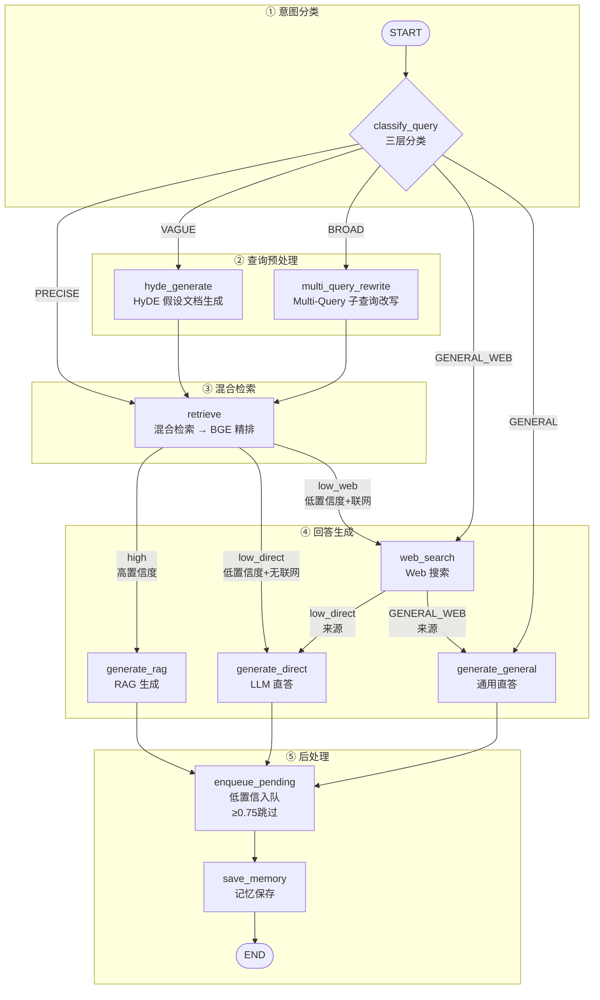

# QA Agent 图装配：`graph.py` 深度解析

> 源文件：`backend/agents/qa/graph.py`（共 183 行）
> 对应课件：5.15 图装配（graph.py）
> 前置依赖：`state.py`、`nodes.py`、`memory.py`

## 一、全文行号速查表

| 行号范围 | 内容 | 说明 |
|---------|------|------|
| 1~19 | 文件头注释 | 图结构概述、5 条路径、3 个路由决策点 |
| 20~36 | import 导入 | 导入 LangGraph、节点函数、MemorySaver |
| 38~52 | `_route_by_query_type()` | 分类后路由：5 条分支（GENERAL / GENERAL_WEB / PRECISE / VAGUE / BROAD） |
| 55~68 | `_route_by_confidence()` | 检索后路由：3 条分支（high / low_web / low_direct） |
| 71~79 | `_route_after_web_search()` | 搜索后路由：2 条分支（generate_general / generate_direct） |
| 82~184 | `build_qa_graph()` | 图构建主函数 |
| 108~117 | ① 注册 10 个节点 | builder.add_node 注册所有节点 |
| 122 | ② 固定边：START → classify_query | 入口边 |
| 127~137 | ③ 条件路由：classify_query → 5 条分支 | 根据 query_type 分流 |
| 142~143 | ④ 固定边：检索前置路径 | hyde_generate → retrieve; multi_query_rewrite → retrieve |
| 148~156 | ⑤ 条件路由：retrieve → 3 条置信度分支 | 根据置信度分流 |
| 161~168 | ⑥ 条件路由：web_search → 2 条分支 | 根据来源区分去向 |
| 175~178 | ⑦ 固定边：生成节点 → enqueue_pending → save_memory → END | 后处理统一路径 |
| 183~184 | ⑧ 编译图 | 注入 checkpointer 编译 |

### 文件定位

`graph.py` 是 QA Agent 的"总装图"——把 10 个节点 + 3 个条件路由组装成一张 LangGraph StateGraph，定义了 5 条完整处理路径和所有分支逻辑。

```
graph.py 的职责：
  ├─ 注册 10 个节点
  ├─ 定义 3 个路由函数
  ├─ 连接边（固定边 + 条件边）
  ├─ 编译图（带 checkpointer）
  └─ 对外暴露 build_qa_graph()

graph.py 不负责：
  ├─ 节点内部逻辑（那是 nodes.py 的事）
  ├─ State 定义（那是 state.py 的事）
  └─ HTTP 接口（那是 qa.py 的事）
```

---

## 二、为什么需要图装配？

### 2.1 节点是"零件"，图是"装配线"

`nodes.py` 定义了 10 个独立的节点函数，但每个节点只知道自己做什么，不知道执行的先后顺序。`graph.py` 负责把这些节点**组装成一条完整的、可执行的流水线**：

```
nodes.py（零件）          graph.py（装配线）
classify_query_node  ──┐
hyde_generate_node   ──┼─→ 决定顺序、分支、入口、出口 ─→ 可调用的图
...共 10 个节点        ──┘
```

**为什么不能直接调用节点？** 因为节点之间存在依赖关系（如 `retrieve_node` 需要 `classify_query_node` 先产出 `query_type`），且路径会分支（GENERAL 跳过检索，VAGUE 走 HyDE）。图装配把这些逻辑集中管理，调用方只需 `graph.ainvoke(state)` 一次。

### 2.2 条件路由解决"动态分支"

静态的节点串联（A→B→C）无法处理运行时分支。图装配引入 `add_conditional_edges`，根据 State 的字段值（`query_type` / `is_high_confidence`）动态决定下一步。

### 2.3 搭配 MemorySaver 实现状态持久化

`build_qa_graph()` 编译时注入 `checkpointer`（MemorySaver），让图在每次调用后自动保存 State。这是多轮对话记忆的基础。

---

## 三、import 分析（第 1~36 行）

```python
# graph.py 第 1~36 行
"""问答 Agent - 图定义"""
# backend/agents/qa/graph.py
# QA Agent 的 LangGraph 状态图定义。
#
# 10 个节点 + 3 个条件路由，覆盖 5 条处理路径：
#   GENERAL → 直答（跳过 RAG）
#   PRECISE → 直接检索 → 置信度分流
#   VAGUE   → HyDE → 检索 → 置信度分流
#   BROAD   → Multi-Query → 并行检索 → 去重 → 置信度分流
#
# 整张图的三个路由决策点：
#   ┌────────────────────┬──────────────────────┬─────────┐
#   │ 决策点             │ 路由函数              │ 分支数  │
#   ├────────────────────┼──────────────────────┼─────────┤
#   │ classify_query 之后 │ _route_by_query_type │   5     │
#   │ retrieve 之后      │ _route_by_confidence │   3     │
#   │ web_search 之后    │ _route_after_web_search │ 2   │
#   └────────────────────┴──────────────────────┴─────────┘

from langgraph.graph import StateGraph, START, END

from backend.agents.qa.state import QAState
from backend.agents.qa.nodes import (
    classify_query_node,
    hyde_generate_node,
    multi_query_rewrite_node,
    retrieve_node,
    generate_rag_node,
    web_search_node,
    generate_direct_node,
    generate_general_node,
    enqueue_pending_node,
    save_memory_node,
)
from backend.core.memory import get_memory_saver
```

| 行号 | import | 来源 | 用途 |
|------|--------|------|------|
| 20 | `StateGraph` | `langgraph.graph` | LangGraph 状态图构建器 |
| 20 | `START` | `langgraph.graph` | 图的起始节点（哨兵） |
| 20 | `END` | `langgraph.graph` | 图的终止节点（哨兵） |
| 22 | `QAState` | `state.py` | 图的 State 类型 |
| 23~34 | 10 个节点函数 | `nodes.py` | 所有节点函数 |
| 35 | `get_memory_saver` | `memory.py` | MemorySaver 检查点 |

---

## 三、三个路由函数（第 38~79 行）

### 3.1 `_route_by_query_type`：分类后路由（第 38~52 行）

```python
# graph.py 第 38~52 行
def _route_by_query_type(state: QAState) -> str:
    """
    classify_query 之后的路由：根据 query_type 和 enable_web_search 分流。

    返回的路由键：
      GENERAL      → 直接 generate_general（跳过检索）
      GENERAL_WEB  → web_search → generate_general（先联网再回答）
      PRECISE      → 直接 retrieve
      VAGUE        → hyde_generate → retrieve
      BROAD        → multi_query_rewrite → retrieve
    """
    qt = state.get("query_type", "PRECISE").upper()
    if qt == "GENERAL" and state.get("enable_web_search", False):
        return "GENERAL_WEB"   # 通用问题 + 联网指令 → 先联网再回答
    return qt                   # 其余按 query_type 直走
```

| 行号 | 代码 | 说明 |
|------|------|------|
| 49 | `qt = state.get("query_type", "PRECISE").upper()` | 从 State 读取 query_type，默认 PRECISE，统一转大写 |
| 50~51 | `if qt == "GENERAL" and state.get("enable_web_search", False): return "GENERAL_WEB"` | GENERAL 路径 + 联网开关 → 特殊分支 GENERAL_WEB |
| 52 | `return qt` | 其余按 query_type 直走（PRECISE / VAGUE / BROAD / GENERAL） |

**5 条分支**：

| 返回值 | 后续节点 | 说明 |
|--------|---------|------|
| `"GENERAL"` | `generate_general` | 通用问题直答，跳过检索 |
| `"GENERAL_WEB"` | `web_search` | 通用问题 + 联网指令，先联网再回答 |
| `"PRECISE"` | `retrieve` | 直接检索 |
| `"VAGUE"` | `hyde_generate` | 先 HyDE 再检索 |
| `"BROAD"` | `multi_query_rewrite` | 先改写再并行检索 |

### 3.2 `_route_by_confidence`：检索后路由（第 55~68 行）

```python
# graph.py 第 55~68 行
def _route_by_confidence(state: QAState) -> str:
    """
    retrieve 之后的路由：根据置信度和联网开关分流。

    返回的路由键：
      high       → generate_rag（RAG 高质量回答）
      low_web    → web_search → generate_direct（先联网补充再直答）
      low_direct → generate_direct（直接 LLM 兜底）
    """
    if state.get("is_high_confidence", False):
        return "high"           # 置信度 >= 0.75 → 高置信度 RAG 生成
    if state.get("enable_web_search", False):
        return "low_web"        # 置信度低 + 联网开启 → 先联网再直答
    return "low_direct"         # 置信度低 + 联网关闭 → 直接 LLM 兜底
```

| 行号 | 代码 | 说明 |
|------|------|------|
| 64 | `if state.get("is_high_confidence", False): return "high"` | 置信度 >= 0.75 → 走 RAG 生成 |
| 66 | `if state.get("enable_web_search", False): return "low_web"` | 低置信度 + 联网开启 → 先联网搜索再直答 |
| 68 | `return "low_direct"` | 低置信度 + 无联网 → 直接 LLM 兜底 |

**3 条分支**：

| 返回值 | 条件 | 后续节点 | 说明 |
|--------|------|---------|------|
| `"high"` | `is_high_confidence=True` | `generate_rag` | 高置信度，RAG 生成 |
| `"low_web"` | 低置信度 + `enable_web_search=True` | `web_search` | 先联网搜索，再 LLM 直答 |
| `"low_direct"` | 低置信度 + 无联网 | `generate_direct` | 直接 LLM 兜底 |

**`low_web` 路径的时序**：
```
retrieve → web_search → generate_direct
  ↑ 置信度低    ↑ 收集网络信息   ↑ 注入 Web 上下文后生成
```

### 3.3 `_route_after_web_search`：搜索后路由（第 71~79 行）

```python
# graph.py 第 71~79 行
def _route_after_web_search(state: QAState) -> str:
    """
    web_search 节点被两条路径共用，走完搜索后需要区分去向：
      - 来自 GENERAL_WEB 路径（query_type=GENERAL）→ generate_general
      - 来自低置信度路径                            → generate_direct
    """
    if state.get("query_type", "").upper() == "GENERAL":
        return "generate_general"
    return "generate_direct"
```

| 行号 | 代码 | 说明 |
|------|------|------|
| 77 | `if state.get("query_type", "").upper() == "GENERAL":` | 判断 query_type 是否为 GENERAL |
| 78 | `return "generate_general"` | 来自 GENERAL_WEB 路径 → 走通用直答 |
| 79 | `return "generate_direct"` | 来自低置信度路径 → 走 LLM 直答 |

**`web_search` 被两条路径共用**：
```
路径 1：GENERAL_WEB → web_search → generate_general
路径 2：low_web → web_search → generate_direct
```

**区分依据**：`query_type` 是否为 `"GENERAL"`。如果是，来自 GENERAL_WEB 路径，走 `generate_general`；否则来自低置信度路径，走 `generate_direct`。

---

## 四、`build_qa_graph`：图构建（第 82~184 行）

### 4.1 函数签名（第 82~102 行）

```python
# graph.py 第 82~102 行
def build_qa_graph():
    """
    构建智能问答 Agent 的状态图。

    完整图结构：

    START → classify_query
      ├─ GENERAL → generate_general
      ├─ GENERAL_WEB → web_search → generate_general
      ├─ PRECISE → retrieve
      │   ├─ high → generate_rag
      │   ├─ low_web → web_search → generate_direct
      │   └─ low_direct → generate_direct
      ├─ VAGUE → hyde_generate → retrieve → ...
      └─ BROAD → multi_query_rewrite → retrieve → ...

    所有生成节点 → enqueue_pending → save_memory → END

    Returns:
        编译后的 LangGraph StateGraph，可调用 graph.ainvoke(state, config)
    """
    builder = StateGraph(QAState)
```

### 4.2 注册 10 个节点（第 108~117 行）

```python
# graph.py 第 108~117 行
builder.add_node("classify_query",      classify_query_node)       # 三层分类
builder.add_node("hyde_generate",       hyde_generate_node)        # VAGUE：假设文档生成
builder.add_node("multi_query_rewrite", multi_query_rewrite_node)  # BROAD：子 Query 改写
builder.add_node("retrieve",            retrieve_node)             # 混合召回 + 精排
builder.add_node("generate_rag",        generate_rag_node)         # 高置信度 RAG 生成
builder.add_node("web_search",          web_search_node)           # Web 搜索兜底
builder.add_node("generate_direct",     generate_direct_node)      # 低置信度 LLM 直答
builder.add_node("generate_general",    generate_general_node)     # 通用问题直答
builder.add_node("enqueue_pending",     enqueue_pending_node)      # 低置信度问题入队
builder.add_node("save_memory",         save_memory_node)          # 记忆保存
```

| 行号 | 节点名 | 函数 | 角色 |
|------|--------|------|------|
| 108 | `classify_query` | `classify_query_node` | 三层意图分类 |
| 109 | `hyde_generate` | `hyde_generate_node` | VAGUE 路径：假设文档生成 |
| 110 | `multi_query_rewrite` | `multi_query_rewrite_node` | BROAD 路径：子 Query 改写 |
| 111 | `retrieve` | `retrieve_node` | 混合召回 + 精排 |
| 112 | `generate_rag` | `generate_rag_node` | 高置信度 RAG 生成 |
| 113 | `web_search` | `web_search_node` | Web 搜索兜底 |
| 114 | `generate_direct` | `generate_direct_node` | 低置信度 LLM 直答 |
| 115 | `generate_general` | `generate_general_node` | 通用问题直答 |
| 116 | `enqueue_pending` | `enqueue_pending_node` | 低置信度问题入队（内部按 confidence 过滤） |
| 117 | `save_memory` | `save_memory_node` | 记忆保存 |

**节点命名规范**：小写蛇形，与函数名一致（去掉 `_node` 后缀）。

### 4.3 连边逻辑（第 122~178 行）

#### 4.3.1 固定边 vs 条件边

| 类型 | 方法 | 用途 | 示例 |
|------|------|------|------|
| 固定边 | `add_edge` | 确定性流转 | `hyde_generate → retrieve` |
| 条件边 | `add_conditional_edges` | 运行时分支 | `classify_query → 5 条分支` |

#### 4.3.2 三种边的关系

```
固定边（4 条）：
  START → classify_query
  hyde_generate → retrieve
  multi_query_rewrite → retrieve
  enqueue_pending → save_memory → END

条件边（3 条）：
  classify_query → _route_by_query_type        （5 条分支）
  retrieve → _route_by_confidence               （3 条分支）
  web_search → _route_after_web_search          （2 条分支）

循环边（生成节点 → 后处理）：
  generate_rag / generate_direct / generate_general → enqueue_pending
```

#### 4.3.3 逐段连边精读

**② 固定边：START → classify_query（第 122 行）**

```python
# graph.py 第 122 行
builder.add_edge(START, "classify_query")
```

**③ 条件路由：classify_query → 5 条分支（第 127~137 行）**

```python
# graph.py 第 127~137 行
builder.add_conditional_edges(
    "classify_query",
    _route_by_query_type,
    {
        "PRECISE":      "retrieve",            # 直接检索
        "VAGUE":        "hyde_generate",       # 先 HyDE 再检索
        "BROAD":        "multi_query_rewrite", # 先改写再并行检索
        "GENERAL":      "generate_general",    # 通用问题直答
        "GENERAL_WEB":  "web_search",          # 先联网再回答
    },
)
```

| 路由键 | 目标节点 | 路径说明 |
|--------|---------|---------|
| `"PRECISE"` | `retrieve` | 精确问题直接检索 |
| `"VAGUE"` | `hyde_generate` | 模糊问题先 HyDE 再检索 |
| `"BROAD"` | `multi_query_rewrite` | 宽泛问题先改写再并行检索 |
| `"GENERAL"` | `generate_general` | 通用问题直答，跳过检索 |
| `"GENERAL_WEB"` | `web_search` | 通用问题 + 联网指令 |

**④ 固定边：检索前置路径（第 142~143 行）**

```python
# graph.py 第 142~143 行
builder.add_edge("hyde_generate", "retrieve")         # VAGUE → HyDE → retrieve
builder.add_edge("multi_query_rewrite", "retrieve")   # BROAD → 改写 → retrieve
```

**⑤ 条件路由：retrieve → 3 条置信度分支（第 148~156 行）**

```python
# graph.py 第 148~156 行
builder.add_conditional_edges(
    "retrieve",
    _route_by_confidence,
    {
        "high":       "generate_rag",     # 高置信度 → RAG 生成
        "low_web":    "web_search",       # 低置信度 + 联网 → 先搜索
        "low_direct": "generate_direct",  # 低置信度 + 无联网 → 直答
    },
)
```

| 路由键 | 目标节点 | 条件 |
|--------|---------|------|
| `"high"` | `generate_rag` | 置信度 >= 0.75 |
| `"low_web"` | `web_search` | 低置信度 + 联网开启 |
| `"low_direct"` | `generate_direct` | 低置信度 + 无联网 |

**⑥ 条件路由：web_search → 2 条分支（第 161~168 行）**

```python
# graph.py 第 161~168 行
builder.add_conditional_edges(
    "web_search",
    _route_after_web_search,
    {
        "generate_general": "generate_general",  # 来自 GENERAL_WEB
        "generate_direct":  "generate_direct",   # 来自低置信度路径
    },
)
```

**⑦ 生成节点 → 入队 → 存记忆 → END（第 175~178 行）**

```python
# graph.py 第 175~178 行
# enqueue_pending_node 内部根据 confidence 过滤，
# 高置信度（>=0.75）直接跳过，不入队。
for gen_node in ("generate_rag", "generate_direct", "generate_general"):
    builder.add_edge(gen_node, "enqueue_pending") # 低置信度问题入队
builder.add_edge("enqueue_pending", "save_memory")   # 记忆保存（摘要压缩 + 写库）
builder.add_edge("save_memory", END)                # 结束
```

### 4.4 编译图（第 183~184 行）

```python
# graph.py 第 183~184 行
memory_saver = get_memory_saver("qa")                # 获取 QA Agent 的 MemorySaver
return builder.compile(checkpointer=memory_saver)
```

| 行号 | 代码 | 说明 |
|------|------|------|
| 183 | `memory_saver = get_memory_saver("qa")` | 获取 QA Agent 专用的 MemorySaver 实例（按 Agent 类型隔离） |
| 184 | `return builder.compile(checkpointer=memory_saver)` | 编译图，启用 checkpointer。每次调用 `graph.ainvoke(state, config)` 时，MemorySaver 自动保存和恢复 State |

### 4.5 完整图结构（Mermaid 流程图）

按逻辑层级分 5 组，从上到下依次为：**意图分类 → 查询预处理 → 检索 → 生成 → 后处理**。



---

## 五、5 条完整路径

### 路径 1：GENERAL（通用问题直答）

```
START → classify_query → generate_general → enqueue_pending → save_memory → END
```

**触发条件**：`query_type="GENERAL"`，无需联网搜索。

### 路径 2：GENERAL_WEB（通用问题 + 联网）

```
START → classify_query → web_search → generate_general → enqueue_pending → save_memory → END
```

**触发条件**：`query_type="GENERAL"` + `enable_web_search=True`。

### 路径 3：PRECISE（精确检索）

```
START → classify_query → retrieve
  ├─ high → generate_rag → enqueue_pending → save_memory → END
  ├─ low_web → web_search → generate_direct → enqueue_pending → save_memory → END
  └─ low_direct → generate_direct → enqueue_pending → save_memory → END
```

**触发条件**：`query_type="PRECISE"`。

### 路径 4：VAGUE（HyDE 语义扩充）

```
START → classify_query → hyde_generate → retrieve → ...
```

**触发条件**：`query_type="VAGUE"`。

### 路径 5：BROAD（Multi-Query 并行检索）

```
START → classify_query → multi_query_rewrite → retrieve → ...
```

**触发条件**：`query_type="BROAD"`。

---

## 六、★ Insight ─── 设计亮点总结

### 6.1 3 个路由函数，5 条路径

| 路由函数 | 决策依据 | 分支数 | 位置 |
|---------|---------|--------|------|
| `_route_by_query_type` | `query_type` + `enable_web_search` | 5 | classify_query 之后 |
| `_route_by_confidence` | `is_high_confidence` + `enable_web_search` | 3 | retrieve 之后 |
| `_route_after_web_search` | `query_type` | 2 | web_search 之后 |

### 6.2 `web_search` 节点被两条路径共用

`web_search` 既可以为 GENERAL_WEB 路径联网，也可以为低置信度路径兜底。通过 `_route_after_web_search` 区分去向。

### 6.3 `enqueue_pending` 内部按 confidence 过滤

```python
for gen_node in ("generate_rag", "generate_direct", "generate_general"):
    builder.add_edge(gen_node, "enqueue_pending")
```

所有生成节点都走 `enqueue_pending`，但节点内部按 `confidence` 过滤：

- **`confidence >= 0.75`**（高置信度 RAG / 通用问题）→ 直接 `return {}`，不产生任何 DB 写入
- **`confidence < 0.75`**（低置信度兜底）→ 写入 `knowledge_pending_queue`，供教师补充

这样设计的好处：**图结构统一**（`for` 循环无需区分路径）+ **行为与课件一致**（`generate_rag` 和 `generate_general` 不会污染待补充队列）。

### 6.4 固定边 + 条件边组合

```
固定边：确定性路径（START → classify_query, hyde_generate → retrieve）
条件边：运行时分支（classify_query → 5 条, retrieve → 3 条）
```

固定边保证核心流程不走错，条件边保证分支灵活。

### 6.5 编译时注入 checkpointer

```python
builder.compile(checkpointer=get_memory_saver("qa"))
```

编译时注入 MemorySaver，而不是在 nodes.py 中手动管理。LangGraph 自动处理 State 的保存和恢复。

### 6.6 `GENERAL_WEB` 特殊分支

`_route_by_query_type` 返回 `"GENERAL_WEB"`（不是标准的 `"GENERAL"`），让 GENERAL 路径在开启联网搜索时走 `web_search` 分支。这是"通用问题 + 时效性信息"的混合场景。

---

## 七、边界情况与异常处理

| 场景 | 表现 | 处理 |
|------|------|------|
| `query_type` 缺失 | `_route_by_query_type` 默认 `PRECISE` | 走最保守的检索路径 |
| `is_high_confidence` 缺失 | `_route_by_confidence` 默认 `False` | 走低置信度兜底 |
| `enable_web_search` 缺失 | 默认 `False` | 不触发联网搜索 |
| `web_search` 被两条路径共用后的去向 | `_route_after_web_search` 按 `query_type` 判断 | GENERAL→generate_general，否则→generate_direct |
| 某个节点抛异常 | LangGraph 中断执行 | 由上层调用方捕获，返回错误 |
| MemorySaver 恢复失败 | 新会话无法读取历史 | 降级为新对话，不阻塞当前请求 |

**设计要点**：所有路由函数都通过 `state.get(key, default)` 提供默认值，即使 State 字段缺失也能安全分流，不会因缺字段而崩溃。这是"防御式路由"的体现。