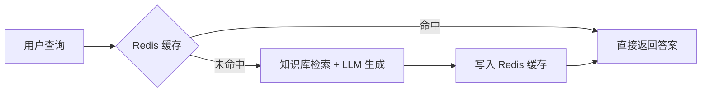

# Redis 数据库简介与使用笔记

> **项目定位**：在本项目（基于 MySQL 库的问答系统）中，Redis 作为缓存层，用于加速高频查询，减少重复计算和数据库压力。

---

## 一、Redis 数据库概述

### 1.1 什么是 Redis？

Redis（**RE**mote **DI**ctionary **S**erver）是一个高性能的**键值对（Key-Value）内存数据库**。它基于内存运行，读写速度极快，广泛用于缓存、会话管理、消息队列等场景。

### 1.2 Redis 的核心特性

| 特性 | 说明 |
|------|------|
| **高性能** | 数据存储在内存中，读写速度可达 10 万+ QPS |
| **持久化** | 支持 RDB（快照）和 AOF（日志）两种持久化方式，数据不丢失 |
| **丰富的数据结构** | 支持字符串、哈希、列表、集合、有序集合等多种数据类型 |
| **原子操作** | 所有操作都是原子性的，支持事务 |
| **简单易用** | 提供直观的 API，无需复杂的配置即可上手 |

### 1.3 常见应用场景

| 场景 | 说明 | 示例 |
|------|------|------|
| **缓存加速** | 缓存数据库查询结果、API 响应 | 缓存热门问答对 |
| **会话存储** | 存储用户登录状态、Session 信息 | 用户 Token 管理 |
| **计数器/排行榜** | 利用 Redis 原子性实现计数排序 | 文章阅读量、热搜榜 |
| **分布式锁** | 实现分布式环境下的互斥访问 | 防止缓存击穿 |
| **消息队列** | 利用 List 结构实现轻量级消息队列 | 异步任务处理 |
| **限流器** | 利用过期时间实现接口限流 | 防止 API 被刷 |

---

## 二、工程化代码实现

### 2.1 项目结构

```python
redis_lesson/
├── redis_client.py      # Redis 客户端封装模块
├── base.py              # 配置文件 + 日志配置
├── main.py              # 主程序入口
└── requirements.txt     # 依赖文件
```

### 2.2 配置文件（base.py）

```python
import logging

# 日志配置
logging.basicConfig(
    level=logging.INFO,
    format='%(asctime)s - %(levelname)s - %(message)s'
)
logger = logging.getLogger(__name__)

# Redis 配置类（集中管理，便于修改）
class Config:
    REDIS_HOST = "localhost"      # Redis 服务地址
    REDIS_PORT = 6379             # 默认端口
    REDIS_PASSWORD = None         # 密码（生产环境必设）
    REDIS_DB = 0                  # 数据库编号（0-15）
```

### 2.3 Redis 客户端封装（redis_client.py）

```python
import redis
import json
from base import Config, logger

class RedisClient:
    def __init__(self):
        self.logger = logger
        try:
            # 建立 Redis 连接
            self.client = redis.StrictRedis(
                host=Config.REDIS_HOST,
                port=Config.REDIS_PORT,
                password=Config.REDIS_PASSWORD,
                db=Config.REDIS_DB,
                decode_responses=True   # 自动解码为字符串
            )
            # 测试连接
            self.client.ping()
            self.logger.info("Redis 连接成功")
        except redis.RedisError as e:
            self.logger.error(f"Redis 连接失败: {e}")
            raise

    def set_data(self, key, value):
        """存储数据（自动序列化为 JSON）"""
        try:
            self.client.set(key, json.dumps(value, ensure_ascii=False))
            self.logger.info(f"存储数据到 Redis: {key}")
        except redis.RedisError as e:
            self.logger.error(f"Redis 存储失败: {e}")

    def get_data(self, key):
        """获取数据（自动反序列化）"""
        try:
            data = self.client.get(key)
            return json.loads(data) if data else None
        except redis.RedisError as e:
            self.logger.error(f"Redis 获取失败: {e}")
            return None

    def get_answer(self, query):
        """专门用于问答系统的缓存查询"""
        try:
            answer = self.client.get(f"answer:{query}")
            if answer:
                self.logger.info(f"从 Redis 命中缓存: {query}")
                return answer
            return None
        except redis.RedisError as e:
            self.logger.error(f"Redis 查询失败: {e}")
            return None

    def delete_data(self, key):
        """删除数据"""
        try:
            self.client.delete(key)
            self.logger.info(f"删除 Redis 数据: {key}")
        except redis.RedisError as e:
            self.logger.error(f"Redis 删除失败: {e}")

    def exists(self, key):
        """检查键是否存在"""
        return self.client.exists(key) > 0
```

**设计亮点**：

- 使用 `json.dumps/loads` 支持任意 Python 对象的存储
- `decode_responses=True` 统一处理字符串编码
- 完善的异常捕获，防止单点故障影响主业务
- 日志全链路追踪，便于排查问题

### 2.4 主程序（main.py）

```python
from redis_client import RedisClient
import logging

logging.basicConfig(level=logging.INFO, format='%(asctime)s - %(levelname)s - %(message)s')
logger = logging.getLogger(__name__)

def main():
    # 初始化 Redis 客户端
    redis_client = RedisClient()

    # ===== 示例1：存储和读取用户数据 =====
    key = "user:1"
    value = {"name": "Alice", "age": 25}
    redis_client.set_data(key, value)

    result = redis_client.get_data(key)
    if result:
        logger.info(f"查询结果: {result}")   # {'name': 'Alice', 'age': 25}
    else:
        logger.info("未找到数据")

    # ===== 示例2：问答缓存场景 =====
    query = "什么是 Redis？"
    answer = redis_client.get_answer(query)
    if answer:
        logger.info(f"缓存答案: {answer}")
    else:
        logger.info("未找到缓存答案，请从知识库检索后写入缓存")

if __name__ == "__main__":
    main()
```

### 2.5 依赖文件（requirements.txt）

```python
redis>=4.0.0
```

---

## 三、运行结果与分析

### 3.1 运行 main.py

```python
2025-05-12 10:00:01,123 - INFO - Redis 连接成功
2025-05-12 10:00:01,124 - INFO - 存储数据到 Redis: user:1
2025-05-12 10:00:01,125 - INFO - 查询结果: {'name': 'Alice', 'age': 25}
2025-05-12 10:00:01,126 - INFO - 未找到缓存答案
```

### 3.2 关键分析

| 观察点 | 说明 |
|--------|------|
| **连接成功** | Redis 服务正常，配置正确 |
| **JSON 存储** | 复杂对象存储后成功反序列化还原 |
| **缓存未命中** | 首次查询缓存为空，需回源检索后再写入 |
| **日志可追踪** | 每个操作都有日志，方便 Debug |

---

## 四、在 RAG 问答系统中的应用场景

| 场景 | Redis 作用 | 收益 |
|------|-----------|------|
| **热点问题缓存** | 缓存高频提问的答案 | 响应时间从秒级降至毫秒级 |
| **Embedding 缓存** | 缓存已计算的文本向量 | 避免重复调用 Embedding API，节省成本 |
| **对话历史存储** | 使用 List 存储多轮对话 | 支持有状态的对话场景 |
| **Session 管理** | 存储用户会话信息 | 支持用户登录态和个性化配置 |
| **分布式限流** | 使用 INCR + EXPIRE 实现 | 保护后端服务不被刷爆 |
| **任务队列** | 使用 List 的 LPUSH/RPOP | 异步处理耗时任务 |

### 典型调用流程（带缓存）：



---

## 五、最佳实践与注意事项

### 5.1 键命名规范

```python
[项目名]:[业务域]:[标识符]
例如：edurag:answer:如何学习Python
```

好处：便于管理、监控和按前缀批量操作。

### 5.2 设置过期时间

```python
# 为缓存键设置 1 小时过期
self.client.setex(key, 3600, json.dumps(value))
```

避免缓存无限膨胀。

### 5.3 缓存穿透/击穿/雪崩防护

| 问题 | 描述 | 解决方案 |
|------|------|---------|
| **缓存穿透** | 查询不存在的数据 | 布隆过滤器 / 缓存空值 |
| **缓存击穿** | 热点 Key 过期瞬间大量请求 | 互斥锁 / 逻辑过期 |
| **缓存雪崩** | 大量 Key 同时过期 | 随机过期时间 / 多级缓存 |

### 5.4 连接池配置（生产环境推荐）

```python
pool = redis.ConnectionPool(
    host='localhost',
    port=6379,
    max_connections=10,
    decode_responses=True
)
client = redis.StrictRedis(connection_pool=pool)
```

### 5.5 生产环境注意事项

| 要点 | 说明 |
|------|------|
| **设置密码** | 生产环境必须配置 `requirepass` |
| **禁用危险命令** | 如 `FLUSHALL`、`KEYS *`（用 `SCAN` 替代） |
| **监控内存** | 设置 `maxmemory` 和淘汰策略（如 `allkeys-lru`） |
| **持久化配置** | 根据数据重要性选择 RDB/AOF/混合模式 |

---

## 本章小结

| 知识点 | 要点 |
|--------|------|
| **Redis 定位** | 高性能内存键值数据库，适用于缓存、会话、计数等场景 |
| **核心 API** | `set/get`、`json.dumps/loads` 序列化、`get_answer` 封装 |
| **工程化设计** | 配置集中管理、日志全链路、异常处理、连接池 |
| **问答系统价值** | 缓存热点问题，大幅降低响应延迟和计算成本 |
