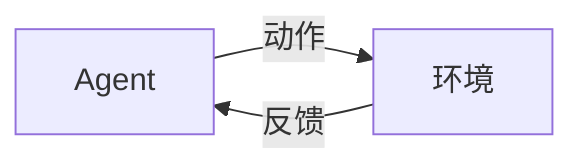

# 原子化知识卡片生成提示词

> 用途：将知识点生成为统一格式的原子卡片，存入仓库对应分类目录下
> 参考样例：`Atomic-Cards/线性代数/01-向量基础.md`

---

## 输出目录规则

所有卡片按知识点归属写入 `Atomic-Cards/<分类名>/` 下。现有分类：

| 分类文件夹 | 内容范围 | 已存在编号 |
|:-----------|:---------|:----------|
| `线性代数/` | 向量 → 矩阵 → SVD → 神经网络连接 | 01~18 |
| `微积分与优化/` | 导数 → 链式法则 → 梯度 → 凸优化 | 01~06 |
| `概率统计/` | 概率空间 → 贝叶斯 → 分布 → MLE | 01~07 |
| `Python/` | OOP → 装饰器 → 迭代器 → 进程 → 线程 → 协程 | 01~15 |
| `Linux/` | 基础哲学 → Shell → 进程 → GPU 监控 | 01~08 |
| `包管理/` | Conda 环境/包管理 → UV | 01~03 |
| `数据库/` | SQL → MySQL → Redis → Milvus 向量库 → RAG Collection 表结构 → TF-IDF → RRF/BGE | 01~15 |
| `数据结构与算法/` | 复杂度 → 排序 → 搜索 → DP → 贪心 | 01~15 |
| `机器学习/` | 概述 → 监督/无监督 → 集成 → 正则化 → PCA/t-SNE → LLM评估(BLEU/ROUGE/PPL) | 01~31 |
| `深度学习/` | 感知机 → 反向传播 → CNN/RNN → 蒸馏/压缩 → 迁移学习/微调 → 语言模型发展史 → Scaling Law | 01~23 |
| `NLP/` | 分词 → Embedding → Transformer → BERT/GPT → 残差连接 → LayerNorm → N-gram → 文本匹配 → 序列标注 | 01~17 |
| `数据分析/` | NumPy → 广播 → Pandas → Matplotlib | 01~04 |
| `AI-Agent/` | Agent → RAG → 混合检索 → 查询改写 → 评估 → LangChain → BM25 → 多格式文档加载与OCR → 推理参数 → CoT | 01~30（跳号，共 21 张） |
| `工程实践/` | Docker → Git → Flask → Ollama → LLM API → HTTP → GPU → Claude → WebSocket/SSE → Docker Compose | 01~11 |
| `知识体系/` | 核心依赖链 → 面试追问树 | 01~02 |

**新卡片编号**：检查对应目录下已有文件的最高编号，新卡片为 `{最高编号+1}-{概念名}.md`，两位数补零。

---

## 卡片格式要求

### Frontmatter（YAML 元数据）

```yaml
---
author: "XunZong"
created: "2026-07-06"
tags: ["所属分类", "二级标签", "核心概念"]
aliases: ["中文名", "English Term"]
---
```

- `tags`：至少 2 个，第一个为所属分类，第二个为具体标签
- `aliases`：包含中文名和常用英文术语

### 正文结构

每张卡片选择包含以下 **2-4 个部分**（定义必选）：

#### 1. 定义（必备）

严谨易懂的定义，包含数学形式。**必须有 LaTeX 公式**（行内 `$...$`，块级 `$$...$$$`）。

#### 公式变量含义标注（强制）

每个公式中的**每个字母/符号**都必须标注其含义。标注方式为以下两种之一（任选其一即可）：

**推荐格式：公式后逐行列出，每行一个变量**

```markdown
$$
\theta_{t+1} = \theta_t - \eta \nabla L(\theta_t)
$$

- $\theta_t$：第 $t$ 步的模型参数
- $\eta$：学习率（步长）
- $\nabla L(\theta_t)$：损失函数在 $\theta_t$ 处的梯度
```

**规则**：

- **禁止**让读者靠惯例或上下文推断变量含义（如 $W$ 表示权重、$b$ 表示偏置虽然是惯例，但仍需在首次出现时说明）
- 同一卡片中已标注过的变量可不再重复标注
- 表格内的公式：在表头行或表格前后说明通用符号含义，或每行"说明"列中解释
- 数学常量和公认符号（如 $\pi$、$e$、$\mathbb{R}$ 表示实数集）可省略标注

#### 2. 核心公式 / 分类表（若适用）

Markdown 表格列出公式/分类/对比，含名称、公式（LaTeX）、含义/几何意义、应用。

#### 3. 直观理解 / 几何意义（若适用）

一句话解释直觉含义，帮助理解。

#### 4. ML/DL 应用场景（重要，必选）

表格或列表说明概念在 AI 领域的具体出现位置及数学形式：

| 应用场景 | 数学形式 | 说明 |
|----------|----------|------|

**例外处理（纯基础数学卡片）**：若当前卡片属于纯数学工具（如线性代数中的行列式、特征值、范数；微积分中的导数定义等），且无法直接在表格中写出具体 ML 算法公式时，可降级为"**数学基础支撑**"模式——列明该数学概念为哪些上层 ML/DL 概念提供理论基础，并至少引用 1 张 `深度学习/` 或 `机器学习/` 目录下的卡片作为应用出口。

示例（`线性代数/07-行列式`）：

| 应用场景 | 数学形式 | 说明 |
|----------|----------|------|
| 判断矩阵可逆性 | $\det(A) \neq 0$ | 用于神经网络参数初始化时保证权重矩阵可逆 |
| 特征值求解前置条件 | $\det(A - \lambda I) = 0$ | 为 PCA 降维提供数学前提 |

### 引用链接（跨领域强制规则）

**链接格式总览**：所有卡片间的引用统一使用标准 Markdown 相对路径。**显示名中不包含编号前缀**，仅写概念名称。

- 同目录：`[名称](./编号-名称.md)`，如 `[自注意力](./06-自注意力.md)` ✅
- 跨目录：`[名称](../目标分类/编号-名称.md)`，如 `[矩阵乘法](../线性代数/04-矩阵乘法.md)` ✅
- 禁止 Obsidian 风格 `[[wiki链接]]`
- 禁止显示名带编号：`[06-自注意力](./06-自注意力.md)` ❌

卡片末尾引用行格式（每个引用单独成行，前有 `## 参考引用` 标题，每行详细说明引用原因）：

```markdown
## 参考引用

- 需要理解[具体原因]参见 [名称](./编号-名称.md)
- 需要掌握[具体原因]参见 [名称](../目标分类/编号-名称.md)
- 需要了解[具体原因]参见 [名称](../目标分类/编号-名称.md)
```

**核心原则**：引用必须跨域，覆盖**数学根基**（线性代数/微积分/概率统计）+ **同域依赖**（当前分类）+ **工程落地**（工程实践/深度学习/AI-Agent），按下方决策流程自检。

**数量与配比**：

- 引用总数：**3 ~ 10 张**，必须含至少 1 张 `线性代数/` 或 `微积分与优化/` 的卡片（有数学公式时），以及至少 1 张跨一级目录的卡片
- **禁止为凑数而引用**：每个引用必须有实际意义

**决策流程**：

1. 看公式→引用数学根基  |  2. 看训练→引用深度学习/微积分  |  3. 看部署→引用工程实践

**错误示例**：

- 显示名带编号：`[06-自注意力](...)` ❌ → `[自注意力](...)` ✅
- 无上下文说明的裸引用：`> 参见 [A](./A.md)` ❌ → 每个引用前必须有上下文短语

### 格式约束

- **不使用图标**（如 ✅、📝、🔗、💡 等）和 **emoji**
- 纯 Markdown：标题 `#` / `##`、表格、列表、LaTeX 公式
- Python 代码块用 ` ```python ` 包裹，**代码中的关键行必须加中文注释**解释该行/该段的功能和目的
- **代码块必须闭合**：任何 ` ``` ` 开头的代码块（python/bash/yaml/mermaid 等）必须有对应的 ` ``` ` 结束标记。缺失闭合会导致后续所有内容被吞入代码块，Markdown 表格、标题、引用等均无法正常渲染。生成后应手动检查或自动化验证每个代码块是否成对出现
- **LaTeX 公式不得放入代码块中**：` ```python ` / ` ``` ` 等代码块内禁止写入 LaTeX 公式（如 `score(m, n) = Q^T \cdot K`）。数学公式必须使用行内 `$...$` 或块级 `$$...$$` 渲染，放入代码块内无法被 LaTeX 解析器识别，将显示为纯文本 ❌
- 文件名：`<两位序号>-<概念名>.md`
- **内容充实要求**：每张卡片的知识点应足够详细——定义部分需至少包含数学形式或核心公式；分类/对比需用表格呈现；代码示例需展示完整用法而非片段；面试问答 Q1-Q4 由浅入深覆盖基础、原理、实战、边界四个层次

### LaTeX 兼容性规则

在 Markdown 表格中使用 LaTeX 时，禁止 `|` 和 `&` 符号（会被解析为表格列分隔符）：

| 场景 | 错误 | 正确 |
|:----|:-----|:-----|
| 范数 | `$\|x\|$` | `$\Vert x \Vert$` |
| 条件概率 | `$P(A\|B)$` | `$P(A\vert B)$` |
| 绝对值 | `$\|x\|$` | `$\vert x \vert$` |
| 矩阵对齐 | `\begin{matrix} 1 & 2` | 移至表格外用独立 `$$...$$` |

部分 LaTeX 命令在 Obsidian/KaTeX 中不兼容，用替代表达：

| 错误（不兼容） | 正确（兼容） |
|:--------------|:-------------|
| `\argmin` | `\arg\min` 或 `\operatorname{argmin}` |
| `\argmax` | `\arg\max` 或 `\operatorname{argmax}` |
| `\softmax` | `\text{softmax}` 或 `\operatorname{softmax}` |
| `\R` / `\N` | `\mathbb{R}` / `\mathbb{N}` |
| `\Var` / `\Cov` / `\E` | `\operatorname{Var}` / `\operatorname{Cov}` / `\mathbb{E}` |
| `\relu` / `\sigmoid` | `\text{ReLU}` / `\text{sigmoid}` |
| `\lVert` / `\rVert` | `\Vert` |

**核心原则**：非标准运算符用 `\operatorname{}` 包裹，标准文本缩写用 `\text{}` 包裹。

### Mermaid 图表格式限定

仅当需展示流程走向或状态转换时使用 mermaid。必须遵守：

| 要点 | 要求 |
|:----|:-----|
| **声明图类型** | 首行为 `flowchart LR/TD` 或 `sequenceDiagram` |
| **节点标识符** | 用 `A[文本]` 格式，字母标识符 + 方括号包裹显示文本 |
| **箭头** | 用 `-->` 连接，禁止 `→` Unicode 箭头 |
| **连线标注** | 用 `-->|说明|` 格式 |
| **禁止裸文本** | 所有文本都必须属于某个节点或连线 |



### 面试问答（必选）

每张卡片**必须**在末尾附带 Q1→Q4 面试问答，由浅入深覆盖基础 → 深挖 → 实战 → 边界。

```markdown
## 面试追问

**Q1（基础）**：[核心概念的理解]
**回答要点**：

1. [第一得分点]
2. [第二得分点]

**Q2（深挖）**：[原理/优缺点/对比]
**回答要点**：[同上格式，省略 Q3/Q4]
```

**规则**：

- Q 行与 `**回答要点**` 之间空行，要点后空一行再写编号列表
- 回答要点**必须有实际内容**，不得使用泛泛占位语

---

> 输出要求 → `.claude/atomic-cards-output.md` ｜ 批量操作规则 → `.claude/atomic-cards-workflow.md` ｜ Python 使用规范 → `.claude/python-usage.md`
