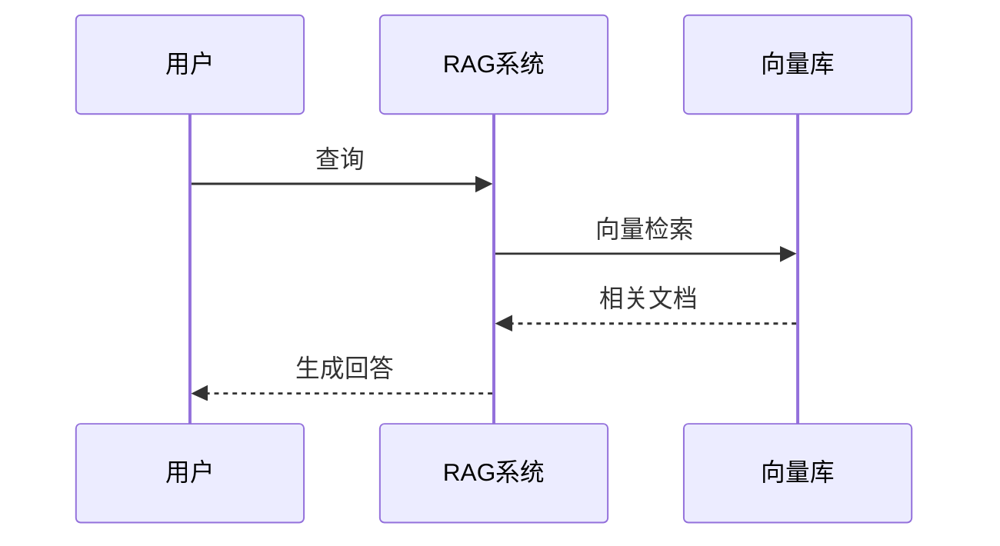
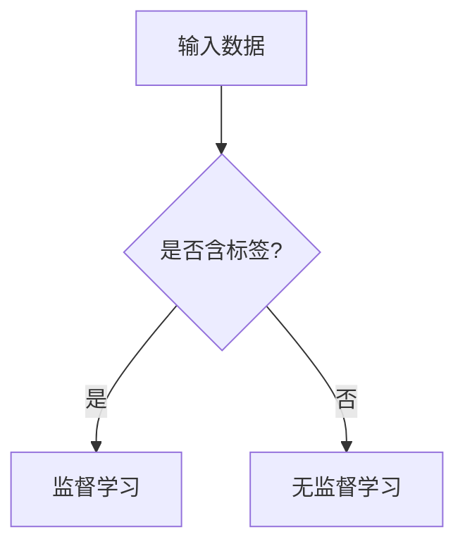

# 原子化知识卡片生成提示词

> 用途：将知识点生成为统一格式的原子卡片，存入仓库对应分类目录下
> 参考样例：`Atomic-Cards/线性代数/01-向量基础.md`

---

## 输出目录规则

所有卡片按知识点归属写入 `Atomic-Cards/<分类名>/` 下。现有分类：

| 分类文件夹 | 内容范围 | 已存在编号 |
|:-----------|:---------|:----------|
| `线性代数/` | 向量 → 矩阵 → SVD → 神经网络连接 | 01~18 |
| `微积分与优化/` | 导数 → 链式法则 → 梯度 → 凸优化 | 01~06 |
| `概率统计/` | 概率空间 → 贝叶斯 → 分布 → MLE | 01~07 |
| `Python/` | OOP → 装饰器 → 迭代器 → 进程 → 线程 → 协程 | 01~15 |
| `Linux/` | 基础哲学 → Shell → 进程 → GPU 监控 | 01~08 |
| `包管理/` | Conda 环境/包管理 → UV | 01~03 |
| `数据库/` | SQL → MySQL → Redis → Milvus 向量库 | 01~11 |
| `数据结构与算法/` | 复杂度 → 排序 → 搜索 → DP → 贪心 | 01~15 |
| `机器学习/` | 概述 → 监督/无监督 → 集成 → 正则化 | 01~30 |
| `深度学习/` | 感知机 → 反向传播 → CNN/RNN → 蒸馏/压缩 → 迁移学习/微调 | 01~23 |
| `NLP/` | 分词 → Embedding → Transformer → BERT/GPT → 残差连接 → LayerNorm | 01~14 |
| `数据分析/` | NumPy → 广播 → Pandas → Matplotlib | 01~04 |
| `AI-Agent/` | Agent → RAG → 混合检索 → 查询改写 → 评估 → LangChain → BM25 | 01~27（跳号，共 18 张） |
| `工程实践/` | Docker → Git → Flask → Ollama → LLM API → HTTP → GPU | 01~08 |
| `知识体系/` | 核心依赖链 → 面试追问树 | 01~02 |

**新卡片编号**：检查对应目录下已有文件的最高编号，新卡片为 `{最高编号+1}-{概念名}.md`，两位数补零。

---

## 卡片格式要求

### Frontmatter（YAML 元数据）

```yaml
---
author: "XunZong"
created: "2026-07-06"
tags: ["所属分类", "二级标签", "核心概念"]
aliases: ["中文名", "English Term"]
---
```

- `tags`：至少 2 个，第一个为所属分类，第二个为具体标签
- `aliases`：包含中文名和常用英文术语

### 正文结构

每张卡片选择包含以下 **2-4 个部分**（定义必选）：

#### 1. 定义（必备）

严谨易懂的定义，包含数学形式。**必须有 LaTeX 公式**（行内 `$...$`，块级 `$$...$$$`）。

#### 公式变量含义标注（强制）

每个公式中的**每个字母/符号**都必须标注其含义。标注方式为以下两种之一（任选其一即可）：

**方式一：公式后逐行列出（推荐，适用于复杂公式）**

```markdown
$$
\theta_{t+1} = \theta_t - \eta \nabla L(\theta_t)
$$

- $\theta_t$：第 $t$ 步的模型参数
- $\eta$：学习率（步长）
- $\nabla L(\theta_t)$：损失函数在 $\theta_t$ 处的梯度
```

**方式二：公式前的正文中定义（适用于简单公式）**

```markdown
设权重矩阵 $W \in \mathbb{R}^{m \times n}$、输入向量 $\mathbf{x} \in \mathbb{R}^n$、偏置 $b \in \mathbb{R}$：
$$
\mathbf{h} = W\mathbf{x} + b
$$
```

**规则**：
- **禁止**让读者靠惯例或上下文推断变量含义（如 $W$ 表示权重、$b$ 表示偏置虽然是惯例，但仍需在首次出现时说明）
- 同一卡片中已标注过的变量可不再重复标注
- 表格内的公式：在表头行或表格前后说明通用符号含义，或每行"说明"列中解释
- 数学常量和公认符号（如 $\pi$、$e$、$\mathbb{R}$ 表示实数集）可省略标注

#### 2. 核心公式 / 分类表（若适用）

Markdown 表格列出公式/分类/对比，含名称、公式（LaTeX）、含义/几何意义、应用。

#### 3. 直观理解 / 几何意义（若适用）

一句话解释直觉含义，帮助理解。

#### 4. ML/DL 应用场景（重要，必选）

表格或列表说明概念在 AI 领域的具体出现位置及数学形式：

| 应用场景 | 数学形式 | 说明 |
|----------|----------|------|

**例外处理（纯基础数学卡片）**：若当前卡片属于纯数学工具（如线性代数中的行列式、特征值、范数；微积分中的导数定义等），且无法直接在表格中写出具体 ML 算法公式时，可降级为"**数学基础支撑**"模式——列明该数学概念为哪些上层 ML/DL 概念提供理论基础，并至少引用 1 张 `深度学习/` 或 `机器学习/` 目录下的卡片作为应用出口。

示例（`线性代数/07-行列式`）：

| 应用场景 | 数学形式 | 说明 |
|----------|----------|------|
| 判断矩阵可逆性 | $\det(A) \neq 0$ | 用于神经网络参数初始化时保证权重矩阵可逆 |
| 特征值求解前置条件 | $\det(A - \lambda I) = 0$ | 为 PCA 降维提供数学前提 |

### 引用链接（跨领域强制规则）

**链接格式总览**：所有卡片间的引用统一使用标准 Markdown 相对路径。**显示名中不包含编号前缀**，仅写概念名称。

- 同目录：`[名称](./编号-名称.md)`，如 `[自注意力](./06-自注意力.md)` ✅
- 跨目录：`[名称](../目标分类/编号-名称.md)`，如 `[矩阵乘法](../线性代数/04-矩阵乘法.md)` ✅
- 禁止 Obsidian 风格 `[[wiki链接]]`
- 禁止显示名带编号：`[06-自注意力](./06-自注意力.md)` ❌

卡片末尾引用行格式（每个引用单独成行，前有 `## 参考引用` 标题，每行详细说明引用原因）：

```markdown
## 参考引用

- 需要理解[具体原因]参见 [名称](./编号-名称.md)
- 需要掌握[具体原因]参见 [名称](../目标分类/编号-名称.md)
- 需要了解[具体原因]参见 [名称](../目标分类/编号-名称.md)
```

> **路径规则**：使用相对于当前卡片所在目录的相对路径。
> - 同一子目录内：`[名称](./编号-名称.md)`
> - 跨一级目录：`[名称](../目标分类/编号-名称.md)`

**核心原则（打破文件夹局限）**：引用**不得**局限于当前分类目录。一张高质量的原子卡片，必须建立 **"三位一体"** 的跨域引用链，将知识点锚定在整个 AI 知识图谱中：

| 引用类型 | 优先级 | 指向目录（示例） | 判断标准（以"多头注意力"为例） |
| :--- | :--- | :--- | :--- |
| **1. 数学根基 (Math Foundation)** | **最高** | `线性代数/`、`微积分与优化/`、`概率统计/` | 理解该概念**必须**懂的数学工具（如矩阵乘法、梯度、分布） |
| **2. 同域依赖 (Domain Dependency)** | 高 | 当前卡片所在目录（如 `NLP/`） | 该概念在领域内的**直接前置**与**直接后置**卡片（如自注意力 → 多头 → BERT） |
| **3. 工程/应用落地 (Engineering & Application)** | 中 | `工程实践/`、`深度学习/`、`AI-Agent/` | 该概念在模型训练/部署中的具体体现（如 GPU 并行、模型架构实现） |

**数量与配比硬性要求**：

- 引用总数：**3 ~ 10 张**。
- **必须包含至少 1 张 `线性代数/` 或 `微积分与优化/` 的卡片**（若该概念有数学公式）。
- **必须包含至少 1 张跨一级目录的卡片**（即不能全在同一个文件夹内）。
- **禁止为凑数而引用**：每个引用必须有实际意义——所引知识是理解当前卡片的已知前提或补充延伸。

**引用选择决策流程（生成时自检）**：

1. 看公式：公式里有矩阵乘法？→ 引用 `线性代数/矩阵乘法` → 写作 `[矩阵乘法](../线性代数/04-矩阵乘法.md)`
2. 看训练：该模块有可学习参数，需反向传播？→ 引用 `深度学习/反向传播算法` 或 `微积分与优化/梯度与方向导数`
3. 看部署：该模块耗费大量显存或需要并行？→ 引用 `工程实践/GPU并行与混合精度`

**正确引用示例（以 `NLP/自注意力与Transformer.md` 为例）**：

```markdown
## 参考引用

- 需要理解自注意力机制的计算原理作为前置知识，参见 [自注意力与Transformer](./06-自注意力与Transformer.md)
- 需要掌握矩阵乘法以理解注意力得分中的线性变换，参见 [矩阵乘法](../线性代数/04-矩阵乘法.md)
- 需要了解梯度计算以理解训练优化过程，参见 [梯度与方向导数](../微积分与优化/03-梯度与方向导数.md)
- 需要了解GPU加速推理以完成工程部署，参见 [GPU并行与混合精度](../工程实践/02-GPU并行与混合精度.md)
```

> （解读：自注意力为同域依赖，矩阵乘法为数学根基，梯度为优化根基，GPU为工程落地——完美覆盖三位一体）

**错误示例（禁止）**：

1. 显示名带编号：`[06-自注意力与Transformer](./06-自注意力与Transformer.md)` ❌ → 应为 `[自注意力与Transformer](./06-自注意力与Transformer.md)`
2. 全部局限在同一个文件夹内：超3个同域引用但无跨域 ❌
3. 无上下文说明的裸引用：`> 参见 [A](./A.md)、[B](./B.md)` ❌ → 每个引用前必须有上下文短语说明引用原因
4. 引用未换行且无标题：末尾仅一行 `> 参见 ...` 无 `## 参考引用` 标题 ❌

### 格式约束

- **不使用图标**（如 ✅、📝、🔗、💡 等）和 **emoji**
- 纯 Markdown：标题 `#` / `##`、表格、列表、LaTeX 公式
- Python 代码块用 ` ```python ` 包裹，**代码中的关键行必须加中文注释**解释该行/该段的功能和目的
- **LaTeX 公式不得放入代码块中**：` ```python ` / ` ``` ` 等代码块内禁止写入 LaTeX 公式（如 `score(m, n) = Q^T \cdot K`）。数学公式必须使用行内 `$...$` 或块级 `$$...$$` 渲染，放入代码块内无法被 LaTeX 解析器识别，将显示为纯文本 ❌
- 文件名：`<两位序号>-<概念名>.md`
- **内容充实要求**：每张卡片的知识点应足够详细——定义部分需至少包含数学形式或核心公式；分类/对比需用表格呈现；代码示例需展示完整用法而非片段；面试问答 Q1-Q4 由浅入深覆盖基础、原理、实战、边界四个层次

### LaTeX 在表格中的注意事项

表格内的 LaTeX 禁止使用 `|` 管道符：

| 场景   | 错误          | 正确                |     |     |           |                   |
| ---- | ----------- | ----------------- | --- | --- | --------- | ----------------- |
| 范数 ` |             | x                 |     | `   | `$\|x\|$` | `$\Vert x \Vert$` |
| 条件概率 | `$P(A\|B)$` | `$P(A\vert B)$`   |     |     |           |                   |
| 绝对值  | `$\|x\|$`   | `$\vert x \vert$` |     |     |           |                   |

**补充规则（禁止 `&` 符号）**：在 Markdown 表格的单元格内，LaTeX 公式中**禁止使用 `&` 符号**（如矩阵 `\begin{matrix} 1 & 2 \\ 3 & 4 \end{matrix}`），因为 `&` 会被 Markdown 解析为表格列分隔符，导致整表渲染崩溃。

### Mermaid 图表格式限定

当卡片中使用 mermaid 图表时，必须遵守以下规则确保在 Obsidian/标准 Markdown 中正确渲染。

**错误示例（禁止——纯文本箭头不是有效 mermaid）**：

```markdown
```mermaid
Agent → 动作 → 环境 → 状态 → Agent
```
```

❌ 以上不是有效 mermaid 语法，不会渲染为流程图。

**正确格式**：


**核心规则**：

| 要点 | 说明 | 正确示例 |
|:----|:-----|:---------|
| **必须声明图类型** | mermaid 代码块第一行必须是 `flowchart` / `graph` / `sequenceDiagram` 等类型声明 | `flowchart LR` |
| **节点必须有标识符** | 每个节点用 `字母[A-Z]` 作为标识符，方括号 `[]` 包裹显示文本 | `A[节点文本]` |
| **箭头语法** | 使用 `-->` 或 `---` 连接节点，不可用 `→` 或 `->` 纯文本箭头 | `A --> B` |
| **连线标注** | 连线上的说明用 `\|...\|` 包裹放在箭头符号的中间 | `A -->\|说明\| B` |
| **禁止中文箭头** | 禁止使用 `→` `←` `↓` 等 Unicode 箭头符号 | 全部替换为 `-->` / `---` |
| **禁止裸文本** | mermaid 块中不能出现没有节点标识符的纯文本行 | 所有文本都必须属于某个节点或连线 |
| **图类型选择** | 简单流程图用 `flowchart LR`（左右）或 `flowchart TD`（上下）；时序图用 `sequenceDiagram` | 视场景选择 |

**选用建议**：mermaid 宜用于展示**流程走向**（RAG 流程、梯度传播路径）或**状态转换**（RL 循环、训练/推理切换）；对于静态分类对比，使用 Markdown 表格替代 mermaid。

**正确示例——时序图**：



**正确示例——流程图**：



### LaTeX 在通用公式中的注意事项

部分 LaTeX 命令在 Obsidian/KaTeX/MathJax 环境中可能无法正常渲染，需使用兼容替代表达：

| 错误写法（不兼容） | 正确写法（兼容） | 说明 |
|:-----------------|:----------------|:-----|
| `\argmin` | `\arg\min` 或 `\operatorname{argmin}` | 非标准运算符 |
| `\argmax` | `\arg\max` 或 `\operatorname{argmax}` | 非标准运算符 |
| `\softmax` | `\text{softmax}` 或 `\operatorname{softmax}` | 非标准运算符 |
| `\R` | `\mathbb{R}` | 简写在黑体宏包中 |
| `\N` | `\mathbb{N}` | 简写在黑体宏包中 |
| `\Var` | `\operatorname{Var}` | 非标准运算符 |
| `\Cov` | `\operatorname{Cov}` | 非标准运算符 |
| `\E` | `\mathbb{E}` 或 `\operatorname{E}` | 期望符号 |
| `\relu` | `\text{ReLU}` | 非标准运算符 |
| `\sigmoid` | `\text{sigmoid}` | 非标准运算符 |
| `\lVert` / `\rVert` | `\Vert` | 某些渲染器不支持 `\lVert` |

**核心原则**：对于非标准数学运算符（如优化算法名、神经网络层名、自定义函数），统一使用 `\operatorname{}` 包裹；对于标准文本缩写（如 ReLU、LSTM、MSE），统一使用 `\text{}` 包裹。避免使用不在 LaTeX 内核中的宏包简写。

- **正确做法**：若公式必须包含 `&`，请将该公式移出表格，使用独立的块级公式（`$$...$$`）展示在表格上方或下方，表格内改用文字描述该公式的含义或结果。
- **替代方案**：使用 `\begin{array}` 并配合 `\vert`，但最简单可靠的方式是"表格外独立公式 + 表格内文字引用"。

### 面试问答（必选）

每张卡片**必须**在末尾附带面试问答板块，用于应对技术面试中的层层追问。格式参照 `G:\AI-Learning\面试追问.md`：

```markdown
## 面试追问

**Q1（基础）**：[核心概念的理解]
**回答要点**：

1. [第一得分点]
2. [第二得分点]
3. [第三得分点]

**Q2（深挖）**：[原理/优缺点/对比]
**回答要点**：

1. [第一得分点]
2. [第二得分点]
3. [第三得分点]

**Q3（实战）**：[项目中的应用场景]
**回答要点**：

1. [第一得分点]
2. [第二得分点]
3. [第三得分点]

**Q4（边界）**：[极端情况/失效场景/优化方向]
**回答要点**：

1. [第一得分点]
2. [第二得分点]
3. [第三得分点]

## 参考引用
- 需要理解...的相关知识，参见 [名称](./路径.md)
- 需要掌握...的相关知识，参见 [名称](../分类/路径.md)
```

**规则**：

- Q1→Q4 由浅入深排列，遵循 **「基础 → 深挖 → 实战 → 边界」** 四层追问结构
- Q 行与 **回答要点** 行之间**不空行**，直接连续书写
- `**回答要点**：` 之后**空一行**，然后使用 `1. 2. 3.` 编号列表写出具体得分点
- 回答要点**必须有实际内容**，不得使用泛泛的占位语，要写出具体知识点
- Q1/Q2/Q3/Q4 必须用 `**加粗**` 包裹
- 问题与问题之间空一行（增强可读性）
- 参考引用位于文件**最末尾**，不使用块引用 `>`，直接用 `## 参考引用` 标题
- 每个引用前需有上下文短语说明引用原因，使用「需要理解...的相关知识，参见」句式
- 引用显示名不含编号前缀，使用标准相对路径

---

## 输出要求

1. 如果知识点属于已有分类 → 写入对应目录，编号为当前最大编号 + 1
2. **编号预占位（防并发冲突）**：多张卡片并行写入前，必须先执行编号预占位——即检查当前目录最大编号后，将本次要生成的所有新编号（如 15、16、17）记录到一个临时占位清单（或直接创建空文件名），再逐一写入内容。严禁两个生成任务同时对同一目录读取 `max` 并写入相同编号。
3. 如果知识点属于全新分类 → 新建目录，从 01 开始编号
4. 生成完成后，执行一次引用断链检查：所有 Markdown 链接（`[名称](../分类/编号-名称.md)` 格式）的路径必须真实可解析（文件存在且路径正确）。
5. **强制更新卡片总览**：每次新卡片生成后，必须同步更新 `Atomic-Cards/卡片总览.md`：
   - 在该分类的编号表格中按序号插入新行；
   - 更新文件开头的卡片总计数（如"共计 176 张"改为"共计 177 张"）；
   - 若新增分类，则在总览中新建对应的分类表格和学习路径。
   此步骤与生成卡片本身同等重要，不得省略。
6. 多张卡片可并行写入，但注意引用链完整性
7. **同步更新输出目录表格**：每次新增卡片后，同步更新本提示词 `## 输出目录规则` 中对应分类的"已存在编号"范围（如 `01~18` → `01~19`），以及"内容范围"描述（若新增了超出范围的子主题）。此表格是快速查阅的静态快照，保持其准确性能提升后续检索效率。

---

## 参考样例

见 `Atomic-Cards/线性代数/01-向量基础.md`，包含上述全部格式要素的完整实现。

汇总目录见 `Atomic-Cards/卡片总览.md`，包含全部 180 张卡片的分类索引和依赖关系图。

---

claude --resume d87ac3b6-0ac4-4479-885d-b7106a9d323a

claude --resume 71055eaf-81d4-4bad-ac02-296befa46661
