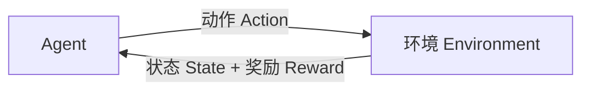

# 监督学习与非监督学习

## 监督学习（Supervised Learning）

从带标签的训练数据中学习 $X \to y$ 的映射函数：

```python
# 分类：预测离散标签（如判断邮件是否为垃圾邮件）
from sklearn.linear_model import LogisticRegression

clf = LogisticRegression()
clf.fit(X_train, y_train)               # X: 特征, y: 标签（0或1）

y_pred = clf.predict(X_test)            # 对测试样本输出预测类别（0或1）

# 回归：预测连续值（如预测房价）
from sklearn.linear_model import LinearRegression

reg = LinearRegression()
reg.fit(X_train, y_train)               # y: 连续值

y_pred = reg.predict(X_test)            # 对测试样本输出预测的连续数值
```

| | 分类（Classification） | 回归（Regression） |
|--|----------------------|-------------------|
| **输出** | 离散类别 | 连续数值 |
| **目标** | 划分到哪个类别 | 预测具体数值 |
| **损失** | 交叉熵、Hinge | MSE、MAE |
| **评估** | 准确率、F1、AUC | R²、RMSE、MAE |
| **示例** | 垃圾邮件检测 | 房价预测 |

## 无监督学习（Unsupervised Learning）

从无标签数据中发现隐藏模式：

```python
# 聚类：自动分组（将数据划分为K个簇，无标签信息）
from sklearn.cluster import KMeans

kmeans = KMeans(n_clusters=5)

labels = kmeans.fit_predict(X)          # 自动分配组别，无需提供真实标签

# 降维：压缩到低维空间（在保留数据主要结构的前提下减少特征数）
from sklearn.decomposition import PCA

pca = PCA(n_components=2)

X_2d = pca.fit_transform(X)             # 保留最大方差方向，降至2维便于可视化
```

| 任务 | 目标 | 算法 |
|------|------|------|
| **聚类（Clustering）** | 将数据自动分组 | K-means、DBSCAN、层次聚类 |
| **降维（Dimensionality Reduction）** | 压缩数据维度 | PCA、t-SNE、UMAP |
| **密度估计（Density Estimation）** | 估计数据分布 | GMM、KDE |
| **异常检测（Anomaly Detection）** | 发现离群点 | Isolation Forest、LOF |

## 强化学习（Reinforcement Learning）

智能体（Agent）通过与环境的交互，根据奖励信号学习最优策略：



| 概念 | 定义 | 类比 |
|------|------|------|
| **状态（State）** | 环境的当前描述 | 棋局局面 |
| **动作（Action）** | 智能体的决策 | 走哪步棋 |
| **奖励（Reward）** | 动作的即时反馈 | 赢棋+1，输棋-1 |
| **策略（Policy）** | 状态到动作的映射 | 棋谱 |

## 三者本质区别

| 维度 | 监督学习 | 无监督学习 | 强化学习 |
|------|:--------:|:----------:|:--------:|
| 有无标签 | ✅ 有 | ❌ 无 | 🟡 奖励信号 |
| 反馈方式 | 每个样本都有 | 无反馈 | 延迟奖励 |
| 目标 | 拟合标签分布 | 发现隐藏结构 | 最大化累计奖励 |
| 类似人类 | 刷题对答案 | 自己找规律 | 试错学习 |

## 面试追问

**Q1（基础）**：监督学习、无监督学习、强化学习三者的本质区别是什么？
**回答要点**：

1. 监督学习有标签，每个样本都有反馈，目标是拟合 X→y 映射
2. 无监督学习无标签，目标是发现隐藏结构
3. 强化学习只有延迟奖励信号，通过试错学习最优策略

**Q2（深挖）**：分类任务和回归任务有什么区别？各自用什么损失函数和评估指标？
**回答要点**：

1. 分类输出离散类别，回归输出连续数值
2. 分类常用交叉熵损失或 Hinge 损失，评估用准确率、F1、AUC
3. 回归常用 MSE 损失，评估用 R²、RMSE、MAE

**Q3（实战）**：在一个新项目初期，如何判断应该用哪种学习范式？
**回答要点**：

1. 有标签则用监督学习，无标签则用无监督学习
2. 根据目标区分：预测离散值选分类，预测连续值选回归
3. 涉及序列决策和交互环境则用强化学习，成本决定是否标注数据

**Q4（边界）**：监督学习在什么场景下会失效？有什么补救措施？
**回答要点**：

1. 失效场景：标注成本过高或无法获取标签时
2. 半监督学习：利用少量标签数据结合大量无标签数据
3. 主动学习与弱监督：只标注最有价值的样本，或利用启发式规则生成噪声标签

## 参考引用
- 需要理解K-means聚类的相关知识，参见 [K-means聚类](./15-K-means聚类.md)
- 需要理解机器学习概述的相关知识，参见 [机器学习概述](./01-机器学习概述.md)
- 需要理解过拟合与欠拟合的相关知识，参见 [过拟合与欠拟合](./05-过拟合与欠拟合.md)
