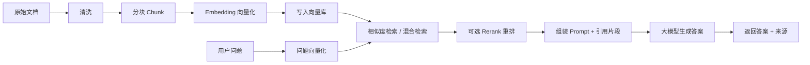
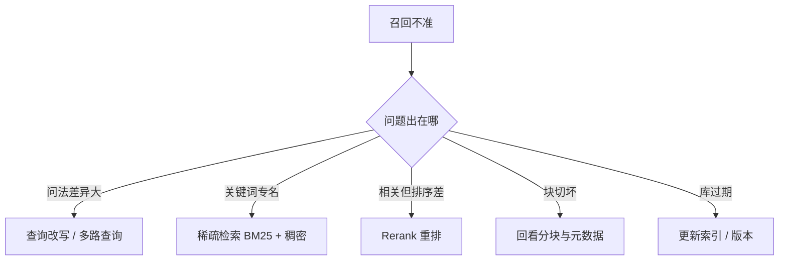
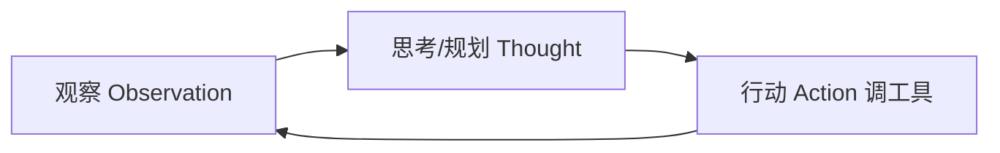
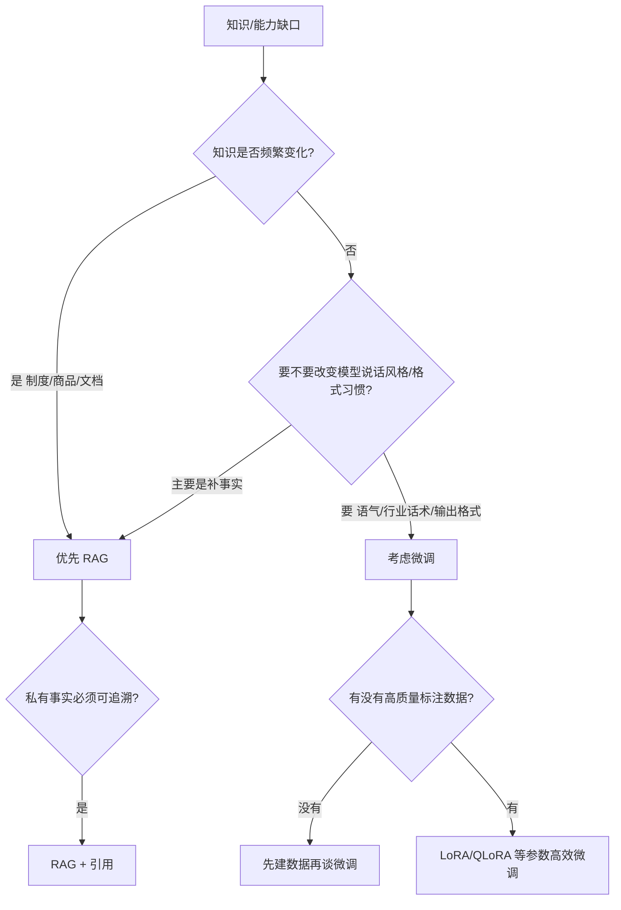

# AI 大模型面试链路实战学习讲义

> **资料索引**：请先阅读 `00_使用说明_先看这个.md`  
> **本文件类型**：跟学主教材（每天啃一条链路）  
> **配套必做**：同步填写 `05`；对照 `06` 练口述；学完用 `10` 生成面试稿

> 对象：准备 AI/大模型相关岗位的同学  
> 用法：**跟着链路学 → 看例子 → 填自己的项目表 → 口述录音**  
> 贯穿案例：**「慧企助手」——企业内部知识库问答（制度 / 产品手册 / 运维文档）**

---

## 怎么用这份讲义（先读 2 分钟）

1. 每天只啃 **一条链路**（或一条链路的 2 步），不要平行撒网。  
2. 每学完一步，立刻做两件事：  
   - **口述 60–90 秒**（录音）  
   - **填「迁移到我的项目」格子**（把假例子换成真项目）  
3. 学完一条链，按文末「连环口述题」连答，卡壳处回炉。  
4. 目标不是背完整讲义，而是：**面试时能边画边讲，并能落到你自己的项目数字上**。

### 贯穿案例一句话

> 公司有 2 万页制度与产品文档，员工总问「报销怎么走」「某功能怎么配」。我们做「慧企助手」：用户提问 → 检索相关文档片段 → 大模型基于片段回答并给出来源。

你学习时，把「慧企助手」整体替换成你的项目名即可。

---

# 链路一：RAG 主链路（最高频，必会）

## 本链路学习目标

学完你应能：

1. 画出并讲清 RAG 入库 → 检索 → 生成 全流程  
2. 说清分块、向量库、召回优化、幻觉定位、评测各怎么做  
3. 用自己的项目填完「RAG 项目卡」并口述 5 分钟

## 0. 一张总图（先建立地图）



**面试口述骨架（直接背结构，别背字）：**

> 「我们项目是检索增强生成。先把文档清洗分块做成向量入库；用户提问时先检索相关片段，必要时重排，再把片段塞进 Prompt 让模型生成，并带来源。这样答案可追溯，也比纯微调更方便更新知识。」

---

## 第 1 步：RAG 基本链路是什么

### 讲解

RAG = **Retrieval-Augmented Generation（检索增强生成）**。

核心思想：别让模型只靠“脑子里的参数”回答会变的知识，而是：

1. **检索**到相关资料  
2. **增强**到 Prompt 里  
3. 再让模型 **生成**答案  

两阶段：

| 阶段 | 做什么 | 类比 |
| --- | --- | --- |
| 离线入库 | 文档 → 清洗 → 分块 → 向量化 → 入库 | 先建好图书馆索引 |
| 在线问答 | 提问 → 检索 →（重排）→ 拼 Prompt → 生成 | 先查书再答题 |

### 例子（慧企助手）

员工问：「出差上海高铁能不能报？限额多少？」

1. 检索命中《差旅管理制度》里「交通」两段  
2. Prompt 变成：根据以下制度回答，并注明条款  
3. 模型答：可报二等座；限额……；来源：差旅制度 §3.2  

**如果没有 RAG：** 模型可能编一个“看起来像真的”限额 —— 这就是幻觉风险。

### 常见误区

- ❌ 把 RAG 说成“就是向量数据库” → 向量库只是检索一环  
- ❌ 只说 LangChain → 要说清你系统里每一步谁在干什么  
- ❌ 宣称“有了 RAG 就没有幻觉” → 检索错了照样胡编

### 迁移到我的项目

| 填空项 | 我的项目写法 |
| --- | --- |
| 项目名 / 用户是谁 | |
| 知识从哪来（文档类型） | |
| 离线入库怎么做的 | |
| 在线问答怎么做的 | |
| 为什么必须用 RAG（不能纯微调） | |

### 口述练习（60 秒）

不看稿讲清：业务是什么 → 为什么用 RAG → 入库三步 → 问答三步 → 带来源的好处。

---

## 第 2 步：清洗与分块（Chunk）

### 讲解

**清洗**：去掉导航、页眉页脚、重复目录、乱码、扫描噪声，统一编码与标题层级。  
**分块**：把长文档切成模型检索友好的小段。块太大 → 噪声多、命中不准；块太小 → 语境碎、答案缺条件。

常见策略：

| 策略 | 做法 | 适用 |
| --- | --- | --- |
| 固定长度 + overlap | 如 500 字，重叠 50–100 | 通用起步 |
| 按标题/条款切 | 按 H2、按「第 X 条」 | 制度、手册（推荐） |
| 父子块 | 小块检索，大块送模型 | 既要准召回又要完整语境 |

### 例子

原文：

```text
## 3.2 交通费用
职工出差火车原则上乘坐高铁二等座……
超标准需提前审批……
## 3.3 住宿费用
……
```

- **好切法**：`3.2` 整节一块（或「原则」与「审批」两块但互相带标题）  
- **坏切法**：在「二等座」中间切开，后半块丢掉「原则上」条件  

慧企助手实测记忆点（面试可说「类似经验」）：

> 先按 800 字切，制度问答经常答漏「需审批」条件；改为按条款切 + 块首带章节标题后，人工抽检合格率明显上升。

### 常见误区

- ❌ 只报一个数字「我们 chunk=500」却说不出为什么  
- ❌ 忽略 overlap / 标题上下文  
- ❌ 表格、图片说明没处理就直接切

### 迁移到我的项目

| 填空项 | 我的项目写法 |
| --- | --- |
| 原文长什么样 | |
| 清洗去掉了什么 | |
| 分块策略与大概大小 | |
| overlap 有没有，多少 | |
| 一个「切坏了」的真实/合理例子 | |
| 改完后用什么现象证明变好了 | |

### 口述练习

「我们怎么切文档？为什么这样切？切错会怎样？怎么验证？」

---

## 第 3 步：Embedding 与向量库选型

### 讲解

- **Embedding 模型**：把文本变成向量，语义相近的问题/段落距离更近。  
- **向量库**：存向量 + 原文 + 元数据（来源、章节、权限），负责近似检索。

选型时别背品牌，背 **维度**：

| 维度 | 要想清楚的问题 |
| --- | --- |
| 数据规模 | 万级 / 百万级 chunk？ |
| 更新频率 | 天更还是周更？ |
| 过滤条件 | 要不要按部门/权限过滤？ |
| 运维成本 | 能不能接受独立中间件？ |
| 延迟 | 在线 P95 要多少毫秒？ |

直觉对照（表述用「常见选型思路」，别假装唯一真理）：

| 场景 | 常见选择思路 |
| --- | --- |
| 原型 / 小规模 | FAISS / Chroma 等轻量方案 |
| 要过滤、要运维生态 | Milvus / ES（稠密+关键字）等 |
| 已有 ES 全文检索 | 可在 ES 上做混合检索 |

### 例子

慧企助手：

- Embedding：中文效果稳定的通用向量模型（面试说清「选型依据：中文制度语料评测集命中率」）  
- 元数据：`doc_id / 部门 / 生效日期 / 密级`  
- 检索时：普通员工过滤掉「高管薪酬」密级文档  

### 迁移到我的项目

| 填空项 | 我的项目写法 |
| --- | --- |
| Embedding 用什么，为何选它 | |
| 向量库用什么，为何选它 | |
| 元数据有哪些字段 | |
| 有没有权限/业务过滤 | |

---

## 第 4 步：召回不准怎么优化

### 讲解（分层，别一上来堆名词）



**稠密 vs 稀疏（必会对比）：**

| | 稠密向量 | 稀疏（如 BM25） |
| --- | --- | --- |
| 擅长 | 同义改写、语义相近 | 专名、型号、条款号 |
| 弱点 | 专名可能漂 | 同义表达可能漏 |
| 组合 | **混合检索** 常更稳 | |

**Rerank：** 先取 Top50（召回），再用重排模型精排 Top5 给生成。  
代价：更准，但多一次模型调用、延迟上升。

### 例子

问：「机票超标怎么报」  
制度原文写的是「民航超标准购票审批流程」。

- 仅稠密：可能漂到「酒店超标」  
- 加上「超标准/机票/民航」关键字通道：更稳  
- Rerank 后再把真正「民航」段落顶到前面  

### 迁移到我的项目

| 填空项 | 我的项目写法 |
| --- | --- |
| 最常见的「问法 ≠ 原文」例子 | |
| 你用了混合检索吗？怎么融合 | |
| 有没有 Rerank？截断 TopK | |
| 优化前后指标/体感如何 | |

---

## 第 5 步：幻觉如何定位（检索问题还是生成问题）

### 讲解（二分法，面试加分）

```text
拿到错误答案
  ├─ 1) 看召回片段里有没有支撑事实
  │     ├─ 没有 / 召回跑题 → 检索侧问题（切分、索引、查询、权限过滤）
  │     └─ 有正确片段
  │           └─ 2) 模型有没有用这些片段
  │                 ├─ 没用 / 编造 → 生成侧（Prompt、上下文过长、模型不听话）
  │                 └─ 断章取义 → 分块语境或 Prompt 约束问题
```

### 例子

问：住宿限额？  
模型答：800 元/晚。  
打开检索结果：命中的是「实习生存活补贴」不是差旅住宿 —— **检索错**。  

另一题：检索已命中「限额 500」，模型仍说 800 —— **生成未忠实于上下文**。  
处理：强化「仅依据资料作答；资料不足就说不知道」；必要时降低 temperature、加引用强制。

### 迁移到我的项目

写 1 个真实/合理案例：

| 项 | 内容 |
| --- | --- |
| 错误现象 | |
| 我如何判断是检索还是生成 | |
| 我改了什么 | |
| 如何验证修好了 | |

---

## 第 6 步：效果如何评测

### 讲解（让面试官相信你能闭环）

不要只说「用户觉得还行」。准备一张小表：

| 层级 | 指标/做法 | 例子 |
| --- | --- | --- |
| 检索 | TopK 命中率、MRR | 黄金问题 100 条，看答案段落是否进 Top5 |
| 生成 | 忠实度、完整性、拒答是否合理 | 人工 1–5 分；或 LLM-as-Judge 初筛 |
| 业务 | 解决率、转人工率、投诉 | 周报数字 |
| 工程 | 延迟 P95、失败率 | 接口监控 |

### 例子（慧企助手）

- 离线：120 条高频问答黄金集，检索 Top5 命中 78% → 优化后 89%  
- 线上：每周抽 50 条日志人工看，幻觉类问题占比从 12% → 5%  

### 迁移到我的项目

| 填空项 | 我的数字/做法 |
| --- | --- |
| 有没有黄金集，多少条 | |
| 检索指标 | |
| 生成/业务指标 | |
| 谁在评、多久评一次 | |

---

## 链路一小结：RAG 项目卡（务必填完）

| 模块 | 我的项目怎么说（写关键词即可） |
| --- | --- |
| 业务与指标 | |
| 数据与清洗 | |
| 分块 | |
| Embedding / 向量库 | |
| 检索与重排 | |
| Prompt / 引用 | |
| 幻觉案例 | |
| 评测数字 | |
| 我负责哪一段 | |

**连环口述题（一次录完，目标 5–7 分钟）：**

1. 讲 RAG 链路  
2. 你们怎么分块  
3. 向量库怎么选  
4. 召回不准怎么办  
5. 幻觉如何定位  
6. 如何评测  

---

# 链路二：Agent + MCP / Function Call / Skill

## 本链路学习目标

1. 用「感知→决策→行动→观察」讲清 Agent  
2. 分清 FC / MCP / Skill 的边界  
3. 说明 LangGraph 等框架在你项目中的落点  
4. 能讲何时需要 Multi-Agent、如何防 AI 编码失控  

## 第 1 步：Agent 是什么

### 讲解

**Agent（智能体）**：不只「答一句」，而是在目标下 **多步决策**，可调用工具，并根据结果继续行动。

最小闭环：



常见模式（面试选 2–3 个讲熟即可）：

| 模式 | 含义 | 例子 |
| --- | --- | --- |
| ReAct | 边想边做边观察 | 查库存 → 看结果 → 再下单 |
| Plan-and-Execute | 先计划再执行 | 先列 5 步调研，再逐步完成 |
| Tool-using | 核心是工具调用 | 天气/数据库/检索器 |
| Multi-Agent | 多角色分工 | 检索员 + 写手 + 质检员 |

### 例子：从「慧企问答」升级到「慧企办事助手」

用户：「帮我看看出差深圳 2 天预算，并生成申请草稿。」

1. 调 RAG 查差旅标准（工具 A）  
2. 调员工日历看是否冲突（工具 B）  
3. 生成申请草稿（LLM）  
4. 质检：缺场次/超标则提醒（规则或第二个 Agent）  

这就是 Agent，而不是单轮 RAG。

### 迁移

| 填空项 | 我的项目 |
| --- | --- |
| 用户目标是什么 | |
| 需要哪些工具 | |
| 几步决策 | |
| 失败时怎么重试/降级 | |

---

## 第 2 步：Function Call vs MCP vs Skill

### 对比表（建议截图背结构）

| | Function Call (FC) | MCP | Skill |
| --- | --- | --- | --- |
| 一句话 | 模型按 schema 调函数 | 工具/资源的统一接入协议 | 给 AI 的「标准作业程序/能力包」 |
| 解决什么 | 「这次调用哪个函数、参数是什么」 | 「工具怎么标准地连到多种客户端/模型」 | 「按我们的技术栈/规范做事」 |
| 典型形态 | `get_order(order_id)` JSON 参数 | MCP Server 暴露 tools/resources | 文档+脚本+约束的技能说明 |
| 面试怎么说 | 模型输出结构化调用，系统执行再回灌 | 像「工具的 USB 协议」 | 像「团队 playbook，让 AI 行为可控」 |

**一句话串联：**

> FC 解决「怎么调」；MCP 解决「工具怎么被标准接入」；Skill 解决「AI 按什么规范长期做事」。三者可同时存在。

### 例子

- FC：`query_policy(keyword="差旅")`、`create_draft(form=...)`  
- MCP：把「制度检索 / 日历 / OA」做成 MCP Server，Cursor/自研 Agent 都能连  
- Skill：`skill-rag-eval.md` 规定评测怎么跑、代码目录规范、禁止直接改生产配置  

### 常见误区

- ❌ 把 MCP 说成「另一种大模型」  
- ❌ 把 Skill 说成「就是 Prompt」——Skill 更像可复用的能力与约束包  
- ❌ 没工具也硬说 Multi-Agent  

### 迁移

写你项目里有没有这三者；没有就写「若重做我会加上哪一个，为什么」。

---

## 第 3 步：LangChain / LangGraph 用在哪

### 讲解

- **LangChain**：常用组件装配（检索器、工具、链）——适合快速搭。  
- **LangGraph**：把流程建成 **有状态的图**（节点+边+循环/分支）——适合复杂 Agent、可恢复、可人工卡点。  

面试满分句式：

> 「简单流水线用链；有分支、重试、人工审核、多轮状态，我用图（LangGraph）把节点显式化，方便调试和观测。」

### 例子（慧企办事）

节点：`理解意图 → 检索制度 → 调日历 → 生成草稿 → 合规检查 →（失败回检索）→ 输出`  
状态里保存：`user_id、已检索文档、草稿版本、错误码`。

### 迁移

画出你项目 4–7 个节点（方框+箭头），并标注：**状态存了什么、哪步会循环**。

---

## 第 4 步：何时 Multi-Agent

### 讲解

**不要为了架构炫技。** 出现这些信号再考虑拆：

- 单一 Prompt 又臭又长、角色互相打架  
- 需要独立质检/安全审核  
- 不同工具权限必须隔离  
- 要并行（检索与计算同时做）  

### 例子

- Agent-A 检索制度  
- Agent-B 写草稿  
- Agent-C 只做「有没有引用、有没有超标」质检  
质检失败 → 回到 B，不让 B 自己既当运动员又当裁判（降低自我放过）。

### 迁移

写：你现在是单 Agent 还是多 Agent？若是单，什么条件你会拆？

---

## 第 5 步：AI 写代码如何防失控

### 讲解（结合 vibe coding 热点）

可控手段：

1. **范围**：一次只改一个模块；禁止直接碰生产配置  
2. **规范 Skill/规则**：目录、测试、日志格式写进约束  
3. **门禁**：单测 / lint / 类型检查必须过  
4. **评审**：AI 差分必须人看  
5. **回滚**：小步提交，保留还原点  

### 例子

让 AI 「优化检索」时限定：只许改 `retriever.py` + 补 2 个单测；不许动部署脚本。  
结果可测：命中率不降、延迟不升。

---

## 链路二小结：Agent 口述 3 分钟结构

1. 业务目标与工具列表  
2. 单步循环怎么走  
3. FC/MCP/Skill 你怎么用（或怎么理解）  
4. 为何用/不用 Multi-Agent  
5. 如何评测与防失控  

---

# 链路三：微调 vs RAG 选型（含 LoRA）

## 学习目标

能画决策树，能讲 LoRA 直觉，能说数据与评估，能说上线后知识怎么更新。

## 第 1 步：何时 RAG、何时微调

### 决策树（先讲这个）



**对照表：**

| 维度 | RAG | 微调 |
| --- | --- | --- |
| 更新知识 | 改文档重建索引即可 | 要重新训练/继续训练 |
| 可追溯 | 强（可带来源） | 弱 |
| 改变文风/格式 | 弱 | 强 |
| 成本形态 | 检索与工程成本 | 数据与算力成本 |
| 典型 | 企业知识库 | 客服话术、分类、固定 JSON 输出 |

### 例子

- 制度问答 → **RAG**（制度常改，要引用来源）  
- 希望模型永远用公司「四段式客服话术」→ **小规模 SFT/LoRA**  
- 很多团队：**RAG + 轻量微调**（微调管格式/路由，RAG 管事实）

### 迁移

写你项目：为什么选了 A 没选 B？如果面试官问「为什么不微调/为什么不只用 RAG」你怎么答？

---

## 第 2 步：LoRA / QLoRA 直觉

### 讲解（不用堆公式）

全量微调：改模型大量参数 → 贵、易遗忘。  
**LoRA**：在少量旁路低秩矩阵上学习增量，推理时可合并，**参数高效**。  
**QLoRA**：底座量化（如 4bit）后再 LoRA，进一步省显存。

面试数字感（量级口述，按你实际改）：

> 「同样 7B，全量微调显存压力远大于 LoRA；我们用 LoRA/QLoRA 是为了在有限 GPU 上完成领域适配。」

### 例子

客服希望输出稳定字段：`问题归类 / 安抚语 / 下一步动作`。  
用 3k 条历史工单 SFT + LoRA，评估字段齐全率从 71% → 93%；事实类仍走 RAG。

---

## 第 3 步：数据从哪来、怎么质检

清单：

1. 来源：历史工单、优质问答对、专家改写  
2. 洗掉：隐私、冲突标签、纯噪声  
3. 平衡：各类别别严重倾斜  
4. 拆分：训练/验证/抽检，防止泄漏  
5. 人工抽检：每类至少看 N 条  

---

## 第 4–5 步：如何评估 + 上线后如何更新

- 评估：业务指标（解决率）+ 能力集（格式/安全拒答）+ 回归集（防止改坏老能力）  
- 更新：  
  - 事实类 → 更新知识库（RAG）更快  
  - 风格/路由类 → 积累新样本再增量 SFT  
  - 别幻想「微调一次一劳永逸」

### 迁移表

| 项 | 我的项目 |
| --- | --- |
| 最终选型（RAG/微调/组合） | |
| 决策理由三句话 | |
| 数据量与质量如何保证 | |
| 评估指标 | |
| 知识更新节奏 | |

---

# 链路四：项目深挖（STAR + 数字）

## 学习目标

任何技术点都能绑回项目；深挖时不慌，不落到「我们组一起做的」。

## STAR-L 模板（建议直接填）

**S 背景：** 谁、什么痛点、基线多差  
**T 任务：** 你负责什么（边界说清）  
**A 行动：** 2–3 个关键决策（要有取舍）  
**R 结果：** 前后对比数字  
**L 学习：** 如果重做怎么改  

### 示例（慧企助手，可仿写）

- **S：** 内部咨询群日均 200+ 重复制度问题，HR 响应慢  
- **T：** 我负责检索与评测，另一人负责前端与权限  
- **A：**  
  1) 条款级分块替代固定 800 字  
  2) 稠密+BM25 混合  
  3) 建立 120 条黄金集周更  
- **R：** Top5 命中 78%→89%；制度类答案人工合格率 80%→92%；HR 重复咨询下降约 35%  
- **L：** 下一步补 Rerank 与权限更细的文档级 ACL  

### 你的三件套（作业，必须写）

#### 故事 1：主项目（技术主力）

| STAR-L | 我的内容 |
| --- | --- |
| S | |
| T | |
| A1/A2/A3 | |
| R（数字） | |
| L | |

#### 故事 2：排障/优化

（专门应对「出过什么问题」）

#### 故事 3：协作/对客/权衡

（专门应对软素质追问）

---

# 综合案例课：把四条链路串进一个项目

下面示范「面试 8 分钟完整讲述」。请先跟读，再改成你的版本。

## 示范口述稿（慧企助手）

> 我做的是企业内部知识助手。背景是制度咨询重复且易答错。我们采用 RAG：文档按条款清洗分块，中文 Embedding 入向量库，在线混合检索，必要时重排，再生成并附来源。  
> 我负责检索与评测。分块上踩过固定长度切碎审批条件的坑，改成条款切后命中与合格率都上来了。幻觉我们用二分法：先看片段有没有事实，再看模型是否忠实。  
> 后来业务希望「生成申请草稿」，我们在 RAG 外加了工具调用：查制度、查日历、写草稿，流程用图编排，质检单独做，避免既当写手又当裁判。  
> 有人问为什么不微调制度进模型：制度月更，且要可追溯，所以事实走 RAG；若要固化输出格式，再考虑 LoRA。  
> 结果上黄金集 Top5 命中到 89%，合格率到 92%。若重做，我会更早上 Rerank 和更细的权限元数据。

### 改写任务

把上面每一句中的业务、技术、数字，换成你的项目；控制在 **6–90 秒/段**，全篇 **7–9 分钟** 内。

---

# 部署与工程（短链补充，配合面试高频）

## 你要能讲清的最小集合

1. **怎么跑起来**：Docker 镜像 / `ollama run` 等（按你真实栈说）  
2. **量化**：用显存换精度；说明你用的精度与是否可接受效果掉点  
3. **API 参数**：temperature、max tokens、超时、重试、限流  
4. **观测**：日志里记下 `query / retrieved_ids / latency / user_feedback`

### 小例子

> 「 температуру 制度问答设低，减少发挥；创作类才提高。P95 延迟超过 3s 就先砍重排或减 TopK。」

---

# 7 日跟学计划（内容版）

| 天 | 学哪一节 | 跟做产出（必须交自己的） |
| --- | --- | --- |
| D1 | 链路一 第0–2步 | RAG 总图手绘 + 分块迁移表 + 60″录音 |
| D2 | 链路一 第3–6步 | 召回优化+幻觉案例各 1 个 + 评测小表 |
| D3 | 链路一项目卡 + 连环口述 | 5–7′ 录音一条龙 |
| D4 | 链路二全 | FC/MCP/Skill 对比用自己的话讲 + 流程图 |
| D5 | 链路三全 | 决策树填空 + 为何不选另一方案 |
| D6 | 链路四 STAR×3 | 三张故事卡数字版 |
| D7 | 综合口述 + 模面 | 8′ 完整项目讲述 + 找同学追问四条链 |

---

# 自测清单（过线标准）

## 知识过线

- [ ] 能默画 RAG 图并讲 3 分钟  
- [ ] 能讲一个分块失败案例  
- [ ] 能做幻觉二分定位  
- [ ] 能对比稠密/稀疏与 Rerank  
- [ ] 能对比 RAG vs 微调  
- [ ] 能说明 FC / MCP / Skill 差异  
- [ ] 能讲清自己在项目中的边界与数字  

## 迁移过线

- [ ] 《RAG 项目卡》已换成自己项目  
- [ ] 至少 1 个排障 STAR  
- [ ] 评测表有数字（真实或合理估算并标注）  
- [ ] 综合口述稿已经「去慧企化」  

## 面试临场过线

- [ ] 任意从链路中部被追问，仍能衔上  
- [ ] 不会的会说「我没做过，但思路是…」而不是瞎编  
- [ ] 反问至少准备 2 个（评测体系 / 数据闭环 / 工具权限）

---

# 附录：空白工作纸（打印或复制填写）

## A. RAG 项目卡

（见链路一小结表，复制到笔记）

## B. 一页故障复盘

| 项 | 内容 |
| --- | --- |
| 现象 | |
| 影响 | |
| 定位过程 | |
| 根因 | |
| 修复 | |
| 防再发 | |
| 指标前后 | |

## C. 反问题库（选 2 个常用）

1. 团队现在线上效果看哪些指标？人工抽检频率？  
2. 知识更新与权限变更如何进索引？  
3. Agent 工具的权限与审计怎么做？  
4. 更期待这个角色半年内拿下哪块业务闭环？  

---

**最后一句话送给同学：**  
面试官要的不是「你会不会名词」，而是「你有没有把链路跑通，并且能把同样方法嵌进下一个项目」。  
先把本讲义四条链路在「慧企助手」上学会，再替换成你的项目名与数字——这就是融合。
